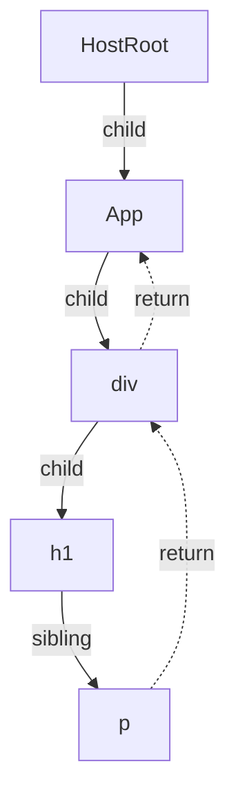
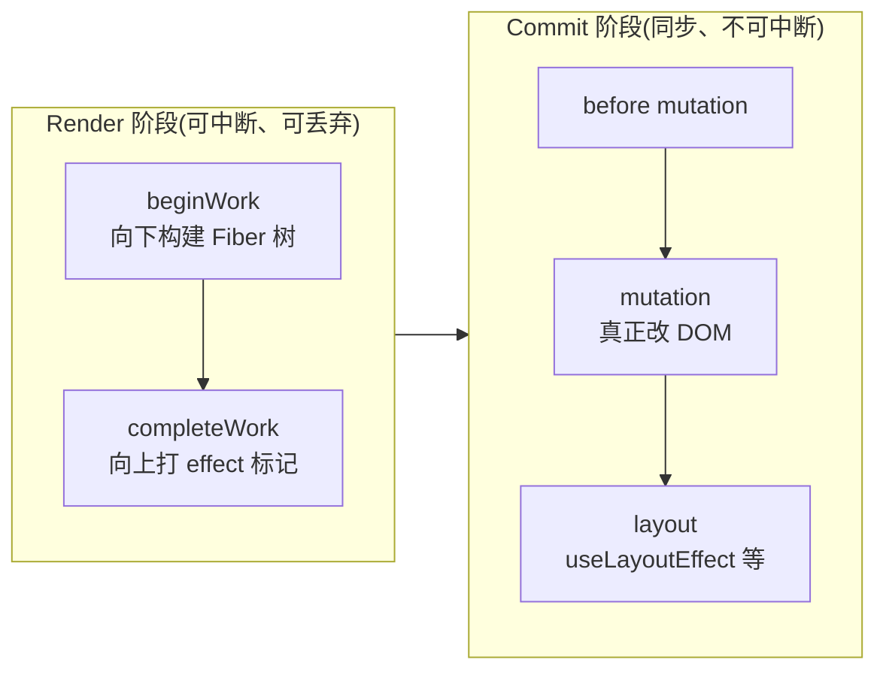
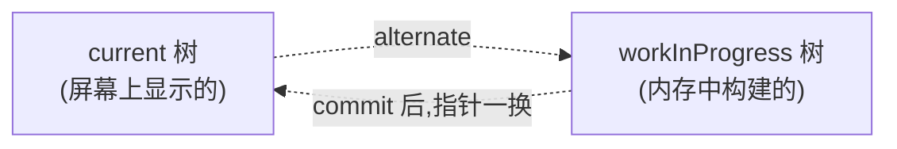

# Fiber

**Fiber 是 React 16 起的核心架构,它把原本「一次性递归、不可打断」的渲染,改写成「可中断、可恢复、可排优先级」的渲染。** 一句话:Fiber 让 React 能把一次大渲染拆成许多小块,在浏览器空闲时一点点做,避免长时间卡住主线程。

:::tip 形象记忆
老 React 渲染像 **一口气搬完一整车砖**:中途不能停,搬到一半用户点按钮、想滚动,只能干等你搬完 (掉帧卡顿)。Fiber 把搬砖拆成「一块一块搬」,每搬几块就抬头看一眼:有没有更急的事 (用户输入)?有就先去办,回头接着搬。这种「能停下、能续上、能插队」的能力,就是 Fiber 带来的。
:::

## 为什么需要 Fiber

React 15 的协调 (Reconciliation) 用的是**递归**:从根组件一路递归比对虚拟 DOM,生成更新。递归基于函数调用栈,有个硬伤——**一旦开始就停不下来,直到整棵树处理完**。

JavaScript 又是单线程的,渲染和用户交互、动画共用一个主线程。如果组件树很大,这段递归可能跑几十甚至上百毫秒,期间主线程被占满:

- 用户的点击、输入没法响应
- 动画掉帧、页面卡顿 (浏览器一帧只有约 16.6ms)

问题的根:**渲染任务不可中断,长任务霸占主线程**。

Fiber 的解法是重写协调过程,让它**可以被中断**:做完一小段就把主线程让出去,等浏览器忙完高优先级的事 (响应交互、渲染一帧),再回来继续。这就是常说的 **时间分片 (Time Slicing)**。

## Fiber 是什么

「Fiber」一词有两层含义,别混淆:

1. **一种架构**:上面说的「可中断渲染」这套机制。
2. **一个数据结构 / 工作单元**:每个 React 元素都对应一个 **Fiber 节点 (Fiber node)**,它既保存了组件信息,也是调度的最小工作单位。

一个 Fiber 节点大致长这样:

```js
const fiber = {
  type: 'div',          // 节点类型:组件函数、DOM 标签等
  stateNode: domNode,   // 对应的真实 DOM 或组件实例

  // 三个指针,把 Fiber 连成一棵可遍历的树(实为链表)
  child: childFiber,    // 第一个子节点
  sibling: siblingFiber,// 下一个兄弟节点
  return: parentFiber,  // 父节点(处理完自己后返回它)

  alternate: currentFiber, // 指向另一棵树里对应的节点(双缓存,见下)
  flags: 'Update',      // effect 标记:本节点要做什么(增/删/改)
  // ...还有 props、state、lanes(优先级)等
};
```

## 为什么链表结构能中断

关键在 `child` / `sibling` / `return` 这三个指针:它们把树**变成了可以手动遍历的链表**。

递归遍历靠的是调用栈,栈没法「暂停一半保存现场」。而 Fiber 用指针手动遍历——处理完一个节点,顺着指针找到下一个该处理的节点。**遍历进度就是「当前停在哪个 Fiber」这一个指针**,随时可以记下来、停下,等会儿再从这个指针继续。



遍历规则:有 `child` 先进 `child`;没有 `child` 就找 `sibling`;没有 `sibling` 就沿 `return` 回到父级再找父级的 `sibling`。每处理完一个节点,React 都会问一句「这一帧的时间还够吗?」——不够就让出主线程,把控制权还给浏览器,下次再从断点续上。

:::info 调度靠的不是 requestIdleCallback
理念上 Fiber 借鉴了 `requestIdleCallback`「空闲时执行」的思路,但它兼容性和触发时机都不理想。React 自己实现了一套 **Scheduler**,底层用 `MessageChannel` 制造宏任务,在每一帧的空隙里调度工作单元,并支持给任务划分优先级 (lane)。
:::

## 两大阶段:render 与 commit

Fiber 把一次更新分成两个阶段,一个可中断、一个不可中断:



- **Render 阶段 (协调)**:在内存里构建新的 Fiber 树,逐个节点 diff,给有变化的节点打上 effect 标记 (要插入 / 更新 / 删除)。**这个阶段可以被中断、甚至整个丢弃重来**,因为它不碰真实 DOM,中途打断不会让用户看到残缺画面。
- **Commit 阶段 (提交)**:把 render 阶段算好的变更**一次性**刷到真实 DOM。**这个阶段必须同步、不可中断**,否则用户会看到更新到一半的界面。

:::warning
正因为 render 阶段可能被打断后**重新执行**,所以这个阶段里的代码 (函数组件体、`useMemo` 计算等) 必须是「纯」的、可重复执行而无副作用的。副作用要放进 `useEffect` / `useLayoutEffect`,它们在 commit 阶段才跑。这也是 React 18 严格模式下故意双调用组件函数来帮你暴露不纯代码的原因。
:::

## 双缓存:current 与 workInProgress

React 同时维护**两棵** Fiber 树,用 `alternate` 指针互相连接:

- **current 树**:当前**屏幕上正在显示**的那棵。
- **workInProgress 树**:render 阶段**在内存里构建**的新树。



新树在内存中慢慢构建,不影响屏幕。等 commit 完成,React 只需把根指针从 current 切到 workInProgress,**新树瞬间变成 current**,旧树则留作下次更新的「画布」。

:::tip 形象记忆
双缓存像 **画动画的两张赛璐珞片**:一张正在投影给观众看 (current),另一张在桌上画下一帧 (workInProgress)。下一帧画好,直接换到投影机上,观众看到的永远是完整的一帧,绝不会看到「画了一半」的过程。
:::

## 它带来了什么

Fiber 架构是 React 并发特性 (Concurrent Features) 的地基。有了「可中断 + 优先级」,才有了后来的:

- **时间分片**:大渲染拆片执行,不阻塞交互。
- **优先级调度 (lane 模型)**:用户输入这类高优先级更新,可以打断正在进行的低优先级渲染,先处理紧急的。
- `useTransition` / `useDeferredValue`:把不紧急的更新标记为「可延后、可被打断」,正是建立在 Fiber 之上的能力。
