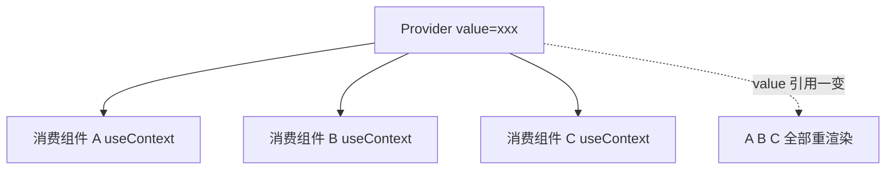
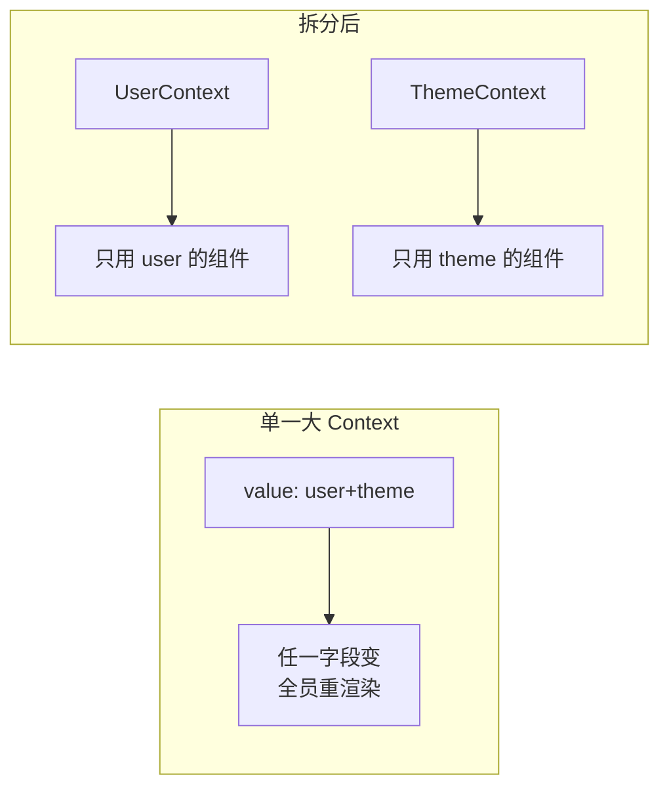

# Context 原理

Context 解决的是**跨层级传值** (props 一层层往下传太累，即「prop drilling」)。一句话原理：

- `Provider` 把 `value` 存起来；
- `useContext(SomeContext)` 的组件**订阅**这个 value；
- 一旦 `value` 变化，**所有消费该 Context 的组件全部重渲染**——不管它们用到的是 value 里的哪个字段。



## 基本用法

```jsx
// 第一步：创建 context
const ThemeContext = createContext('light');

// 第二步：用 Provider 在上层提供 value
function App() {
  const [theme, setTheme] = useState('dark');
  return (
    <ThemeContext.Provider value={theme}>
      <Page />
    </ThemeContext.Provider>
  );
}

// 第三步：任意深度的后代直接消费，不用一层层传
function Button() {
  const theme = useContext(ThemeContext);
  return <button className={theme}>按钮</button>;
}
```

:::info
**Context 不是「状态管理」**，它只是个传输管道，本身不帮你管理/优化状态。复杂全局状态仍可能需要 Redux / Zustand 等，或多个细粒度 Context 配合。
:::

## 核心坑：value 变化导致的过度重渲染

最常见的性能问题：**把对象字面量直接当 value**。父组件每次渲染，这个对象都是**全新引用**，订阅者全部触发重渲染，哪怕内容根本没变。

```jsx
function App() {
  const [user, setUser] = useState(null);
  const [theme, setTheme] = useState('dark');

  // ❌ 每次 App 渲染，这个对象都是新引用 → 所有消费者无脑重渲染
  return (
    <AppContext.Provider value={{ user, theme, setUser, setTheme }}>
      <Page />
    </AppContext.Provider>
  );
}
```

更隐蔽的：就算只有 `theme` 变了，**只用到 `user` 的组件也会跟着重渲染**——因为 Context 的订阅是「整个 value」级别，没有字段级粒度。

## 优化一：useMemo 稳定 value 引用

```jsx
function App() {
  const [user, setUser] = useState(null);
  const [theme, setTheme] = useState('dark');

  // ✅ 只有 user/theme 真变了才生成新对象，否则引用稳定
  const value = useMemo(
    () => ({ user, theme, setUser, setTheme }),
    [user, theme]
  );

  return (
    <AppContext.Provider value={value}>
      <Page />
    </AppContext.Provider>
  );
}
```

这能避免「父组件因别的原因重渲染、但 value 内容没变」时的无谓重渲染。

## 优化二：拆分 Context (按变化频率/字段)

`useMemo` 解决不了「`theme` 变了，只用 `user` 的组件也重渲染」的问题，因为它们订阅同一个 value。**根治办法是拆成多个 Context**，让各自独立订阅。

```jsx
const UserContext = createContext(null);
const ThemeContext = createContext('dark');

function App() {
  const [user, setUser] = useState(null);
  const [theme, setTheme] = useState('dark');

  // 第一步：各字段用各自的 Provider，互不牵连
  return (
    <UserContext.Provider value={user}>
      <ThemeContext.Provider value={theme}>
        <Page />
      </ThemeContext.Provider>
    </UserContext.Provider>
  );
}

// 第二步：组件只订阅自己需要的那个，theme 变了不会惊动只用 user 的组件
function Avatar() {
  const user = useContext(UserContext); // 只随 user 变重渲染
  return ;
}
```

:::tip
**常见拆分策略：把「值」和「更新函数」拆开。**
`setUser` 这种函数引用通常永远不变，但若和频繁变的 `user` 塞在一个 value 里，只想拿 `setUser` 的组件也会被连累。拆成 `UserStateContext` (值) 和 `UserDispatchContext` (函数)，只调 dispatch 的组件就完全不受值变化影响。这是 Redux 风格全局状态的经典写法。
:::



## 形象记忆

Context 像办公室的**公共广播**：Provider 是广播站，`useContext` 的组件是戴着耳机的员工。

- 广播站内容一更新 (value 变)，**所有戴耳机的人都被打扰**，哪怕这条通知跟他无关——这就是过度重渲染。
- `useMemo` = 广播站「内容没变就别重播」，避免空播打扰大家。
- **拆分 Context** = 分成「财务频道」「行政频道」，员工各调各的台，行政发通知不会吵到只听财务频道的人。

## 参考

1. [useContext – React](https://react.dev/reference/react/useContext)
2. [Passing Data Deeply with Context – React](https://react.dev/learn/passing-data-deeply-with-context)
3. [Scaling Up with Reducer and Context – React](https://react.dev/learn/scaling-up-with-reducer-and-context)

## 一句话口诀

> Context 是跨层传值管道：value 一变，**所有消费者全部重渲染** (无字段粒度)。
> 优化两招：`useMemo` 稳定 value 引用、按字段/变化频率**拆分多个 Context** (值与 dispatch 分开)。
