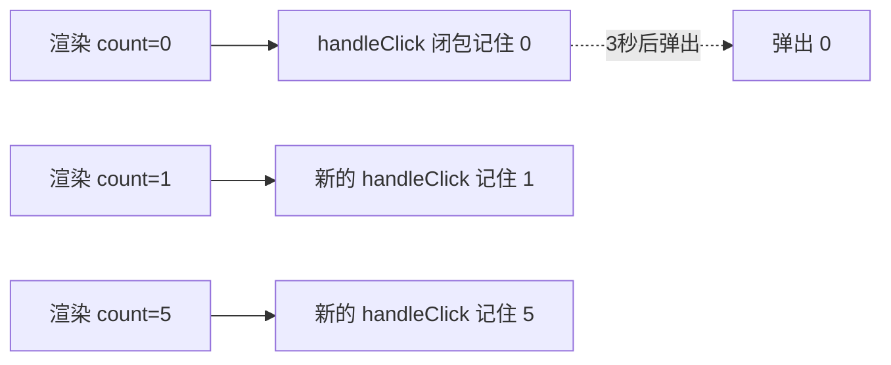

# Hooks 原理

理解 Hooks 只需抓住两点，所有「为什么」都从这里推出来：

1. **每个组件的 Hooks 存在一条链表里，靠「调用顺序」一一对应**，不靠名字。
2. **每次渲染都是一个独立的闭包**，函数里捕获到的 `state` 是「这一次渲染的快照」。

## 为什么不能写在条件/循环里

React 不知道你这次调的 `useState` 是哪一个，它**只数你第几个调用**。第一次渲染按顺序建链表，后续渲染再按同样顺序去链表里取。顺序一乱，对应关系就错位。

```jsx
function Bad({ show }) {
  // ❌ 把 hook 放进条件里
  if (show) {
    const [a, setA] = useState(0); // 第 1 个 hook —— 但只在 show 为 true 时存在
  }
  const [b, setB] = useState(''); // show=true 时是第 2 个，show=false 时却成了第 1 个
}
```

`show` 从 `true` 变 `false` 时，原本是「第 2 个」的 `b`，这次渲染变成「第 1 个」去取链表——拿到的是上次 `a` 的格子，state 全错乱。

```mermaid
flowchart TD
  subgraph 第一次渲染 show=true
    A1[第1个: useState a] --> A2[第2个: useState b]
  end
  subgraph 第二次渲染 show=false
    B1[第1个: useState b] -.错位.-> X[拿到了上次 a 的格子]
  end
```

底层结构 (简化)：组件对应的 Fiber 上挂着一条 hook 链表，每个 hook 是链表的一个节点。

```js
// React 内部大致是这样存的 (简化示意)
fiber.memoizedState = {
  state: 0,          // 第 1 个 useState 的值
  next: {
    state: '',       // 第 2 个 useState 的值
    next: {
      state: [],     // 第 3 个 useState 的值
      next: null,
    },
  },
};
```

渲染时有个**游标**从头开始走，第几次调 Hook 就读链表的第几个节点。所以**调用顺序必须每次渲染完全一致**——这就是 Hooks 规则 (只在顶层调用) 的根因。

:::info
**手写极简 useState 体会原理：**

```js
let hooks = [];      // 存所有 hook 的值 (相当于链表)
let cursor = 0;      // 游标：当前数到第几个 hook

function useState(initial) {
  const i = cursor;  // 第一步：记下我是第几个 (锁定位置)
  hooks[i] = hooks[i] ?? initial; // 第二步：首次用初始值，之后用存的值

  function setState(next) {
    hooks[i] = next; // 第三步：setState 改的是「这个位置」的值
    render();        // 触发重新渲染
  }

  cursor++;          // 第四步：游标后移，给下一个 hook 让位
  return [hooks[i], setState];
}

// 每次渲染前必须把游标归零，才能按同样顺序对上号
function render() { cursor = 0; /* 执行组件函数 */ }
```

看这段就懂了：`i` 是按调用顺序固定的，一旦顺序变了 (放进 if)，`i` 就对不上。
:::

## 闭包如何捕获每次渲染的 state

每次渲染，组件函数都**重新执行一遍**，产生一组全新的局部变量和函数。这一次产生的事件处理函数，闭包里捕获的就是**这一次的 `count`**——它是个定值，不会随后续 state 变化而更新。

```jsx
function Counter() {
  const [count, setCount] = useState(0);

  function handleClick() {
    setTimeout(() => {
      // 捕获的是「点击那一刻这次渲染」的 count
      alert(count);
    }, 3000);
  }

  return <button onClick={handleClick}>{count}</button>;
}
```

操作流程：`count=0` 时点一下 (定时器记住 0)，3 秒内疯狂点到 `count=5`，弹窗仍是 **0**——因为那次点击的闭包永远活在 `count=0` 的渲染里。



:::tip
想在异步里拿到**最新值**而非快照，两种办法：

- **函数式更新**：`setCount(c => c + 1)`，React 会把最新值喂给你，不依赖闭包里的 `count`。
- **用 `useRef` 同步最新值**：把每次的 `count` 写进 `ref.current`，异步里读 `ref.current` 永远是最新的。
:::

## 形象记忆

Hooks 链表像**储物柜**：你不报名字，只报「我要第 N 个柜子」。第一次来按顺序分配，以后每次都得按**同样顺序**来取，否则张三的钥匙开了李四的柜子 (state 错位)。把 hook 放进 `if` 里，就像有时来 3 个人有时来 2 个人，编号全乱。

闭包则像**拍立得照片**：每次渲染「咔嚓」拍一张，照片上的 `count` 就定格了。后面 state 再变，旧照片也不会跟着改。

## 参考

1. [Rules of Hooks – React](https://react.dev/reference/rules/rules-of-hooks)
2. [State as a Snapshot – React](https://react.dev/learn/state-as-a-snapshot)
3. [React hooks: not magic, just arrays – Rudi Yardley](https://medium.com/@ryardley/react-hooks-not-magic-just-arrays-cd4f1857236e)
