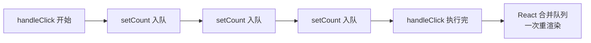

# setState 批量更新

`setState` 不是「同步改变量」，而是「**排队一个更新请求**」。React 把同一次事件里的多个 `setState` 收集起来，合并成一次重新渲染——这就是批量更新 (batching)，目的是避免每改一次 state 就渲染一次。

所以下面这段最终只 `+1`，不是 `+3`：

```jsx
function Counter() {
  const [count, setCount] = useState(0);
  function handleClick() {
    setCount(count + 1); // count 是本次渲染的快照，恒为 0
    setCount(count + 1); // 还是 0 + 1
    setCount(count + 1); // 还是 0 + 1
  }
  return <button onClick={handleClick}>{count}</button>;
}
```

`count` 在这次渲染里是个固定的快照值 `0`，三次调用算出来都是 `1`。想累加要用**函数式更新**，让 React 依次拿上一个结果：

```jsx
setCount((c) => c + 1); // 0 → 1
setCount((c) => c + 1); // 1 → 2
setCount((c) => c + 1); // 2 → 3，最终 3
```

## 为什么是异步/批量

「异步」是个误称——`setState` 本身是同步执行的，只是**它不立刻改 state、也不立刻渲染**，而是把更新推进队列，等当前函数执行栈跑完再统一处理。



好处：

- **性能**：N 次 `setState` 只触发 1 次渲染，不会界面闪烁。
- **一致性**：渲染时 `state` 和 `props` 始终是同一批，不会出现「state 已变、props 没变」的撕裂状态。

## React 18 自动批处理

React 17 及以前，批处理**只在 React 事件处理函数里生效**。`setTimeout`、Promise、原生事件、`fetch` 回调里的 `setState` 不会合并，每次都单独渲染：

```jsx
// React 17：下面会渲染两次
setTimeout(() => {
  setCount((c) => c + 1); // 渲染一次
  setFlag((f) => !f);     // 又渲染一次
}, 0);
```

React 18 引入 **自动批处理 (automatic batching)**：只要用 `createRoot` 启动，无论 `setState` 在哪里调用 (定时器、Promise、原生事件) 都会自动合并。上面那段在 React 18 只渲染一次。

:::tip
若确实需要某次更新**立即同步刷新 DOM** (例如读取更新后的布局)，用 `flushSync` 跳出批处理：

```jsx
import { flushSync } from 'react-dom';

flushSync(() => setCount((c) => c + 1));
// 这里 DOM 已经是更新后的了
```

代价是放弃了批处理优化，别滥用。
:::

## 如何拿到更新后的值

`setState` 之后**当前作用域里读不到新值**，因为新值要等下次渲染。三种正确姿势：

| 场景 | 做法 |
|------|------|
| 类组件，需要更新完做点事 | `this.setState(next, callback)` 第二个参数 |
| 函数组件，监听某 state 变化 | `useEffect(fn, [count])`，在依赖变化后执行 |
| 只是想拿到「即将的值」 | 自己用函数式更新算出来，或先存进局部变量 |

```jsx
useEffect(() => {
  console.log('count 更新后是', count);
}, [count]);
```

:::warning
不要试图在 `setCount(...)` 的下一行 `console.log(count)`——那永远是旧值。这是面试和实战里最常见的误区。
:::

## 参考

1. [Queueing a Series of State Updates – React](https://react.dev/learn/queueing-a-series-of-state-updates)
2. [Automatic batching – React 18 升级说明](https://react.dev/blog/2022/03/29/react-v18#new-feature-automatic-batching)

## 一句话口诀

> `setState` 不改当前快照、只排队，整次事件合并成一次渲染。
> React 18 自动批处理覆盖定时器/Promise；想拿新值用函数式更新或 `useEffect([dep])`，想立即同步用 `flushSync`。
