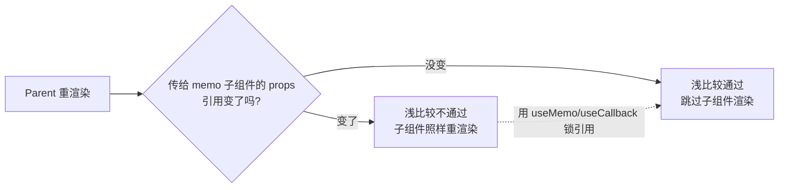

# useMemo / useCallback / memo

三者都是性能优化工具，**默认都不需要用**，只有在「确实有不必要的计算或渲染」时才加。一句话区分：

- **`useMemo`**：缓存一个**计算结果** (值)。
- **`useCallback`**：缓存一个**函数** (本质是 `useMemo` 缓存函数的语法糖)。
- **`React.memo`**：缓存一个**组件的渲染输出**，props 没变就跳过重渲染。

```js
// useCallback(fn, deps) 等价于 useMemo(() => fn, deps)
const memoFn = useCallback(() => doSomething(a), [a]);
const memoFn2 = useMemo(() => () => doSomething(a), [a]); // 完全等价
```

## 引用相等才是本质

`React.memo` 比较 props 用的是 **`Object.is` 浅比较**。对象、数组、函数这些引用类型，每次渲染都是**新创建的引用**，浅比较永远不等，`memo` 就白做了。

```jsx
function Parent() {
  const [count, setCount] = useState(0);

  // 每次 Parent 渲染，这个对象/函数都是全新引用
  const config = { color: 'red' };
  const handleClick = () => console.log('click');

  // Child 用 memo 包了也没用，因为 config / handleClick 引用每次都变
  return <Child config={config} onClick={handleClick} />;
}

const Child = React.memo(function Child({ config, onClick }) {
  console.log('Child 渲染了'); // 仍然每次都打印
  return <button onClick={onClick}>{config.color}</button>;
});
```

`useMemo` / `useCallback` 的作用就是**锁住引用**，让浅比较能通过：

```jsx
const config = useMemo(() => ({ color: 'red' }), []);     // 引用不变
const handleClick = useCallback(() => console.log('click'), []); // 引用不变
// 现在 React.memo(Child) 才真正生效
```



:::info
**为什么要稳定引用，光 `React.memo` 不够？**
`memo` 负责「props 没变就跳过」，但「props 变没变」取决于父组件传下来的引用稳不稳。两者要配合：`memo` 守门，`useMemo`/`useCallback` 保证门口的人是同一个。单用任何一个常常无效。
:::

## 什么时候该用

| 场景 | 用什么 | 理由 |
|------|--------|------|
| 计算开销大 (排序、过滤上千条数据) | `useMemo` | 避免每次渲染重算 |
| 把函数传给 `memo` 子组件 | `useCallback` | 锁住函数引用，让子组件 memo 生效 |
| 把对象/数组传给 `memo` 子组件 | `useMemo` | 锁住引用 |
| 函数/值是 `useEffect` 的依赖 | `useCallback`/`useMemo` | 避免依赖每次变导致 effect 反复执行 |
| 子组件渲染开销大且 props 常不变 | `React.memo` | 跳过无谓重渲染 |

## 什么时候是过度优化

:::warning
**大多数情况下不该用。** 滥用反而更慢、更难读：

- 缓存本身有成本：要存上次的值、存依赖数组、每次做浅比较。对**廉价计算** (一次加法、一次 `map` 几条数据)，缓存的开销比重算还大。
- `useCallback` 包一个**没传给 memo 子组件、也不是 effect 依赖**的函数，纯属浪费——没人 care 它的引用。
- 依赖数组写错会引入隐蔽 bug (拿到旧闭包)，比那点性能更可怕。
:::

判断口径：**先测量，再优化**。用 React DevTools Profiler 看到某组件确实因为引用问题反复重渲染、或某计算确实是瓶颈，再针对性加。

:::tip
React 19 的编译器 (React Compiler) 能自动插入这些缓存，未来手写 `useMemo`/`useCallback` 的需求会大幅减少。但理解原理仍是必须的，否则看不懂编译器在干嘛。
参考：https://react.dev/learn/react-compiler
:::

## 形象记忆

把组件想象成一家**餐厅后厨**：

- `useMemo` = **预制好的高汤**。熬一锅高汤很贵 (大计算)，没换食材 (依赖没变) 就不重新熬，直接舀。
- `useCallback` = **写好的菜谱卡片**。每次开工不重新誊抄一遍菜谱 (函数)，沿用同一张卡，传菜的人 (子组件) 一看「还是这张卡」就不重新备料。
- `React.memo` = **门口的验菜员**。新订单进来先看「食材 (props) 和上次一模一样吗？」一样就直接上次的成品，连后厨都不进。

但如果每道菜都配验菜员、每锅汤都预制，管理成本反而拖垮餐厅——所以只给**贵的、常点的**菜这么搞。

## 参考

1. [useMemo – React](https://react.dev/reference/react/useMemo)
2. [useCallback – React](https://react.dev/reference/react/useCallback)
3. [memo – React](https://react.dev/reference/react/memo)

## 一句话口诀

> `useMemo` 缓存值、`useCallback` 缓存函数、`memo` 缓存组件渲染。
> 本质是用**稳定引用**让浅比较通过；三者常要配合，且默认不用——先测量到瓶颈再优化。
