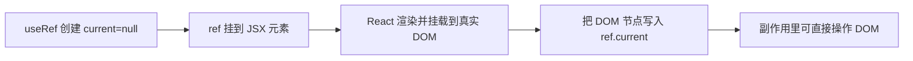

# useRef / forwardRef

`ref` 是 React 里的「逃生舱口」——当你需要绕过声明式渲染、直接抓住一个**可变值**或**真实 DOM**时用它。核心结论：

- **`useRef`** 给你一个 `{ current: ... }` 容器，改 `current` **不触发重渲染**，且跨渲染保持同一个对象。
- **`forwardRef`** 让父组件能把 `ref` 穿透到子组件内部的某个 DOM 上。
- **`useImperativeHandle`** 让子组件**自定义**它通过 ref 暴露给父组件的方法，而不是直接暴露整个 DOM。

## useRef 的两种用途

### 用途一：存可变值 (不触发渲染)

和 `useState` 的关键区别：**改 `ref.current` 不会让组件重渲染**。适合存「需要跨渲染记住、但变了不需要刷新界面」的东西，比如定时器 id、上一次的值。

```jsx
function Timer() {
  const timerId = useRef(null); // 第一步：建一个容器存 id

  function start() {
    // 第二步：把 setInterval 返回的 id 存进 current，改它不会重渲染
    timerId.current = setInterval(() => console.log('tick'), 1000);
  }

  function stop() {
    // 第三步：用存下来的 id 清除
    clearInterval(timerId.current);
  }

  return (
    <>
      <button onClick={start}>开始</button>
      <button onClick={stop}>停止</button>
    </>
  );
}
```

:::info
**为什么不用普通变量 `let id`？**
普通变量每次渲染都重新声明、重新初始化，存不住跨渲染的值。`useRef` 返回的对象在组件整个生命周期里**始终是同一个**，`current` 才能稳定保存。
:::

### 用途二：存 DOM 节点

```jsx
function SearchBox() {
  const inputRef = useRef(null); // 第一步：建容器

  // 第二步：挂载后 React 会把真实 DOM 塞进 inputRef.current
  useEffect(() => {
    inputRef.current.focus(); // 第三步：直接操作 DOM
  }, []);

  return <input ref={inputRef} />;
}
```



## forwardRef：把 ref 转发进子组件

普通组件**收不到 `ref`**——`ref` 不是普通 prop。父组件想拿到子组件内部的 `<input>`，要用 `forwardRef` 把 ref 转发进去。

```jsx
// 第一步：用 forwardRef 包裹，函数第二个参数才是父传来的 ref
const FancyInput = forwardRef(function FancyInput(props, ref) {
  // 第二步：把 ref 挂到内部真正的 DOM 上
  return <input ref={ref} className="fancy" {...props} />;
});

function Form() {
  const inputRef = useRef(null);

  // 第三步：现在父组件能直接拿到子组件内部的 input
  return (
    <>
      <FancyInput ref={inputRef} />
      <button onClick={() => inputRef.current.focus()}>聚焦</button>
    </>
  );
}
```

:::tip
React 19 起，函数组件可以**直接把 `ref` 当普通 prop 接收**，不再强制 `forwardRef`：

```jsx
function FancyInput({ ref, ...props }) {
  return <input ref={ref} {...props} />;
}
```

老项目仍大量使用 `forwardRef`，两种写法都要认识。
参考：https://react.dev/blog/2024/12/05/react-19#ref-as-a-prop
:::

## useImperativeHandle：别裸露整个 DOM

直接把内部 DOM 全暴露出去，父组件能乱改 (改样式、删节点)，破坏封装。`useImperativeHandle` 让子组件**只暴露想给的几个方法**。

```jsx
const VideoPlayer = forwardRef(function VideoPlayer(props, ref) {
  const videoRef = useRef(null); // 第一步：内部自己持有真实 DOM

  // 第二步：自定义对外暴露的「遥控器」，只给 play/pause，不给整个 video
  useImperativeHandle(ref, () => ({
    play: () => videoRef.current.play(),
    pause: () => videoRef.current.pause(),
  }));

  return <video ref={videoRef} src={props.src} />;
});

function App() {
  const playerRef = useRef(null);
  // 第三步：父组件只能 play/pause，碰不到底层 video 节点
  return (
    <>
      <VideoPlayer ref={playerRef} src="x.mp4" />
      <button onClick={() => playerRef.current.play()}>播放</button>
    </>
  );
}
```

## 形象记忆

`useRef` 像一个**贴了便利贴的抽屉**：抽屉 (那个对象) 一直是同一个，你随时换里面的便利贴 (`current`) 不会惊动任何人 (不重渲染)；而 `useState` 像**门口的公告栏**，一改就全楼通知 (重渲染)。

`forwardRef` 像给子组件**装了一根传声筒**，父亲的指令能直达孩子手里的工具 (DOM)；`useImperativeHandle` 则是孩子说「我只让你用这几个按钮 (play/pause)，工具本体不给你碰」。

## 参考

1. [useRef – React](https://react.dev/reference/react/useRef)
2. [forwardRef – React](https://react.dev/reference/react/forwardRef)
3. [useImperativeHandle – React](https://react.dev/reference/react/useImperativeHandle)

## 一句话口诀

> `useRef` 是不触发渲染的可变容器，存定时器 id 或 DOM；`forwardRef` 把 ref 转发进子组件 (React 19 后可当普通 prop)；`useImperativeHandle` 让子组件只暴露指定方法、不裸露 DOM。
