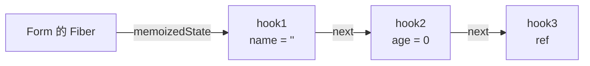
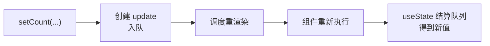

# useState 原理

**函数组件每次渲染都从头执行一遍,局部变量会重置——它能「记住」状态,靠的不是组件函数本身,而是挂在 Fiber 节点上的一条 hook 链表。** `useState` 做两件事:渲染时按调用顺序去链表里取出对应的状态;`setState` 时把更新塞进队列、再调度一次重渲染,而不是当场改值。

:::tip 形象记忆
函数组件像一个**每次开门都重新布置的房间**:你这次摆的家具,关门 (函数执行完) 就清空了。`useState` 相当于门外有个**带编号的储物柜** (Fiber 上的 hook 链表):每次进屋按顺序 (第 1 个柜子、第 2 个柜子……) 去取你上次存的东西。所以状态不在屋里,在柜子里;而「按顺序取」正是 Hooks 不能写在 `if` 里的原因——顺序一乱,柜子就对错号了。
:::

## 状态存在哪:Fiber 上的 hook 链表

函数组件没有实例 (不像类组件有 `this`),状态没法挂在组件自己身上。React 把它存到组件对应的 **Fiber 节点**上 (Fiber 是什么见 [Fiber 架构](./Fiber))。

一个组件里调用了多个 Hook,它们在 Fiber 上以**单向链表**串起来,顺序就是你写代码时的调用顺序:

```jsx
function Form() {
  const [name, setName] = useState('');    // hook 1
  const [age, setAge] = useState(0);       // hook 2
  const inputRef = useRef(null);           // hook 3
  // ...
}
```



每个 hook 节点存着自己的 `memoizedState` (当前值) 和一个更新队列。**React 不靠变量名 `name` / `age` 来认领状态,只靠「这是第几个 Hook」——即链表里的位置。**

:::warning 这就是 Hooks 两条铁律的由来
- **只在顶层调用 Hook,不能放进 `if` / 循环 / 嵌套函数**:一旦某次渲染少调用了一个 `useState`,后面所有 hook 的位置全部前移,取到的就是别人的状态。
- **只在函数组件 / 自定义 Hook 里调用**:链表挂在 Fiber 上,脱离渲染流程就没有 Fiber 可挂。
:::

## 两条路径:mount 与 update

`useState` 内部根据「是首次渲染还是更新」走两套逻辑:

- **mount (首次渲染)**:为这个 Hook **新建**一个节点,用初始值填好 `memoizedState`,接到链表末尾。
- **update (重渲染)**:不再用初始值,而是**沿链表取出上次那个 hook 节点**,把它待处理的更新算出来,得到新值。

所以 `useState(0)` 里的 `0` **只在 mount 时用一次**,之后的重渲染完全无视它——这也是为什么改了初始值参数、组件已经挂载后却不生效。

## setState 做了什么:入队 + 调度

调用 `setCount(...)` 触发的是 hook 内部的 **dispatch** 函数。它**不会立即修改状态**,而是:

1. 创建一个 update 对象 (记录这次要怎么改),挂到该 hook 的**更新队列** (环形链表) 上。
2. 标记这个 Fiber 需要更新,**调度**一次重新渲染。
3. 重渲染时,组件函数重新执行,`useState` 走 update 路径,把队列里攒的 update **依次结算**,算出最终值返回。



理解了「入队 + 重渲染才结算」,几个经典现象就都通了。

### 现象一:setState 之后当前行读不到新值

```jsx
const [count, setCount] = useState(0);

function handleClick() {
  setCount(count + 1);
  console.log(count); // 仍是 0,不是 1
}
```

`count` 是**本次渲染锁定的快照**——它只是当前这次执行里的一个常量 `0`。`setCount` 只是入队 + 安排下次渲染,不会回头改当前作用域的 `count`。新值要等下次渲染、`useState` 重新返回时才拿得到。

:::warning
别试图在 `setCount(...)` 的下一行 `console.log(count)` 等新值,永远是旧值。要在更新后做事,用 `useEffect(fn, [count])`。
:::

### 现象二:连续三次 +1,结果只 +1

```jsx
setCount(count + 1); // count 快照恒为 0 → 入队「改成 1」
setCount(count + 1); // 还是 0 → 入队「改成 1」
setCount(count + 1); // 还是 0 → 入队「改成 1」
// 结算:1
```

三次传的都是**值** `count + 1`,而 `count` 在这次渲染里恒为 `0`,所以三条 update 都是「把状态置为 1」,结算下来就是 `1`。

想真正累加,传**函数式更新**——React 结算队列时会把上一条的结果喂给下一条:

```jsx
setCount((c) => c + 1); // 0 → 1
setCount((c) => c + 1); // 1 → 2
setCount((c) => c + 1); // 2 → 3,结算:3
```

:::tip
凡是「新值依赖旧值」(计数、开关取反、往数组里追加),一律用函数式更新 `setX(prev => ...)`,绕开闭包快照的坑。
:::

### 现象三:批量更新

同一事件里的多次 `setState` 不会各渲染一次,而是攒进队列**合并成一次重渲染**,这叫**批处理 (batching)**,目的是省掉中间的无效渲染、避免界面闪烁。

```jsx
function handleClick() {
  setCount((c) => c + 1);
  setFlag((f) => !f);
  // 两个 state 都变了,但只触发一次重渲染
}
```

React 17 及以前,批处理**只在 React 事件处理函数里生效**;`setTimeout`、Promise、原生事件回调里的 `setState` 不合并,每次单独渲染。React 18 用 `createRoot` 启动后引入**自动批处理 (automatic batching)**,无论在哪里调用都会合并。

:::tip flushSync
若确实需要某次更新**立刻同步刷到 DOM** (比如紧接着要读更新后的布局),用 `flushSync` 跳出批处理:

```jsx
import { flushSync } from 'react-dom';

flushSync(() => setCount((c) => c + 1));
// 这一行之后,DOM 已是更新后的
```

代价是放弃批处理优化,别滥用。
:::

## 两个细节

**惰性初始化**:如果初始值要靠一段开销大的计算得来,给 `useState` 传**函数**,它只在 mount 时执行一次;直接传值则每次渲染都会重新求值 (虽然结果被丢弃,但计算照跑)。

```jsx
useState(() => expensiveInit(props)); // 只在首次渲染执行
useState(expensiveInit(props));       // 每次渲染都执行 expensiveInit,浪费
```

**同值 bailout**:`setState` 传入的新值经 `Object.is` 比较和当前值相等时,React 可能跳过这次重渲染。但要注意对象/数组改的是**同一个引用**时,`Object.is` 判定相等,界面不会更新——这正是「state 要不可变更新、得换新引用」的原因。

```jsx
// ❌ 改的是同一个数组引用,可能不触发更新
list.push(item);
setList(list);

// ✅ 换成新引用
setList([...list, item]);
```
