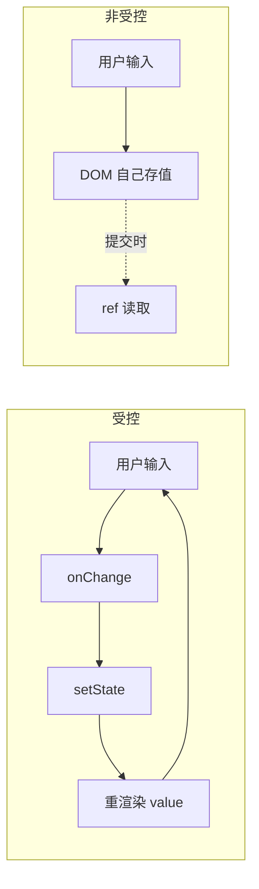

# 受控与非受控组件

区别只有一句：**表单值由谁掌管**。

- **受控组件**：值存在 React `state` 里，`value` 受 state 控制，每次输入靠 `onChange` 同步回 state。React 是唯一数据源。
- **非受控组件**：值存在 DOM 自己身上，React 不管，需要时用 `ref` 去读。

```jsx
// 受控：state 是唯一数据源
function Controlled() {
  const [name, setName] = useState('');
  return <input value={name} onChange={(e) => setName(e.target.value)} />;
}

// 非受控：值在 DOM 里，用 ref 读
function Uncontrolled() {
  const ref = useRef(null);
  const submit = () => console.log(ref.current.value);
  return <input ref={ref} defaultValue="" />;
}
```

:::warning
受控组件的初始值用 `value`，非受控用 `defaultValue` / `defaultChecked`。
若给 `value` 又不给 `onChange`，输入框会变成只读，React 会在控制台报警告。
:::

## 数据流对比



## 怎么选

| 维度 | 受控 | 非受控 |
|------|------|--------|
| 实时校验 / 格式化 | 容易 (每次输入都能拦截) | 难 |
| 联动 (A 变 B 跟着变) | 容易 | 难 |
| 代码量 | 多 (每个字段都要 state + onChange) | 少 |
| 性能 | 大表单每输入一次都重渲染 | 不重渲染 |
| 集成第三方非 React 库 | 别扭 | 自然 |
| 文件上传 `<input type="file">` | 不支持 (只能非受控) | 必须 |

:::tip
默认优先用**受控组件**，它让 state 成为唯一数据源，符合 React 单向数据流。
只有在「大表单性能敏感」「文件上传」「接入非 React 的 DOM 库」时才用非受控。
实战中复杂表单一般交给 `react-hook-form` 等库，它内部用非受控 + 订阅来兼顾性能和易用。
:::

## 参考

1. [Controlled and uncontrolled components – React](https://react.dev/reference/react-dom/components/input)
2. [react-hook-form](https://react-hook-form.com/)
