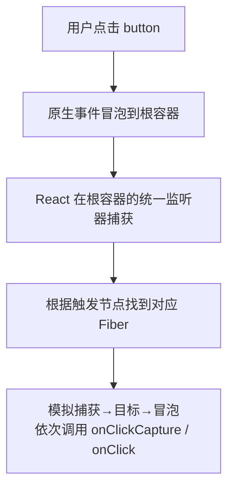

# 合成事件

你在 JSX 里写的 `onClick` **不是原生事件**，而是 React 的合成事件 (SyntheticEvent)。React 并没有把监听器绑到每个 DOM 节点上，而是**统一委托到根容器**，再由一套机制分发给对应组件。

```jsx
<button onClick={handleClick}>点我</button>
// handleClick 收到的 e 是 SyntheticEvent，不是原生 MouseEvent
```

## 为什么要做合成事件

1. **跨浏览器一致**：抹平不同浏览器的事件差异，`e.target`、`e.stopPropagation()` 等行为统一。
2. **性能 / 内存**：不给每个节点单独绑监听，而是事件委托到一个根节点，N 个按钮也只绑一次。
3. **与并发渲染配合**：React 能在统一入口里控制事件的优先级 (如点击是高优先、滚动是低优先)。

## 事件委托到 root

关键变化：**React 17 起，事件委托的目标从 `document` 改成了 React 应用挂载的根容器**。



React 17 之前委托到 `document` 会有问题：同页面多个 React 版本、或 React 嵌在非 React 页面里时，`document` 上的 `stopPropagation` 会互相干扰。改挂到根容器后，多个 React 应用互不影响。

## 与原生事件的区别

| 维度 | 合成事件 | 原生事件 |
|------|----------|----------|
| 绑定方式 | JSX 的 `onClick` 等 | `addEventListener` |
| 实际监听位置 | 委托到根容器，统一一个监听器 | 绑在具体 DOM 节点 |
| 命名 | 小驼峰 `onClick` `onMouseEnter` | 全小写 `click` `mouseenter` |
| 阻止冒泡 | `e.stopPropagation()` 只拦合成事件体系内 | `e.stopPropagation()` 拦原生冒泡 |
| 阻止默认 | 必须 `e.preventDefault()` (return false 无效) | 部分场景 return false 有效 |

:::warning
**混用原生事件和合成事件时，`stopPropagation` 有坑。**
原生事件先于合成事件触发 (合成事件要等冒泡到根容器才执行)。在子节点上用 `addEventListener` 绑的原生事件里调 `e.stopPropagation()`，会阻止事件冒泡到根容器，导致**外层的合成事件 `onClick` 收不到**。
尽量别混用；要混用时清楚两套体系的执行顺序：原生捕获 → 原生目标/冒泡 → 到达根容器 → React 模拟的合成事件捕获/冒泡。
:::

## 事件池 (已过时,但常被问)

React 16 及以前，SyntheticEvent 对象会被**复用** (事件池)：事件回调执行完，对象属性会被清空。所以异步访问 `e` 要先 `e.persist()`，否则拿到的是被回收的空对象。

:::info
**React 17 起已移除事件池**。现在可以放心在异步代码里访问合成事件对象，`e.persist()` 不再需要。面试若问到事件池，记得补一句「17 之后已废弃」。
:::

## 参考

1. [SyntheticEvent – React](https://react.dev/reference/react-dom/components/common#react-event-object)
2. [Changes to Event Delegation – React 17 升级说明](https://legacy.reactjs.org/blog/2020/08/10/react-v17-rc.html#changes-to-event-delegation)

## 一句话口诀

> JSX 的 `onClick` 是合成事件：不绑在节点上，而是**委托到根容器** (17 起，之前是 document) 统一分发，抹平浏览器差异。
> 别和原生事件混用 `stopPropagation`；事件池已在 17 移除。
