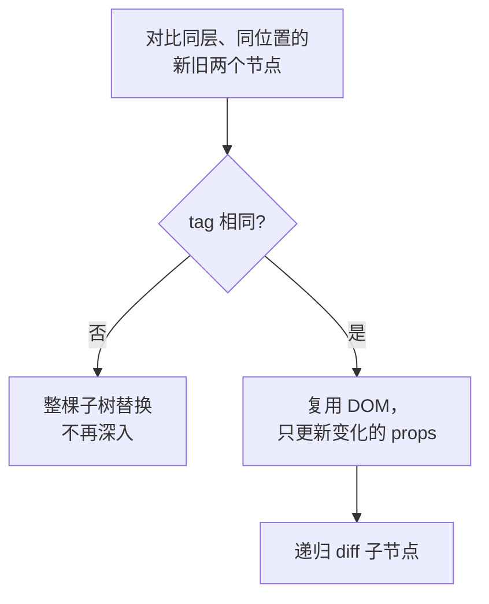

# 虚拟 DOM 与 diff

虚拟 DOM = **用 JS 对象描述真实 DOM 结构**。数据变化时，先在轻量的 JS 对象上算出「哪里变了」(diff)，再只把变化的部分更新到真实 DOM (patch)，避免整棵重建——这是 React / Vue 性能的基础。直接操作真实 DOM 慢，是因为会触发浏览器的重排重绘；先在 JS 里算差异就便宜得多。

## vnode 结构

一个 vnode 描述一个节点，只需三样：**标签、属性、子节点**。

```js
function h(tag, props, children) {
  return { tag, props: props || {}, children: children || [] };
}

// 描述 div#app 里套一个 span：
const vnode = h('div', { id: 'app' }, [h('span', {}, ['hi'])]);
```

## render：vnode → 真实 DOM

```js
function render(vnode) {
  // 文本节点：直接创建文本
  if (typeof vnode === 'string') {
    return document.createTextNode(vnode);
  }

  const el = document.createElement(vnode.tag);

  // 设置属性
  Object.entries(vnode.props).forEach(([key, value]) => {
    el.setAttribute(key, value);
  });

  // 递归渲染子节点并挂上去
  vnode.children.forEach((child) => {
    el.appendChild(render(child));
  });

  return el;
}
```

## diff + patch 的三条核心策略

**完整对比两棵树的开销是 O(n³)**(每个节点都可能移到任意位置，得两两比较再算最小编辑距离)，节点一多就不可接受。React 的做法不是「找出最小差异」，而是用**三条「偷懒假设」把复杂度压到 O(n)**——牺牲一点点理论最优解，换工程上够用的速度：

1. **只做同层比较**：两棵树逐层对比，一个节点只和旧树里**同一位置**的节点比，不跨层移动。
2. **tag 不同就整个替换**：标签都变了 (`<div>` → `<p>`)，认定是全新节点，销毁旧子树、重建新子树，不再深入比较。
3. **tag 相同就复用**：复用真实 DOM，只更新变化的 props，再递归比 children。



:::info 三条假设各自的赌注
- **不跨层移动**：把节点从一个层级整个挪到另一层级很少见，于是 React 对这种情况「删了重建」而非「移动」——所以别频繁改变 DOM 的层级结构。
- **tag 变了就换**：实践中标签都换了的两个节点，内部结构通常面目全非，逐个比对纯属浪费。
:::

简化版 patch（对比新旧 vnode，把差异更新到真实节点 `el`）：

```js
function patch(el, oldVnode, newVnode) {
  // 1. 类型/标签不同 → 直接替换
  if (
    typeof oldVnode !== typeof newVnode ||
    (typeof newVnode === 'string' && oldVnode !== newVnode) ||
    oldVnode.tag !== newVnode.tag
  ) {
    el.replaceWith(render(newVnode));
    return;
  }

  if (typeof newVnode === 'string') return; // 文本且相同，无需处理

  // 2. 同标签：更新有变化的属性
  patchProps(el, oldVnode.props, newVnode.props);

  // 3. 递归比较子节点
  const oldCh = oldVnode.children;
  const newCh = newVnode.children;
  const len = Math.max(oldCh.length, newCh.length);
  for (let i = 0; i < len; i++) {
    if (!oldCh[i]) {
      el.appendChild(render(newCh[i])); // 新增
    } else if (!newCh[i]) {
      el.removeChild(el.childNodes[i]); // 删除
    } else {
      patch(el.childNodes[i], oldCh[i], newCh[i]); // 递归比较
    }
  }
}

function patchProps(el, oldProps, newProps) {
  // 更新或新增属性
  Object.entries(newProps).forEach(([key, value]) => {
    if (oldProps[key] !== value) el.setAttribute(key, value);
  });
  // 删除"旧的有、新的没有"的属性
  Object.keys(oldProps).forEach((key) => {
    if (!(key in newProps)) el.removeAttribute(key);
  });
}
```

## key 的作用

列表是「同层的一组兄弟节点」，光按下标一一对比会很蠢。在头部插入一个元素：

```
旧: [A, B, C]
新: [X, A, B, C]   ← 只在头部插了个 X
```

按下标比：位置 0 的 `A` vs `X` 不同→改，位置 1 的 `B` vs `A` 不同→改……结论是「整列都变了」，**全部重建**。实际上只该插入一个 X。

`key` 就是给每个节点发的**身份证**。有了唯一 key，React 一眼认出「X 是新增的，A/B/C 还是原来那仨、只是各往后挪一位」，于是只插入 X、复用其余三个真实 DOM。

:::warning 别拿数组 index 当 key
用 `index` 当 key 等于没加——头部插入后，A 的 index 从 0 变 1、B 从 1 变 2……每个节点的「身份证号」全变了，React 照样判定全变。key 必须用**数据本身的稳定 id**，跟着数据走、不跟位置走。
:::

## 与 Fiber 的分工

这篇讲的是 **「比什么、怎么比」**——diff 决定新旧树之间哪些节点该复用、更新、删除。而**「这趟比较能不能中断、按什么优先级排、最后怎么提交到 DOM」**是 [Fiber 架构](./Fiber) 的事：diff 在 Fiber 的 render 阶段进行，给变化节点打上 effect 标记，再到 commit 阶段一次性刷进真实 DOM。
