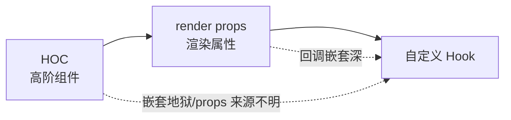

# 逻辑复用

React 复用的是**有状态的逻辑** (比如「订阅窗口尺寸」「拉取数据」)，不是 UI。历史上有三代方案，按出现顺序演进：**HOC → render props → 自定义 Hook**。结论先行：**今天默认用自定义 Hook**，前两者主要用于读懂老代码。



以同一个需求贯穿三种写法：**复用「实时获取鼠标位置」的逻辑**。

## 一、HOC (高阶组件)

定义：**接收一个组件、返回一个增强后新组件的函数**。把复用逻辑塞进外层包装组件，通过 props 注入给被包装组件。

```jsx
// 第一步：写一个函数，吃进一个组件 Wrapped
function withMouse(Wrapped) {
  // 第二步：返回一个新组件，逻辑写在这层
  return function WithMouse(props) {
    const [pos, setPos] = useState({ x: 0, y: 0 });

    useEffect(() => {
      const handle = (e) => setPos({ x: e.clientX, y: e.clientY });
      window.addEventListener('mousemove', handle);
      return () => window.removeEventListener('mousemove', handle);
    }, []);

    // 第三步：把结果通过 props 注入被包装组件
    return <Wrapped {...props} mouse={pos} />;
  };
}

// 使用：用 mouse 这个 prop，但不知道它从哪来
const Position = withMouse(({ mouse }) => <p>{mouse.x}, {mouse.y}</p>);
```

:::warning
HOC 的痛点：

- **嵌套地狱**：`withRouter(withTheme(withAuth(Comp)))`，调试时 DevTools 里一堆 `WithXxx` 包裹层。
- **props 来源不明**：组件里用了 `mouse`，但看不出是哪个 HOC 注入的，命名还可能冲突。
:::

## 二、render props

定义：**把「要渲染什么」作为一个函数 prop 传进去**，复用组件负责算出数据，调用这个函数把数据交还给使用方决定怎么渲染。

```jsx
// 第一步：复用组件自己管理状态
function Mouse({ render }) {
  const [pos, setPos] = useState({ x: 0, y: 0 });

  useEffect(() => {
    const handle = (e) => setPos({ x: e.clientX, y: e.clientY });
    window.addEventListener('mousemove', handle);
    return () => window.removeEventListener('mousemove', handle);
  }, []);

  // 第二步：不自己渲染 UI，而是把数据交给传进来的 render 函数
  return render(pos);
}

// 使用：数据来源清晰，但回调嵌套
function App() {
  return <Mouse render={(pos) => <p>{pos.x}, {pos.y}</p>} />;
}
```

比 HOC 好在**数据来源一目了然** (就在 `render` 的参数里)，但多个 render props 嵌套时一样会形成「回调金字塔」。

## 三、自定义 Hook (现代首选)

定义：**一个 `use` 开头的函数，内部调别的 Hook，把逻辑和状态封装起来直接返回数据**。没有额外组件层、没有嵌套。

```jsx
// 第一步：抽成 use 开头的函数
function useMouse() {
  const [pos, setPos] = useState({ x: 0, y: 0 });

  // 第二步：逻辑原样搬进来
  useEffect(() => {
    const handle = (e) => setPos({ x: e.clientX, y: e.clientY });
    window.addEventListener('mousemove', handle);
    return () => window.removeEventListener('mousemove', handle);
  }, []);

  // 第三步：直接 return 数据
  return pos;
}

// 使用：像调普通函数一样，无嵌套、来源清晰
function App() {
  const pos = useMouse();
  return <p>{pos.x}, {pos.y}</p>;
}
```

## 三者对比

| 维度 | HOC | render props | 自定义 Hook |
|------|-----|--------------|-------------|
| 形态 | 函数包组件、返回新组件 | 函数 prop 回传数据 | `use` 函数返回数据 |
| 嵌套问题 | 包裹层叠加 (wrapper hell) | 回调金字塔 | 无嵌套 |
| 数据来源 | 不清晰 (隐式注入 props) | 清晰 (函数参数) | 清晰 (返回值) |
| 多个复用叠加 | 越叠越深 | 越嵌越深 | 平铺多调几次即可 |
| 适用 | 老库、需要包裹整棵子树 | 老代码、需控制渲染时机 | 默认首选 |

:::tip
**HOC 和 render props 没死透**——类组件无法用 Hook，老库 (如部分 react-redux 旧版、`react-router` v5 的 `withRouter`) 仍是 HOC；需要「由父组件控制子树渲染时机」的场景 render props 仍有用。但新写的函数组件逻辑复用，**优先自定义 Hook**。
:::

## 形象记忆

同样是「请人帮你算鼠标位置」：

- **HOC** 像**代收快递的门卫**：你的包裹 (组件) 先送到门卫那 (包裹一层)，门卫贴个标签 (注入 props) 再转交给你。包裹多了，门卫摞门卫，你都不知道哪张标签谁贴的。
- **render props** 像**你给厨师递个空盘子 (回调) 说「菜做好放这个盘里」**：厨师算好数据放进你的盘子，你拿回来自己摆盘。盘子套盘子就乱了。
- **自定义 Hook** 像**直接打个电话问「鼠标在哪」**：`const pos = useMouse()`，一句话拿到答案，不用包裹、不用递盘子。

## 参考

1. [Reusing Logic with Custom Hooks – React](https://react.dev/learn/reusing-logic-with-custom-hooks)
2. [Higher-Order Components (legacy) – React](https://legacy.reactjs.org/docs/higher-order-components.html)
3. [Render Props (legacy) – React](https://legacy.reactjs.org/docs/render-props.html)

## 一句话口诀

> 逻辑复用三代：HOC (包组件、props 来源不明)、render props (回调回传、易嵌套)、自定义 Hook (一句话拿数据、无嵌套)。
> 新代码默认自定义 Hook，前两者主要用来读懂老项目。
