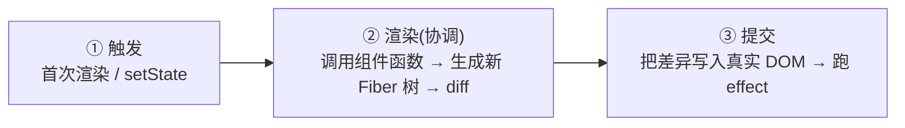
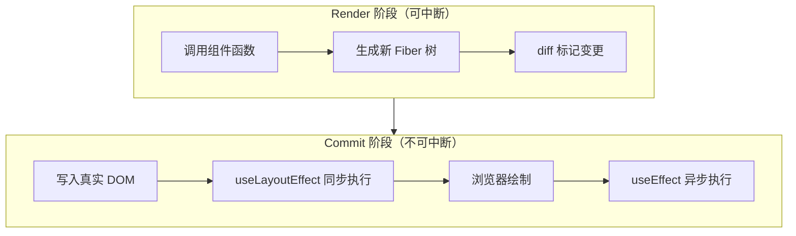

# 重新渲染机制

**结论先行**：React 的一次「渲染」不是直接改 DOM，而是分三步走——**触发 (Trigger) → 渲染 (Render) → 提交 (Commit)**。只有最后一步才真正操作 DOM。所谓「组件重新渲染」，指的是 React **再次调用组件函数**算出一份新的 UI 描述，再和上一份对比，找出差异。



## 三个阶段

### ① 触发：什么时候开始渲染

只有两种情况会触发渲染：

1. **首次渲染**：`createRoot(...).render(<App />)`，应用启动时的初始渲染。
2. **状态更新**：组件调用 `setState`（类组件）或 `useState` / `useReducer` 的 dispatch（函数组件）。每次 `set` 都会把这个组件**排进一次更新队列**，触发它和它子树的重新渲染。

```js
function Counter() {
  const [count, setCount] = useState(0);
  // 点击 → setCount → 触发 Counter 重新渲染
  return <button onClick={() => setCount(count + 1)}>{count}</button>;
}
```

:::info
更新是**排队**而非立即执行的。同一事件里多次 `setCount` 会被**批处理**合并成一次渲染，详见 [setState 批量更新](./setState-batching)。
:::

### ② 渲染：调用组件函数，算出新 UI

「渲染」这个词最容易被误解。它的实际动作只有：**React 调用你的组件函数**（或类组件的 `render()`），拿到返回的 JSX——也就是一棵描述「页面应该长什么样」的 **React 元素树**。

- 首次渲染：得到整棵元素树。
- 更新渲染：从触发更新的组件往下，重新调用这些组件函数，得到一棵新树。

拿到新树后，React 进入**协调 (Reconciliation)**：把新树和上一次的树做 **diff**，标记出「哪些节点要新增、删除、更新」。这一步在内存里完成，**不碰真实 DOM**。diff 的具体规则（同层比较、key 的作用）见 [虚拟 DOM 与 diff](./虚拟dom与diff)。

:::warning
**重渲染 ≠ 操作 DOM**。渲染只是「重新执行函数 + 算 diff」，如果 diff 出来没差异，DOM 一动不动。所以大多数重渲染其实很便宜——这也是 [重渲染优化](./重渲染优化) 的前提：先别焦虑，热点才优化。
:::

### ③ 提交：把差异写入 DOM

协调算出差异后，React 进入**提交阶段**：把这些差异**一次性**应用到真实 DOM（增删节点、改属性）。提交完成后：

- 浏览器重新绘制屏幕。
- React 按时机执行副作用：`useLayoutEffect` 在 DOM 变更后、浏览器绘制前**同步**执行；`useEffect` 在绘制后**异步**执行。

## Render 可中断，Commit 不可中断

这是 React 16+ **Fiber 架构** 带来的关键特性：

| 阶段 | 能否中断 | 说明 |
| --- | --- | --- |
| **Render（协调）** | ✅ 可中断、可丢弃、可重来 | 纯计算，没有副作用。并发模式下高优先级更新（如用户输入）可以打断正在进行的低优先级渲染 |
| **Commit（提交）** | ❌ 必须一次性同步做完 | 直接操作 DOM，中途打断会让界面停在不一致的中间态 |

正因为 Render 阶段可被打断重来，**组件函数必须保持纯净**——同样的输入给出同样的输出，不在渲染期间产生副作用，否则被打断重跑时会出问题。Fiber 如何把渲染拆成可中断的小单元，见 [Fiber](./Fiber)。



## 哪些情况触发重渲染

一句话：**自身 `state` 变、父组件重渲染、消费的 `Context` value 变**，三者之一即触发。其中最反直觉的是「父组件一渲染，整棵子树默认全部跟着重渲染，不管 props 变没变」。如何拦截这些不必要的重渲染，是 [重渲染优化](./重渲染优化) 的主题。

## 形象记忆

把一次渲染想成**装修房子**：

- **触发** = 业主提了新需求（state 变了）。
- **渲染（协调）** = 设计师在图纸上画新方案、和旧图纸对比圈出要改的地方（diff）——**只动图纸，不动墙**，画到一半还能停下来改优先级。
- **提交** = 施工队照圈出的差异动工改墙（操作 DOM）——**一旦开砸就得一气呵成**，不能拆一半停工。

## 参考

1. [Render and Commit – React](https://react.dev/learn/render-and-commit)
2. [State as a Snapshot – React](https://react.dev/learn/state-as-a-snapshot)
3. [React 中的 Reconciliation](https://react.dev/learn/preserving-and-resetting-state)
