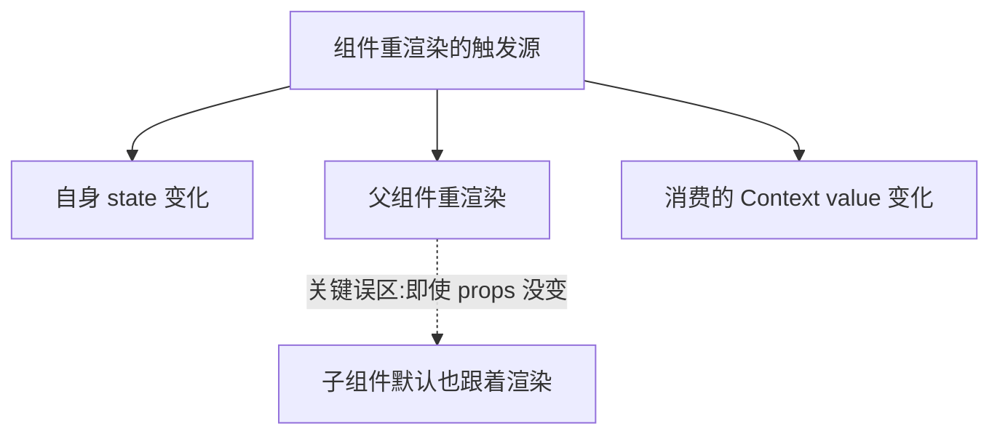
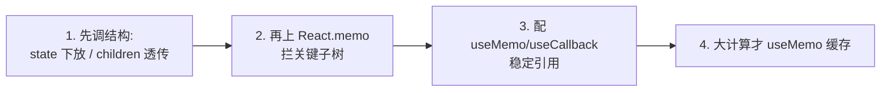

# 重渲染优化

先记住组件**何时会重渲染** (三种情况)，再谈怎么减少。结论：

1. **自身 `state` 变了**。
2. **父组件重渲染了** (默认会带着所有子组件一起重渲染，无论 props 变没变)。
3. **它消费的 `Context` value 变了**。



:::warning
**最大的认知误区：「props 没变子组件就不会重渲染」是错的。**
默认情况下，父组件一渲染，整棵子树**全部**重渲染，跟 props 变没变无关。要拦住，得显式用 `React.memo`。
:::

## 重渲染 ≠ 重新操作 DOM

先消除焦虑：**重渲染 (re-render) 只是重新执行组件函数 + 跑一遍 diff**，不等于真的改 DOM。diff 后没差异就不动 DOM。所以**大部分重渲染其实很便宜**，不值得优化。只在「组件树大、计算重、或高频触发」时才出手。

## 优化手段汇总

### 1. React.memo —— 拦住「父渲染带崽」

```jsx
// 父组件 state 变化时，Child 不再无脑跟着渲染，只在 props 浅比较变化时才渲
const Child = React.memo(function Child({ name }) {
  return <p>{name}</p>;
});
```

前提：传给它的 props 引用要稳定，否则 memo 白搭 (见 `useMemo / useCallback / memo` 一文)。

### 2. useMemo / useCallback —— 稳定引用

让传给 memo 子组件的对象/函数引用不变，使 memo 真正生效；也用于缓存昂贵计算。

```jsx
const handleClick = useCallback(() => doSth(id), [id]); // 引用稳定
const sorted = useMemo(() => bigList.sort(cmp), [bigList]); // 重计算只在依赖变时跑
```

### 3. state 下放 (colocation) —— 缩小渲染半径

把 state 放到**真正用到它的最小子树**里，别放在大组件顶层。state 在哪，渲染就从哪开始，放得越低、波及越小。

```jsx
// ❌ 输入框 state 放在顶层，每次输入整个 Page 重渲染
function Page() {
  const [text, setText] = useState('');
  return (
    <>
      <input value={text} onChange={(e) => setText(e.target.value)} />
      <HugeExpensiveTree /> {/* 跟着遭殃，每次输入都重渲染 */}
    </>
  );
}

// ✅ 把 input 和它的 state 一起下放到小组件，HugeExpensiveTree 不再受影响
function SearchInput() {
  const [text, setText] = useState('');
  return <input value={text} onChange={(e) => setText(e.target.value)} />;
}
function Page() {
  return (
    <>
      <SearchInput />
      <HugeExpensiveTree />
    </>
  );
}
```

### 4. children 透传 (内容提升) —— 不用 memo 也能拦

把会频繁变的部分作为 `children` 从更上层传进来。**因为 `children` 是上层创建好的 React 元素，下层组件重渲染时这个元素引用没变，React 就跳过它的重渲染。**

```jsx
// 第一步：Counter 自己管 count，但把不相关的内容作为 children 接收
function Counter({ children }) {
  const [count, setCount] = useState(0);
  return (
    <div onClick={() => setCount((c) => c + 1)}>
      <p>{count}</p>
      {children} {/* 第二步：children 由外层创建，count 变时它引用不变，不重渲染 */}
    </div>
  );
}

// 第三步：使用时把昂贵组件塞进 children
function App() {
  return (
    <Counter>
      <HugeExpensiveTree /> {/* count 怎么变都不会重渲染它 */}
    </Counter>
  );
}
```

:::info
**为什么 children 透传能免渲染？**
`<HugeExpensiveTree />` 这个元素是在 `App` 里创建的，作为 prop 传给 `Counter`。`Counter` 因 `count` 重渲染时，并不会重新创建 `children` 那个元素 (它来自父级、引用不变)，React diff 时发现是同一个元素就直接复用。本质和 memo 异曲同工，但**不用包 memo**。
:::

### 5. 状态合并 / 拆分得当、列表加稳定 key

- 列表项用稳定唯一的 `key` (别用 index)，避免 diff 误判导致整列重建。
- 别把无关 state 塞进一个大对象，改一个字段连带其它消费者一起渲染。

## 优化优先级



:::tip
**先靠组件结构解决 (下放、透传)，再考虑 memo 系列。** 结构调整往往比到处包 memo 更干净、更不易出 bug。优化前用 React DevTools Profiler 的「高亮重渲染」定位真正的热点，别凭感觉乱优化。
:::

## 形象记忆

组件树像一栋楼，重渲染像**拉警报**：默认警报一响 (父组件渲染)，整栋楼跟着疏散 (全子树重渲染)。

- `React.memo` = 给某层楼装**门禁**，没新情况 (props 没变) 就不疏散。
- **state 下放** = 把警报器从大堂搬到**具体房间**，只惊动那一间，不闹全楼。
- **children 透传** = 让某些住户**从楼外搬进来住** (children 由上层创建)，楼内拉警报跟他们无关。

## 参考

1. [Render and Commit – React](https://react.dev/learn/render-and-commit)
2. [memo – React](https://react.dev/reference/react/memo)
3. [Before You memo() – Dan Abramov](https://overreacted.io/before-you-memo/)

## 一句话口诀

> 重渲染三因：自身 state 变、父组件渲染 (默认带崽)、Context value 变。
> 减负优先调结构 (state 下放、children 透传)，再上 `memo` + 稳定引用；且记住重渲染≠改 DOM，多数没必要优化。
