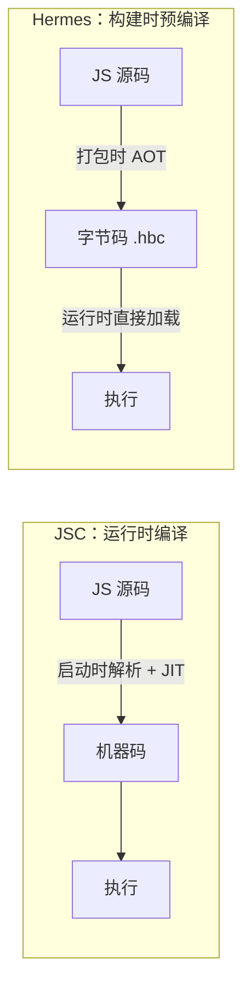

# RN 的 JS 引擎

JS 引擎是 RN 里真正 **执行 JS 代码** 的程序：解析 (或加载字节码)、编译、运行你写的业务逻辑和 React 协调。它跑在 [JS 线程](./架构与运行原理#线程模型) 上，是引擎和线程的「厨师与厨房」关系——引擎可换，线程不变。

RN 历史上用过两个引擎：早期的 **JSC**，和现在默认的 **Hermes**。

## JSC (JavaScriptCore)

JSC 是 Apple 为 Safari 开发的 JS 引擎，也是 RN 早期唯一选择。iOS 上系统自带 JSC，Android 上 RN 会打包一份进来。

JSC 走的是浏览器引擎的常规路线：**运行时解析 + JIT (Just-In-Time) 即时编译** 。应用启动时,引擎要先把整包 JS 源码解析、编译成机器码才能执行。

这套机制在浏览器里没问题——网页代码量小、JIT 能在热点代码上持续优化。但搬到移动端就暴露两个短板：

1. **启动慢** ：每次冷启动都要重新解析和编译整个 bundle，bundle 越大启动越慢。
2. **内存高** ：JIT 需要把编译后的机器码缓存在内存里，占用大。

:::info
iOS 出于安全限制 (W^X，内存页不能同时可写可执行) 实际禁用了第三方 App 的 JIT，所以 RN 在 iOS 上的 JSC 跑的是更慢的解释模式，进一步放大了启动和执行的劣势。
:::

## Hermes

Hermes 是 Meta 专门为 RN 定制的轻量 JS 引擎，2019 年开源，RN 0.70+ 起成为 **默认引擎** 。它针对移动端的核心思路是 **AOT (Ahead-Of-Time) 预编译** ：

把「解析 + 编译」这步从 **运行时** 提前到 **构建时** 。打包时就把 JS 编译成 **字节码** (`.hbc`)，运行时引擎直接加载字节码执行，不再解析源码、不再 JIT。

省去运行时编译这一步，换来三个收益：启动快、内存低、包体可控。

## JSC vs Hermes

| 维度 | JSC (JavaScriptCore) | Hermes |
| --- | --- | --- |
| 编译方式 | 运行时解析 + JIT | 构建时 AOT 预编译为字节码 |
| 启动速度 (TTI) | 慢，启动时才编译 | 快，省去解析编译 |
| 内存占用 | 高 (JIT 缓存机器码) | 低 |
| 峰值执行性能 | JIT 热点优化后可能更高 | 无 JIT，纯字节码解释执行 |
| 调试 | 依赖外部工具 | 内置调试支持，集成 Chrome DevTools |
| 来源 | Apple，通用浏览器引擎 | Meta，为 RN 定制 |

:::info
**TTI (Time To Interactive)** 指从启动到可交互的时间，是衡量引擎收益最直观的指标。Hermes 对 **中低端机型** 收益最明显——这些机器 CPU 弱，省下运行时编译的开销立竿见影。高端机上两者启动差距会缩小。
:::

:::tip
Hermes 没有 JIT，理论上 **CPU 密集型纯计算** (大量循环、复杂运算) 的峰值性能可能不如 JSC 的 JIT 优化后。但 RN 应用的瓶颈绝大多数在启动、UI 和通信，不在纯计算，所以 Hermes 的整体体验更优。
:::

## 与新架构的关系

引擎的可替换性正是靠 [JSI](./架构与运行原理#新架构-jsi) 实现的：JSI 是引擎之上的 C++ 抽象层，不绑定具体引擎。只要引擎实现了 JSI 接口，RN 就能在 JSC 和 Hermes 之间平滑切换，上层业务代码无感知。Hermes 与新架构 (JSI + Fabric + TurboModules) 是配套设计、协同最佳的组合。

## 参考

1. [Hermes 引擎官方文档](https://reactnative.dev/docs/hermes)
2. [Hermes 项目主页](https://hermesengine.dev/)
