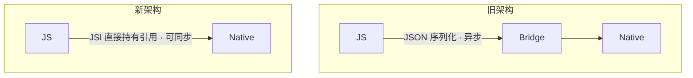

# React Native 性能优化

RN 性能优化的核心矛盾只有一条:**JS 逻辑跑在 JS 线程,界面绘制跑在原生 UI 线程,两条线程靠通信协作**。一旦 JS 线程被占满,或两条线程间通信过载,界面就掉帧。下面所有手段,本质都是在「**别堵 JS 线程、别让两线程之间塞车**」上做文章。


形象例子:JS 线程是**厨房后厨**(出菜单决定做什么),Shadow 线程是**配菜区**(算每盘怎么摆),UI 线程是**前厅服务员**(把菜端上桌、接客人需求)。后厨忙到瘫(JS 长任务),前厅再勤快,客人也只能干等——这就是 RN 卡顿的典型现场。

## 启动 / 首屏:让它秒开

- **bundle 拆分**:把首屏不需要的代码拆出去,首屏只加载必要 bundle,减小初始解析量。
- **Hermes 引擎**:Facebook 为 RN 定制的轻量 JS 引擎,支持**字节码预编译**——构建时就把 JS 编译成字节码,运行时省去解析,**显著缩短启动时间(TTI)、降低内存**。RN 0.70+ 默认开启。
- **内联 require**:把 `import` 改成用到时才 `require`,让模块**懒加载**,避免启动时一次性求值所有模块。
- 目标是**秒开**:首屏只做最少的事,其余延后。

## 列表性能:虚拟化是底线

长列表是 RN 最常见的性能杀手。绝不要用 `ScrollView` 渲染长列表,用虚拟化列表 `FlatList` / `SectionList`:

| 维度 | `ScrollView` | `FlatList` |
| --- | --- | --- |
| 渲染策略 | 一次性全量渲染所有子项 | 虚拟化,只渲染可视区域附近的项 |
| 内存 | 列表越长占用越高 | 稳定,回收屏幕外的项 |
| 适用 | 少量、数量固定的内容 | 长列表、不定长数据 |

`FlatList` 关键 props:

| prop | 作用 |
| --- | --- |
| `keyExtractor` | 提供稳定 key,避免重排时整列表重渲染 |
| `getItemLayout` | 提前告知每项尺寸,跳过测量,支持快速跳转滚动 |
| `windowSize` | 可视区前后保留的渲染窗口大小(单位为屏) |
| `initialNumToRender` | 首屏渲染的项数,调小可加快首屏 |
| `maxToRenderPerBatch` | 每批增量渲染的项数,控制滚动时的渲染节奏 |
| `removeClippedSubviews` | 移除屏幕外子视图,省内存(注意可能引入个别渲染 bug,按需开启) |

```jsx
// 固定高度的列表项:配 getItemLayout 让滚动/跳转免去测量
<FlatList
  data={items}
  keyExtractor={(item) => item.id}
  renderItem={renderRow}            // 提到组件外,不要写成内联箭头
  getItemLayout={(_, index) => ({
    length: ROW_HEIGHT,
    offset: ROW_HEIGHT * index,
    index,
  })}
  removeClippedSubviews
/>
```

## 减少 re-render

RN 的组件就是 React 组件,re-render 治理和 Web 一致:

```jsx
const renderItem = useCallback(({ item }) => <Row data={item} />, []);

const Row = React.memo(function Row({ data }) {
  return <Text>{data.title}</Text>;
});
```

- **`React.memo`** 包裹纯展示组件,props 没变就跳过重渲染。
- **`useCallback` / `useMemo`** 缓存传给子组件的函数和对象,避免每次渲染都给出新引用、击穿 `memo`。
- **避免在 render 中创建新对象/新函数**(如 `style={{ margin: 8 }}`),否则每次都触发子组件重渲染;把内联样式提到 `StyleSheet.create`。
- 列表项尤其要做:一个长列表里子项无谓重渲染,代价是成百上千次。

## 动画:别在 JS 线程上跑

动画每帧都要更新,如果跑在 JS 线程,JS 一忙动画就掉帧:

| 方案 | 运行线程 | 限制 |
| --- | --- | --- |
| `Animated` + `useNativeDriver: true` | UI 线程 | 仅支持 `transform` 和 `opacity`,不能驱动布局属性(如 `width`) |
| `react-native-reanimated` | UI 线程(Worklet) | 几乎无限制,复杂手势动画首选 |

```jsx
// 把动画交给原生线程,JS 线程繁忙也不掉帧
Animated.timing(opacity, {
  toValue: 1,
  duration: 300,
  useNativeDriver: true, // transform / opacity 才支持
}).start();
```

:::tip
能用 `react-native-reanimated` 就用它 —— Worklet 在 UI 线程执行,JS 线程繁忙也不掉帧。普通过渡动画用 `Animated` 时务必开 `useNativeDriver: true`。
:::

## JS↔Native 通信与新架构

这是 RN 最底层的性能议题。**旧架构**靠一座 **Bridge**:JS 线程和原生线程之间所有通信都要**序列化成 JSON、异步传过桥**。问题:

- **异步**:JS 要拿原生结果得等一个来回,做不了同步调用。
- **批量序列化瓶颈**:高频通信(如跟手滚动、连续动画)时,大量消息挤在桥上排队,序列化开销累积成卡顿。

**新架构**(RN 0.68+ 逐步铺开,0.76 起默认)拆掉了 Bridge:



- **JSI**(JavaScript Interface):一个 C++ 层,让 JS **直接持有原生对象引用并同步调用**,不再走 JSON 序列化。是新架构的地基。
- **Fabric**:基于 JSI 的新渲染系统,渲染更快、支持同步布局、并发特性。
- **TurboModules**:原生模块按需懒加载,且通过 JSI 同步调用,启动更快。
- **Hermes**:与新架构配套,字节码 + JSI 协同。

## 内存与图片

- 图片按**显示尺寸**加载,别把 4000px 大图塞进 100px 的位置——既费内存又费解码。
- 图片缓存:RN 内置 `Image` 缓存有限,长列表大量图片用 **`FastImage`**(基于原生 SDWebImage/Glide,缓存和优先级更可控),屏幕外懒加载。
- 长列表开 `removeClippedSubviews` 回收屏外视图;及时释放大对象、解绑监听与定时器,避免组件卸载后 JS 线程内存持续上涨触发 GC 卡顿。

:::warning
**性能测试必须在 release 包上做**。debug 模式带着开发工具和未压缩代码,性能远低于真实上线表现,测出来的数据没有参考价值。
:::

## 参考

- [Performance Overview - React Native](https://reactnative.dev/docs/performance)
- [Using Hermes - React Native](https://reactnative.dev/docs/hermes)
- [Optimizing FlatList Configuration - React Native](https://reactnative.dev/docs/optimizing-flatlist-configuration)
- [The New Architecture - React Native](https://reactnative.dev/architecture/landing-page)
- [react-native-reanimated 文档](https://docs.swmansion.com/react-native-reanimated/)
