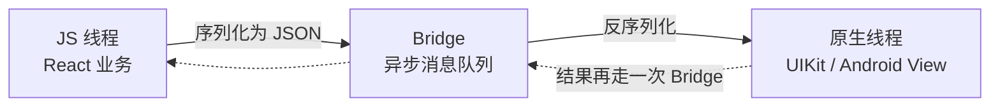
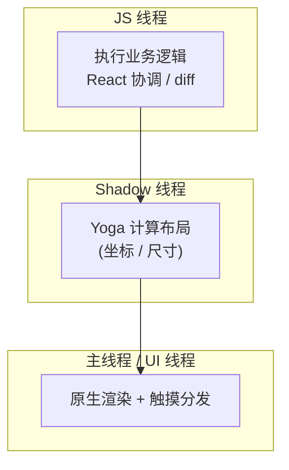

# RN 架构与运行原理

RN 让 JS 写出 **真原生 UI** ：JS 负责业务逻辑和 React 协调，原生侧负责渲染真正的平台控件 (`UIView` / `ViewGroup`)。理解 RN 的关键，是理解 **JS 与原生如何分线程运行** ，以及 **新旧架构在通信这件事上的根本差异** 。

## 旧架构 Bridge vs 新架构 JSI

一句话区分：**旧架构靠异步消息桥 (Bridge) 跨线程传 JSON，新架构靠 JSI 让 JS 直接同步调用原生对象。**

### 旧架构 Bridge

JS 侧和原生侧是两个独立运行时，互相不可见。任何调用 (调原生模块、更新 UI) 都要打包成消息，经 Bridge 异步传递。

Bridge 的三个性能瓶颈：

1. **异步，拿不到同步返回值** 。JS 调原生方法不能立即拿结果，只能等回调或 Promise，无法实现「读取布局后同步决定下一步」这类逻辑。
2. **JSON 序列化开销** 。所有参数必须可序列化成 JSON，传一个大列表或频繁通信时序列化/反序列化本身就很贵。
3. **消息批量排队** 。调用被批量塞进队列异步发送，高频交互 (如滚动、手势跟手动画) 容易因排队延迟而掉帧。

### 新架构 JSI

新架构 (RN 0.68+ 起逐步默认，0.76 起全面启用) 以 **JSI (JavaScript Interface)** 为基石。JSI 是一层轻量 **C++ 抽象** ，让 JS 引擎能直接持有原生对象的引用并 **同步调用** ，彻底绕开 JSON 序列化和异步队列。

新架构四大件 + 布局引擎：

| 组件 | 作用 |
| --- | --- |
| **JSI** | C++ 抽象层，JS 直接持有原生对象引用并同步调用，是其余三件的基础 |
| **Fabric** | 新渲染器，C++ 实现，JS 与原生共享同一棵 Shadow Tree，支持同步布局与并发渲染 |
| **TurboModules** | 新一代原生模块，按需 **懒加载** (用到才初始化)，启动更快 |
| **Codegen** | 根据类型定义 (`.ts` 接口规范) 自动生成 JS 与原生之间的胶水代码，保证类型安全 |
| **Yoga** | 跨平台 Flexbox 布局引擎，把样式算成具体坐标尺寸 (新旧架构都用) |

### 新旧架构对比

| 维度 | 旧架构 (Bridge) | 新架构 (JSI) |
| --- | --- | --- |
| 通信方式 | 异步消息 + JSON 序列化 | 同步直接调用，无序列化 |
| 原生模块加载 | 启动时全部初始化 | TurboModules 按需懒加载 |
| 渲染器 | Paper (旧渲染器) | Fabric (C++，共享 Shadow Tree) |
| 同步能力 | 不支持，全异步 | 支持同步布局、并发渲染 |
| 引擎绑定 | JS 与原生隔离 | JSI 把 JS 引擎与原生对象直接绑定 |
| 代码生成 | 手写胶水代码 | Codegen 按类型自动生成 |

:::info
JSI 不依赖具体的 JS 引擎，它是引擎之上的抽象。正因为如此，RN 才能从 JSC 平滑切换到 Hermes —— 只要引擎实现了 JSI 接口即可。
:::

## 线程模型

RN 运行时有三条 **核心线程** ，理解它们的分工就能解释大部分性能问题。

| 线程 | 职责 | 卡住的后果 |
| --- | --- | --- |
| **JS 线程** | 跑业务逻辑、React 协调与 diff | JS 逻辑过重时，事件响应和动画变慢 |
| **主线程 / UI 线程** | 原生控件渲染、触摸事件分发 | 直接掉帧、界面卡死 |
| **Shadow 线程** | 跑 Yoga 算布局 | 布局计算阻塞 |

「三线程」是简化模型，实际运行时还有 **原生模块线程池** ：每个原生模块 (TurboModule) 可以指定自己的后台队列，把耗时操作 (网络、文件 IO、数据库) 放到独立线程跑，避免阻塞上面三条线程。所以严格说线程数不止三条，但需要重点理解的就是上面这三条主线程。

:::info
**JS 引擎不等于 JS 线程**：JS 引擎 (Hermes / JSC) 是负责执行 JS 代码的程序，跑在 **JS 线程** 这条操作系统线程之上——引擎是「厨师」，线程是「厨房」。引擎可替换 (JSC 换 Hermes)，线程还是那条线程。因为一个引擎实例只绑定一条 JS 线程，二者一一对应，所以口语里常被当成一回事。引擎本身的细节见 [JS 引擎](./JS引擎)。
:::

:::info
**主线程就是 UI 线程**，在 RN 语境里两个词指同一条线程——平台原生 UI 的渲染和触摸分发都在它上面。下文 `reanimated` 把动画搬到的「UI 线程」，指的正是这条主线程。
:::

:::warning
**动画跑在 JS 线程容易掉帧** ：JS 线程一旦被业务逻辑占满，每帧动画的计算就赶不上 60fps。这正是 `react-native-reanimated` 把动画逻辑搬到 **UI 线程** (Worklet) 执行的根本原因 —— 即使 JS 线程繁忙，动画依旧流畅。
:::

## 参考

1. [React Native 新架构官方文档](https://reactnative.dev/architecture/landing-page)
