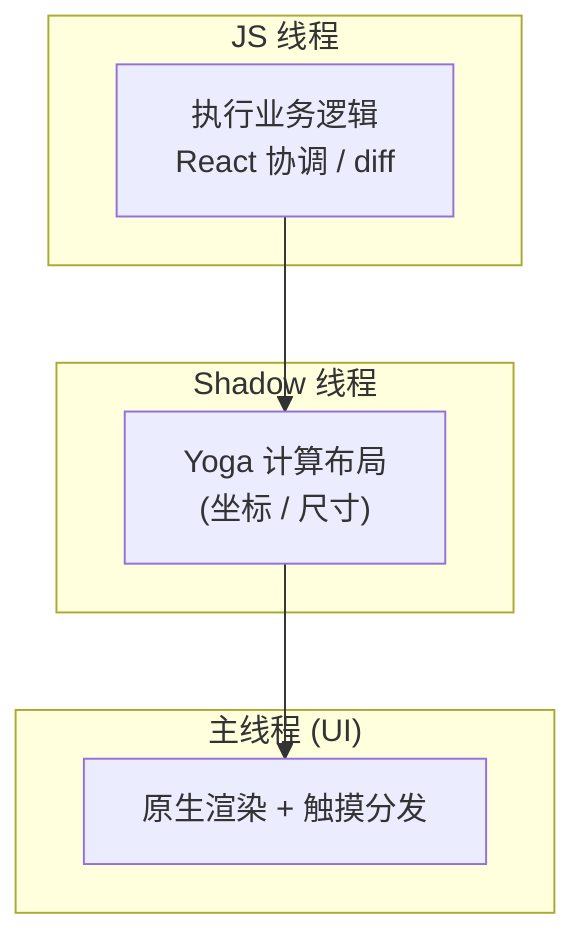

# React Native 核心原理与高频考点

RN 让 JS 写出**真原生 UI** ：JS 负责业务逻辑和 React 协调，原生侧负责渲染真正的平台控件 (`UIView` / `ViewGroup`)，两者之间的通信方式决定了整个框架的性能上限。理解 RN，关键是理解 **JS 与原生如何通信** 以及 **新旧架构在这件事上的根本差异** 。

## 架构：旧 Bridge vs 新 JSI

这是 RN 最重要的考点。一句话区分：**旧架构靠异步消息桥 (Bridge) 跨线程传 JSON，新架构靠 JSI 让 JS 直接同步调用原生对象。**

### 旧架构 Bridge

JS 侧和原生侧是两个独立运行时，互相不可见。任何调用 (调原生模块、更新 UI) 都要打包成消息，经 Bridge 异步传递。


Bridge 的三个性能瓶颈：

1. **异步，拿不到同步返回值** 。JS 调原生方法不能立即拿结果，只能等回调或 Promise，无法实现「读取布局后同步决定下一步」这类逻辑。
2. **JSON 序列化开销** 。所有参数必须可序列化成 JSON，传一个大列表或频繁通信时序列化/反序列化本身就很贵。
3. **消息批量排队** 。调用被批量塞进队列异步发送，高频交互 (如滚动、手势跟手动画) 容易因排队延迟而掉帧。

### 新架构 JSI

新架构 (RN 0.68+ 起逐步默认，0.76 起全面启用) 以 **JSI (JavaScript Interface)** 为基石。JSI 是一层轻量 **C++ 抽象** ，让 JS 引擎能直接持有原生对象的引用并 **同步调用** ，彻底绕开 JSON 序列化和异步队列。

新架构四大件 + 布局引擎：

| 组件 | 作用 |
| --- | --- |
| **JSI** | C++ 抽象层，JS 直接持有原生对象引用并同步调用，是其余三件的基础 |
| **Fabric** | 新渲染器，C++ 实现，JS 与原生共享同一棵 Shadow Tree，支持同步布局与并发渲染 |
| **TurboModules** | 新一代原生模块，按需 **懒加载** (用到才初始化)，启动更快 |
| **Codegen** | 根据类型定义 (`.ts` 接口规范) 自动生成 JS 与原生之间的胶水代码，保证类型安全 |
| **Yoga** | 跨平台 Flexbox 布局引擎，把样式算成具体坐标尺寸 (新旧架构都用) |

### 新旧架构对比

| 维度 | 旧架构 (Bridge) | 新架构 (JSI) |
| --- | --- | --- |
| 通信方式 | 异步消息 + JSON 序列化 | 同步直接调用，无序列化 |
| 原生模块加载 | 启动时全部初始化 | TurboModules 按需懒加载 |
| 渲染器 | Paper (旧渲染器) | Fabric (C++，共享 Shadow Tree) |
| 同步能力 | 不支持，全异步 | 支持同步布局、并发渲染 |
| 引擎绑定 | JS 与原生隔离 | JSI 把 JS 引擎与原生对象直接绑定 |
| 代码生成 | 手写胶水代码 | Codegen 按类型自动生成 |

:::info
JSI 不依赖具体的 JS 引擎，它是引擎之上的抽象。正因为如此，RN 才能从 JSC 平滑切换到 Hermes —— 只要引擎实现了 JSI 接口即可。
:::

## 线程模型

RN 运行时有三条核心线程，理解它们的分工就能解释大部分性能问题。



| 线程 | 职责 | 卡住的后果 |
| --- | --- | --- |
| **JS 线程** | 跑业务逻辑、React 协调与 diff | JS 逻辑过重时，事件响应和动画变慢 |
| **主线程 (UI)** | 原生控件渲染、触摸事件分发 | 直接掉帧、界面卡死 |
| **Shadow 线程** | 跑 Yoga 算布局 | 布局计算阻塞 |

:::warning
**动画跑在 JS 线程容易掉帧** ：JS 线程一旦被业务逻辑占满，每帧动画的计算就赶不上 60fps。这正是 `react-native-reanimated` 把动画逻辑搬到 **UI 线程** (Worklet) 执行的根本原因 —— 即使 JS 线程繁忙，动画依旧流畅。
:::

## 渲染原理

渲染链路：**JSX → React 协调 → Shadow Tree → Yoga 布局 → 原生控件** 。RN 写的组件最终都映射成平台原生控件，没有 WebView、没有 DOM。


核心组件的原生映射：

| RN 组件 | iOS | Android |
| --- | --- | --- |
| `View` | `UIView` | `ViewGroup` |
| `Text` | `UITextView` | `TextView` |
| `Image` | `UIImageView` | `ImageView` |
| `TextInput` | `UITextField` | `EditText` |
| `ScrollView` | `UIScrollView` | `ScrollView` |

## 通信机制：原生模块

当 JS 需要调用相机、定位、蓝牙等平台能力时，要走原生模块。

**旧方式 (`NativeModules` + Bridge)** ：参数必须可序列化，结果通过回调、Promise 或事件 (`DeviceEventEmitter`) 返回，全程异步。

**新方式 (JSI + TurboModules)** ：同步调用，按需懒加载，配合 Codegen 生成类型安全的接口。

写一个原生模块的大致形态：

iOS (Objective-C)：

```objc
// 注册模块
RCT_EXPORT_MODULE();

// 导出方法给 JS 调用
RCT_EXPORT_METHOD(getDeviceName:(RCTPromiseResolveBlock)resolve
                  rejecter:(RCTPromiseRejectBlock)reject) {
  resolve([[UIDevice currentDevice] name]);
}
```

Android (Java)：继承 `ReactContextBaseJavaModule`，用 `@ReactMethod` 标注要导出的方法。

```java
public class DeviceModule extends ReactContextBaseJavaModule {
  @Override
  public String getName() { return "DeviceModule"; }

  @ReactMethod
  public void getDeviceName(Promise promise) {
    promise.resolve(Build.MODEL);
  }
}
```

JS 侧统一通过 `NativeModules.DeviceModule.getDeviceName()` 调用。

## 性能优化

### 长列表：FlatList vs ScrollView

| 维度 | `ScrollView` | `FlatList` |
| --- | --- | --- |
| 渲染策略 | 一次性全量渲染所有子项 | 虚拟化，只渲染可视区域附近的项 |
| 内存 | 列表越长占用越高 | 稳定，回收屏幕外的项 |
| 适用 | 少量、数量固定的内容 | 长列表、不定长数据 |

`FlatList` 关键 props：

| prop | 作用 |
| --- | --- |
| `keyExtractor` | 提供稳定 key，避免重排时整列表重渲染 |
| `getItemLayout` | 提前告知每项尺寸，跳过测量，支持快速跳转滚动 |
| `windowSize` | 可视区前后保留的渲染窗口大小 (单位为屏) |
| `initialNumToRender` | 首屏渲染的项数，调小可加快首屏 |
| `removeClippedSubviews` | 移除屏幕外子视图，省内存 |
| `maxToRenderPerBatch` | 每批增量渲染的项数，控制滚动时的渲染节奏 |

### 减少 re-render

```js
const renderItem = useCallback(({ item }) => <Row data={item} />, [])

const Row = React.memo(function Row({ data }) {
  return <Text>{data.title}</Text>
})
```

要点：用 `useCallback` 稳定 `renderItem` 引用，列表项用 `React.memo` 包裹，**避免在 render 中创建新对象/新函数** (如 `style={{ margin: 8 }}`)，否则每次都触发子组件重渲染。把内联样式提到 `StyleSheet.create` 外部。

### 动画

| 方案 | 运行线程 | 限制 |
| --- | --- | --- |
| `Animated` + `useNativeDriver: true` | UI 线程 | 仅支持 `transform` 和 `opacity`，不能驱动布局属性 (如 `width`) |
| `react-native-reanimated` | UI 线程 (Worklet) | 几乎无限制，复杂手势动画首选 |

:::tip
能用 `react-native-reanimated` 就用它 —— Worklet 在 UI 线程执行，JS 线程繁忙也不掉帧。普通过渡动画用 `Animated` 时务必开 `useNativeDriver: true`。
:::

### 其他手段

- **Hermes** ：默认引擎，预编译字节码，加快启动 (详见下节)。
- **启动优化** ：减少首屏依赖、按需加载原生模块 (TurboModules)、拆分 bundle。
- **图片优化** ：用 `react-native-fast-image` 做缓存与预加载，避免大图直接 `Image` 渲染。

## Hermes 引擎

Hermes 是 Meta 为 RN 定制的 JS 引擎，核心思路是 **AOT (Ahead-Of-Time) 预编译** ：构建时就把 JS 编译成 **字节码** ，运行时不再解析和编译源码，直接执行字节码。

| 维度 | Hermes | JSC (JavaScriptCore) |
| --- | --- | --- |
| 编译方式 | AOT 预编译为字节码 | 运行时解析 + JIT |
| 启动速度 (TTI) | 快，省去解析编译 | 慢，启动时才编译 |
| 内存占用 | 低 | 高 |
| 调试 | 内置调试支持，集成 DevTools | 依赖外部工具 |

:::info
**TTI (Time To Interactive)** 指从启动到可交互的时间。Hermes 现为 RN 默认引擎，对中低端机型收益最明显 —— 这些机器 CPU 弱，省下运行时编译的开销立竿见影。
:::

## 样式与布局差异 (vs Web)

RN 的样式只是「长得像 CSS」，本质是另一套系统：

- **默认 `flexDirection` 是 `column`** (Web 默认 `row`)。这是最常踩的坑。
- **不支持完整 CSS** ：没有 `float`、`grid`、伪类 (`:hover`)、媒体查询、级联继承。
- **数值无单位** ：直接写数字，单位是 dp (密度无关像素)，不写 `px`；百分比要用字符串 `'50%'`。
- **属性驼峰命名** ：`backgroundColor` 而非 `background-color`。
- **样式靠数组合并** ：`style={[a, cond && b]}` ，数组中后者覆盖前者，相当于条件样式。

```js
const styles = StyleSheet.create({
  box: { flexDirection: 'row', width: '50%', padding: 16 },
  active: { backgroundColor: 'tomato' },
})

<View style={[styles.box, isActive && styles.active]} />
```

## 路由导航

主流方案是 `react-navigation` ，提供三类导航器，可嵌套组合 (如 Tab 里套 Stack)：

| 导航器 | 包 | 说明 |
| --- | --- | --- |
| Stack | `@react-navigation/native-stack` | 页面栈，`native-stack` 用原生导航控件，性能优于 JS 版 |
| Tab | `@react-navigation/bottom-tabs` | 底部标签页 |
| Drawer | `@react-navigation/drawer` | 侧滑抽屉 |

核心 API：`navigation.navigate('Detail', { id })` 跳转传参、`push` 入栈、`goBack` 返回；目标页用 `route.params` 取参数。

:::info
`expo-router` 提供 **文件系统路由** (按目录结构自动生成路由，类似 Next.js App Router)，是 Expo 项目里更省心的选择。
:::

## 跨端与热更新

RN 的「跨端」体现在三个层面：

- **嵌入原生 App** ：通过 `RCTRootView` (iOS) / `ReactRootView` (Android) 把 RN 页面挂载进已有原生应用，渐进式接入。
- **平台特化** ：用 `Platform.OS` 判断平台，或用 `.ios.js` / `.android.js` 后缀让打包器自动选对应实现。
- **三端复用** ：配合 `react-native-web` 把同一套代码跑到 Web。

**CodePush 热更新原理** ：业务代码会被打成一份 JS bundle，CodePush 在云端推送新 bundle，App 启动时检测版本、下载并替换本地 bundle，下次启动生效。

:::warning
热更新 **只能更新 JS 和资源，不能修改原生代码** 。正因为更新的是 JS 而非原生二进制，它能绕过应用商店审核 —— 但一旦改动涉及原生模块，仍需走商店发版。
:::

更完整的跨端方案横向对比 (WebView / RN / Flutter / PWA / 小程序) 见 [跨端](./跨端) 。

## 调试与发布

### Metro 打包器

Metro 是 RN 的官方打包器，负责打 bundle、转译 (Babel)、提供开发服务器和 HMR，开发服务器默认端口 **8081** 。

### debug vs release

| 维度 | debug | release |
| --- | --- | --- |
| bundle | 从 Metro dev server 实时加载 | 预打包进 App，离线可用 |
| 开发工具 | 开启 (调试桥、警告框) | 关闭 |
| 代码 | 未压缩 | 压缩混淆 |

:::warning
**性能测试必须在 release 包上做** 。debug 模式带着开发工具和未压缩代码，性能远低于真实上线表现，测出来的数据没有参考价值。
:::

### Fast Refresh vs Hot Reloading

`Fast Refresh` 是当前的热更新开发体验：改完代码自动刷新，且 **保留组件状态** (改样式不丢页面数据)。它取代了旧的 `Hot Reloading` (容易状态错乱) 和 `Live Reloading` (整个 App 重载、状态全丢)。

## 高频面试题清单

1. 旧架构 Bridge 的性能瓶颈是什么？(异步 / JSON 序列化 / 消息排队)
2. 新架构的 JSI 解决了什么问题？为什么能同步调用？
3. Fabric、TurboModules、Codegen 各自的作用？
4. RN 的三条核心线程及各自职责？哪条卡住会直接掉帧？
5. RN 组件如何映射到原生控件？举例 `View` / `Text` 的映射。
6. 渲染链路是怎样的？(JSX → 协调 → Shadow Tree → Yoga → 原生)
7. `FlatList` 相比 `ScrollView` 为什么更适合长列表？关键优化 props 有哪些？
8. 如何减少列表的 re-render？(`React.memo` + 稳定的 `renderItem`)
9. 为什么动画推荐用 `react-native-reanimated` 而非 `Animated`？
10. `Animated` 的 `useNativeDriver` 有什么限制？
11. Hermes 相比 JSC 的优势？AOT 字节码是什么意思？
12. RN 的 Flexbox 和 Web 的主要差异？(默认 `column`、无单位、无级联)
13. CodePush 热更新的原理？为什么能绕过商店审核？它的边界在哪？
14. Metro 是什么？debug 和 release 包有何区别？为什么性能测试要用 release？
15. `Fast Refresh` 和旧的 `Hot Reloading` 有什么不同？

## 参考

1. [React Native 新架构官方文档](https://reactnative.dev/architecture/landing-page)
2. [Hermes 引擎](https://reactnative.dev/docs/hermes)
3. [RN 性能优化](https://www.react-native.cn/docs/performance)
4. [react-native-reanimated](https://docs.swmansion.com/react-native-reanimated/)
5. [react-navigation](https://reactnavigation.org/)
