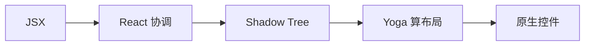

# RN 渲染原理

结论：RN 写的组件最终都映射成 **平台原生控件** ，没有 WebView、没有 DOM。渲染链路是 **JSX → React 协调 → Shadow Tree → Yoga 布局 → 原生控件** 。



- **JSX → React 协调** ：和 Web 端 React 一样，构建虚拟节点树并做 diff，得出需要变更的节点。
- **Shadow Tree** ：协调结果落到一棵与原生节点对应的影子树，新架构 (Fabric) 下 JS 与原生 **共享同一棵 Shadow Tree** ，C++ 实现。
- **Yoga 布局** ：跑在 Shadow 线程，用 Flexbox 把样式算成具体坐标和尺寸。
- **原生控件** ：主线程据布局结果创建/更新真实的平台控件。

## 虚拟节点到原生组件的映射

RN 没有「虚拟 DOM → 真实 DOM」这一步，取而代之的是「虚拟节点 → 原生控件」。核心组件的原生映射：

| RN 组件 | iOS | Android |
| --- | --- | --- |
| `View` | `UIView` | `ViewGroup` |
| `Text` | `UITextView` | `TextView` |
| `Image` | `UIImageView` | `ImageView` |
| `TextInput` | `UITextField` | `EditText` |
| `ScrollView` | `UIScrollView` | `ScrollView` |

## 样式与布局差异 (vs Web)

RN 的样式只是「长得像 CSS」，本质是另一套系统：

- **默认 `flexDirection` 是 `column`** (Web 默认 `row`)。这是最常踩的坑。
- **不支持完整 CSS** ：没有 `float`、`grid`、伪类 (`:hover`)、媒体查询、级联继承。
- **数值无单位** ：直接写数字，单位是 dp (密度无关像素)，不写 `px`；百分比要用字符串 `'50%'`。
- **属性驼峰命名** ：`backgroundColor` 而非 `background-color`。
- **样式靠数组合并** ：`style={[a, cond && b]}` ，数组中后者覆盖前者，相当于条件样式。

```js
const styles = StyleSheet.create({
  box: { flexDirection: 'row', width: '50%', padding: 16 },
  active: { backgroundColor: 'tomato' },
})

<View style={[styles.box, isActive && styles.active]} />
```

:::tip
把样式提到 `StyleSheet.create` 里而非内联，既能复用又能让框架对样式对象做缓存，减少跨线程传输与重渲染。
:::

> ## 一句话口诀
>
> JSX 经协调进 Shadow Tree，Yoga 算坐标，最终落成原生控件 —— 没有 DOM，样式只是长得像 CSS。

## 参考

1. [React Native 渲染原理 (官方)](https://reactnative.dev/architecture/render-pipeline)
2. [Yoga 布局引擎](https://www.yogalayout.dev/)
