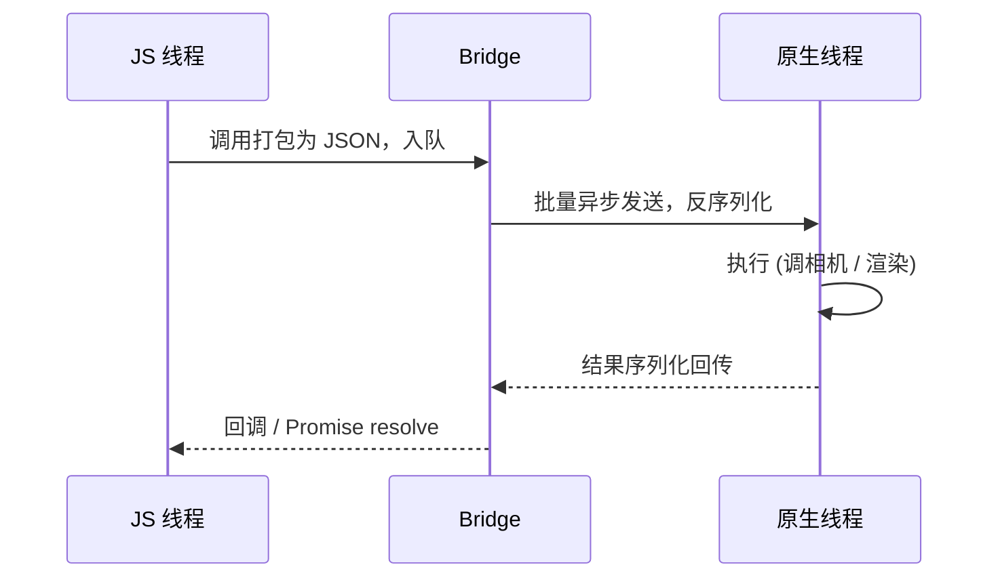

# JS 与原生的通信机制

结论：通信方式决定 RN 的性能上限。**旧架构走 Bridge 异步序列化通信，新架构走 JSI 同步直接调用** ，后者是新旧架构性能差异的根源。

## 旧架构：Bridge 序列化通信

JS 侧与原生侧是两个隔离的运行时，任何调用都要打包成消息经 Bridge 异步传递。

三个固有约束：

1. **全异步** ：JS 拿不到同步返回值，只能等回调、Promise 或事件 (`DeviceEventEmitter`)。
2. **必须可序列化** ：参数和返回值都要能转成 JSON，无法直接传函数、原生对象引用。
3. **批量排队** ：调用攒批异步发送，高频通信时排队延迟会累积成卡顿。

## 新架构：JSI 同步调用

JSI (JavaScript Interface) 是一层 C++ 抽象，让 JS 引擎 **直接持有原生对象的引用** 并 **同步调用** ，绕开 JSON 序列化和消息队列。

带来的能力：

- **同步返回值** ：可以「读取布局后同步决定下一步」，这是手势跟手、复杂动画的基础。
- **零序列化** ：传引用而非拷贝 JSON，大数据通信成本骤降。
- **按需懒加载** ：配合 TurboModules，原生模块用到才初始化。

## 两者对比

| 维度 | 旧 Bridge | 新 JSI |
| --- | --- | --- |
| 调用方式 | 异步消息 | 同步直接调用 |
| 数据传递 | JSON 序列化拷贝 | 持有引用，零序列化 |
| 返回值 | 回调 / Promise | 可同步返回 |
| 适合场景 | 普通业务调用 | 高频、低延迟、需同步结果 |

:::info
JSI 不绑定具体引擎，是引擎之上的抽象，因此 RN 能在 JSC 与 Hermes 间平滑切换 —— 只要引擎实现了 JSI 接口。
:::

> ## 一句话口诀
>
> Bridge 异步传 JSON，JSI 同步传引用 —— 从「隔墙喊话」变成「面对面握手」。

## 参考

1. [React Native JSI 说明](https://reactnative.dev/architecture/glossary#javascript-interfaces-jsi)
2. [RN 新架构通信原理](https://reactnative.dev/architecture/landing-page)
