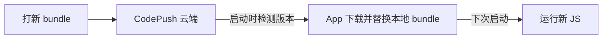

# RN 高频面试考点

汇总 RN 面试里反复出现的对比题与原理题，前面各章已展开的细节这里只给结论。

## RN vs 原生 vs Flutter

| 维度 | 原生 (Swift/Kotlin) | React Native | Flutter |
| --- | --- | --- | --- |
| UI 渲染 | 平台原生控件 | 映射到平台原生控件 | 自带 Skia 引擎自绘 |
| 语言 | Swift / Kotlin | JS / TS | Dart |
| 一致性 | 各平台分别开发 | 跟随系统控件，平台间略有差异 | 自绘，跨平台高度一致 |
| 性能 | 最高 | 接近原生 (新架构更好) | 接近原生 |
| 热更新 | 难 (需发版) | 支持 (CodePush) | 受限 |
| 生态 | 平台原生生态 | 复用 React/JS 生态 | Dart 生态，相对年轻 |

要点：RN 用 **原生控件** ，长得最像系统原生但有平台差异；Flutter **自绘** ，跨平台一致但不直接用系统控件。

## 热更新原理 (CodePush)

业务代码会被打成一份 JS bundle，CodePush 在云端推送新 bundle，App 启动时检测版本、下载并替换本地 bundle，下次启动生效。

:::warning
热更新 **只能更新 JS 和资源，不能修改原生代码** 。正因为更新的是 JS 而非原生二进制，它能绕过应用商店审核 —— 但一旦改动涉及原生模块，仍需走商店发版。
:::

## Metro 打包器

Metro 是 RN 的官方打包器，负责打 bundle、转译 (Babel)、提供开发服务器和 HMR，开发服务器默认端口 **8081** 。

### debug vs release

| 维度 | debug | release |
| --- | --- | --- |
| bundle | 从 Metro dev server 实时加载 | 预打包进 App，离线可用 |
| 开发工具 | 开启 (调试桥、警告框) | 关闭 |
| 代码 | 未压缩 | 压缩混淆 |

### Fast Refresh vs Hot Reloading

`Fast Refresh` 是当前的热更新开发体验：改完代码自动刷新，且 **保留组件状态** (改样式不丢页面数据)。它取代了旧的 `Hot Reloading` (容易状态错乱) 和 `Live Reloading` (整个 App 重载、状态全丢)。

## 高频面试题清单

1. 旧架构 Bridge 的性能瓶颈是什么？(异步 / JSON 序列化 / 消息排队)
2. 新架构的 JSI 解决了什么问题？为什么能同步调用？
3. Fabric、TurboModules、Codegen 各自的作用？
4. RN 的三条核心线程及各自职责？哪条卡住会直接掉帧？
5. RN 组件如何映射到原生控件？举例 `View` / `Text` 的映射。
6. 渲染链路是怎样的？(JSX → 协调 → Shadow Tree → Yoga → 原生)
7. `FlatList` 相比 `ScrollView` 为什么更适合长列表？关键优化 props 有哪些？
8. 如何减少列表的 re-render？(`React.memo` + 稳定的 `renderItem`)
9. 为什么动画推荐用 `react-native-reanimated` 而非 `Animated`？
10. `Animated` 的 `useNativeDriver` 有什么限制？
11. Hermes 相比 JSC 的优势？AOT 字节码是什么意思？
12. RN 的 Flexbox 和 Web 的主要差异？(默认 `column`、无单位、无级联)
13. CodePush 热更新的原理？为什么能绕过商店审核？它的边界在哪？
14. Metro 是什么？debug 和 release 包有何区别？为什么性能测试要用 release？
15. `Fast Refresh` 和旧的 `Hot Reloading` 有什么不同？
16. RN 和 Flutter 在渲染上的根本区别？(原生控件 vs Skia 自绘)

## 参考

1. [React Native 新架构官方文档](https://reactnative.dev/architecture/landing-page)
2. [CodePush 文档](https://learn.microsoft.com/en-us/appcenter/distribution/codepush/)
3. [Metro 打包器](https://metrobundler.dev/)
