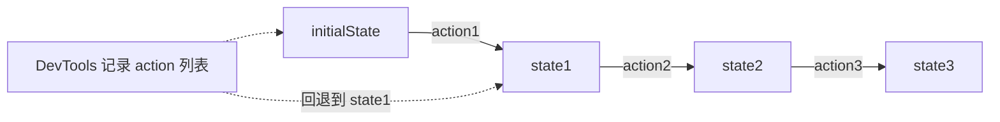

# 常见八股

Redux 高频问题集合，结论先行。

## Redux 和 Context 有什么区别

很多人觉得有了 Context 就不需要 Redux 了，其实两者定位不同。

| 维度 | Context | Redux |
|------|---------|-------|
| **定位** | 解决 props 透传 (依赖注入) | 状态管理方案 |
| **更新机制** | value 一变，所有消费者**全部** re-render，无法细粒度订阅 | selector + 浅比较，只渲染真正用到变化数据的组件 |
| **调试** | 无 | DevTools、时间旅行、action 日志 |
| **异步 / 中间件** | 没有，得自己写 | thunk / saga / RTK Query 生态完善 |
| **适用场景** | 主题、语言、当前用户等低频全局值 | 高频变化、逻辑复杂的全局状态 |

一句话：**Context 是「传递」工具，Redux 是「管理」方案。** Context 解决「怎么把值传下去」，Redux 还解决「怎么可预测地变、怎么调试、怎么处理异步」。事实上 react-redux 内部就是用 Context 来透传 store 的——它俩不是竞争关系。

:::warning
直接用 Context 存高频变化的状态会有性能坑：Provider 的 value 一变，**所有** `useContext` 的组件都会 re-render，没有 selector 那样的细粒度订阅。
:::

## 为什么 reducer 必须是纯函数

纯函数 = 相同输入永远得到相同输出 + 没有副作用 (不发请求、不改外部变量、不依赖 `Date.now()` / `Math.random()`)。

reducer 必须纯，是为了换来三个能力：

1. **可预测**：给定 state 和 action，结果唯一确定，行为可推理。
2. **可时间旅行 / 可回放**：因为结果只取决于输入，把历史 action 重新跑一遍就能精确重现任意时刻的状态。
3. **可测试**：纯函数最好测，输入什么断言输出什么，不用 mock。

```js
// 错误：reducer 里有副作用，不纯
function badReducer(state, action) {
  state.list.push(action.payload); // 改了入参
  fetch('/log');                   // 发了请求
  return { ...state, time: Date.now() }; // 依赖外部时间
}

// 正确：只根据输入计算并返回新对象
function goodReducer(state, action) {
  return { ...state, list: [...state.list, action.payload] };
}
```

## 为什么 state 必须不可变

不可变 (immutable) = 不修改原对象，每次产生新对象。

核心原因是**性能**：React / react-redux 判断「数据变没变」用的是 `===` 浅比较，比较引用而非深比较内容。

```js
// 如果原地修改，引用不变，浅比较认为「没变」→ 视图不更新！
state.count = 1;
oldState === newState; // true，组件不会重渲

// 不可变写法，新对象新引用，浅比较立刻发现「变了」→ 高效更新
const newState = { ...state, count: 1 };
oldState === newState; // false
```

不可变还顺带保证了时间旅行可行 (旧 state 没被改坏，能随时回到任意快照)。手写展开太累，所以 RTK 用 Immer 让你写「可变」代码、得「不可变」结果 (见 [Redux Toolkit](./redux-toolkit.md))。

## Redux 怎么处理异步

reducer 是纯函数不能有副作用，异步只能交给**中间件**：

- **redux-thunk**：让 dispatch 能接收一个函数，在函数里发请求、等结果、再 dispatch。最常用，RTK 内置。
- **redux-saga**：用 Generator 编排复杂异步 (并发、取消、防抖、轮询)。
- **createAsyncThunk (RTK)**：标准化异步，自动派发 `pending / fulfilled / rejected`。
- **RTK Query**：直接把请求 + 缓存 + 加载态全包了。

```js
// thunk：dispatch 一个函数而非对象
function fetchUser(id) {
  return async (dispatch) => {
    dispatch({ type: 'user/loading' });
    const res = await fetch(`/api/users/${id}`);
    dispatch({ type: 'user/loaded', payload: await res.json() });
  };
}
store.dispatch(fetchUser(1));
```

详细原理见 [中间件机制](./中间件.md)。

## Redux 和 Mobx / Zustand 的对比

| 维度 | Redux | Mobx | Zustand |
|------|-------|------|---------|
| **范式** | 函数式、单向数据流 | 响应式、可变数据 | 极简、基于 hook 的 store |
| **写法** | action + reducer (RTK 已大幅简化) | 装饰器 / observable，直接改 | 一个 `create`，直接 set |
| **样板代码** | 中 (RTK 后较少) | 少 | 极少 |
| **不可变** | 强制 (Immer 辅助) | 不要求，可变 | 推荐不可变 |
| **调试 / 时间旅行** | 强，生态成熟 | 一般 | 有中间件支持 |
| **适用** | 大型、多人协作、需强约束 | 中小型、追求开发速度 | 中小型、追求轻量简单 |

一句话：**Redux 用「强约束」换「可预测和可维护」，适合大型项目；Mobx 用「响应式」换「写得爽」；Zustand 用「极简 API」换「轻量」，是近年中小项目的热门选择。**

## 时间旅行是怎么实现的

时间旅行 (time travel debugging) 指在 DevTools 里前进 / 后退到任意历史状态。能做到全靠 Redux 的两条铁律：

1. **所有变更都经过 dispatch**——所以可以把每一个 action 完整记录成一个有序列表。
2. **reducer 是纯函数 + state 不可变**——所以 `历史 actions.reduce(reducer, initialState)` 能精确重算出任意时刻的 state，且旧快照不会被破坏。



本质：**DevTools 存的不是一堆 state 快照，而是「初始 state + 一串 action」。** 想跳到第 N 步，就从初始 state 开始把前 N 个 action 重新 reduce 一遍——这正是 reducer 必须纯、state 必须不可变的终极回报。

## 参考

1. [Redux 常见问题 - 官方文档](https://cn.redux.js.org/faq/)
2. [Redux vs Context - 官方](https://cn.redux.js.org/faq/general#when-should-i-use-redux)
