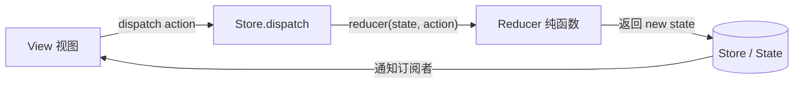
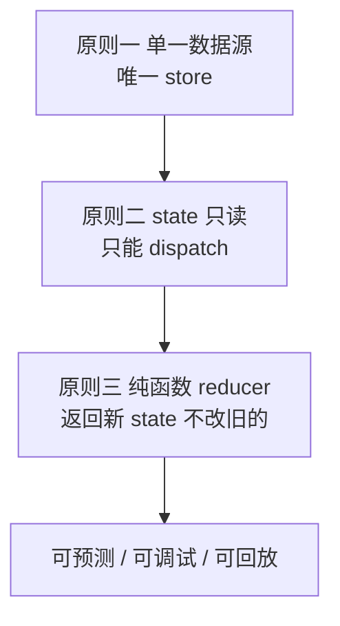

# 核心概念与数据流

Redux 是一个**可预测的状态容器**：整个应用的状态集中存在一个 store 里，唯一改变状态的方式是 dispatch 一个描述「发生了什么」的 action，由纯函数 reducer 计算出新状态。一句话——**单向数据流 + 不可变状态 + 纯函数更新**。

:::tip
现在写 Redux 不应该再手写 action types、action creators、`switch` reducer。官方推荐用 **Redux Toolkit (RTK)**，它是 Redux 的标准写法。本文先讲清概念，RTK 见 [Redux Toolkit](./redux-toolkit.md)。
:::

## 五个核心概念

| 概念 | 是什么 | 类比 |
|------|--------|------|
| **store** | 保存整个应用 state 的唯一容器 | 数据库 |
| **state** | 某一时刻的应用状态快照，只读 | 数据库里的一行数据 |
| **action** | 描述「发生了什么」的纯对象，必须有 `type` | 一条 SQL 语句的意图 |
| **reducer** | `(state, action) => newState` 的纯函数 | 执行变更的存储过程 |
| **dispatch** | 派发 action 的唯一入口 | 提交事务 |

action 示例：

```js
// action 是一个描述事件的纯对象，type 必填，payload 携带数据
const addTodo = {
  type: 'todos/added',
  payload: { id: 1, text: '学 Redux' },
};
```

reducer 示例——注意它**不修改入参，而是返回新对象**：

```js
const initState = { count: 0 };

function counterReducer(state = initState, action) {
  switch (action.type) {
    case 'counter/incremented':
      return { ...state, count: state.count + 1 }; // 返回新对象
    case 'counter/decremented':
      return { ...state, count: state.count - 1 };
    default:
      return state; // 不认识的 action 原样返回
  }
}
```

dispatch 触发更新：

```js
import { createStore } from 'redux';

const store = createStore(counterReducer);

store.subscribe(() => console.log(store.getState()));

store.dispatch({ type: 'counter/incremented' }); // { count: 1 }
store.dispatch({ type: 'counter/incremented' }); // { count: 2 }
```

## 单向数据流

Redux 的数据流是一个**严格闭环**，永远朝一个方向走：



任何交互都走同一条路：**用户操作 → dispatch(action) → reducer 算出新 state → store 通知 view 重新渲染**。这种「单一入口、单一方向」让状态变化可追踪、可回放、可调试 (Redux DevTools 的时间旅行就靠这个)。

:::info
为什么叫 reducer？因为它的签名和 `Array.prototype.reduce` 的回调一模一样：`(累积值, 当前项) => 新累积值`。Redux 把一连串 action 「归约」成最终 state——`actions.reduce(reducer, initialState)`。
:::

## 三大原则

Redux 的全部约束可以归结为三条铁律 (官方称 Three Principles)：

### 1. 单一数据源 (Single source of truth)

整个应用的 state 存在**唯一**的 store 中，以一棵 object tree 的形式组织。好处：状态集中、易于调试、便于做持久化 / SSR / 撤销重做。

### 2. State 只读 (State is read-only)

改变 state 的**唯一**方式是 dispatch 一个 action。你永远不能直接 `state.x = 1`。这保证了所有变更都经过同一个收口，视图层和网络回调不会偷偷篡改状态。

### 3. 用纯函数 reducer 修改 (Changes are made with pure functions)

reducer 必须是**纯函数**：相同输入永远得到相同输出，不产生副作用，不修改入参。这是 Redux 可预测、可测试、可时间旅行的根基 (详见 [常见八股](./faq.md))。



## 一句话口诀

> **单一 store 存状态，dispatch 派 action，纯函数 reducer 返回新 state，view 订阅自动刷新——单向闭环，状态只读，绝不原地修改。**
