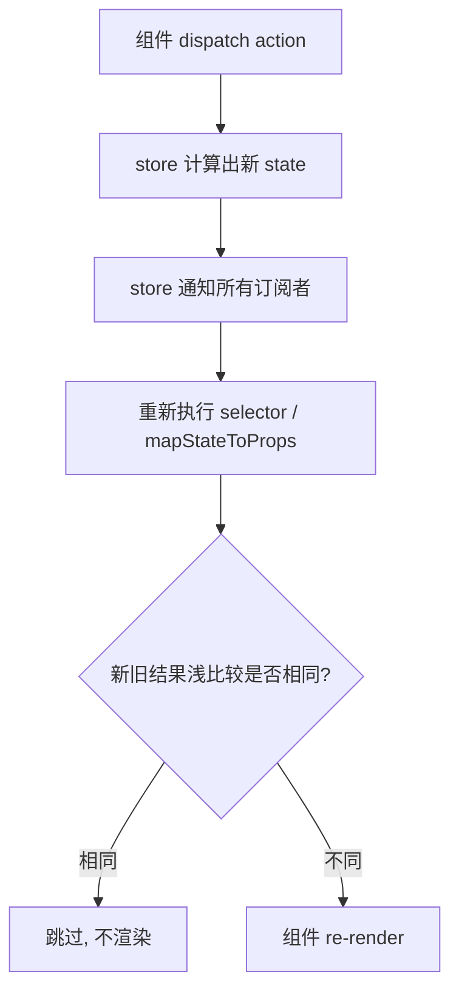

# react-redux 原理

Redux 本身和 React 没关系——它只是一个纯 JS 的状态容器，`createStore` 出来的 store 在 Vue、原生 JS 里都能用。`react-redux` 是连接 Redux 和 React 的**官方桥梁**，解决两个问题：

1. **store 透传**：让组件树里任意层级的组件都能拿到 store，不用一层层手动传 props。
2. **订阅更新**：store 变化时，自动让用到了对应 state 的组件重新渲染。

## 为什么需要 react-redux

不用 react-redux 直接用 Redux，你得自己干两件累活：

```js
// 1. 把 store 一层层往下传，深层组件苦不堪言
<App store={store}>
  <Page store={store}>
    <Panel store={store}>
      <Counter store={store} /> {/* 终于用到了 */}

// 2. 每个组件自己 subscribe，自己 forceUpdate，自己 unsubscribe
componentDidMount() {
  this.unsub = store.subscribe(() => this.forceUpdate());
}
componentWillUnmount() {
  this.unsub();
}
```

react-redux 把这两件事封装好了：`Provider` 负责透传，`connect` / `useSelector` 负责订阅。

## Provider 原理

`Provider` 用 **React Context** 把 store 注入整棵组件树，子组件无论多深都能取到，不用 props 逐层传递。

```js
import { Provider } from 'react-redux';
import { store } from './store';

function App() {
  return (
    // store 放进 Context，下面所有组件都能拿到
    <Provider store={store}>
      <Counter />
    </Provider>
  );
}
```

它的本质极简——就是一个 Context.Provider：

```js
// react-redux 内部大致长这样
const ReactReduxContext = React.createContext(null);

function Provider({ store, children }) {
  // 把 store 塞进 context 的 value
  return (
    <ReactReduxContext.Provider value={{ store }}>
      {children}
    </ReactReduxContext.Provider>
  );
}
```

## connect：高阶组件写法

`connect(mapStateToProps, mapDispatchToProps)(Component)` 是经典的**高阶组件 (HOC)** 写法：它包裹你的组件，从 context 里取出 store，把你需要的 state 和 dispatch 当作 props 注入进去。

```js
import { connect } from 'react-redux';

function Counter({ count, increment }) {
  // count 和 increment 都是 connect 注入的 props
  return <button onClick={increment}>{count}</button>;
}

// state 树 → 这个组件需要的 props
const mapStateToProps = (state) => ({
  count: state.counter.count,
});

// dispatch → 这个组件能调用的事件函数
const mapDispatchToProps = (dispatch) => ({
  increment: () => dispatch({ type: 'counter/incremented' }),
});

export default connect(mapStateToProps, mapDispatchToProps)(Counter);
```

两个参数的分工：

| 参数 | 作用 | 注入成什么 |
|------|------|-----------|
| `mapStateToProps(state, ownProps)` | 从全局 state 里**挑出**这个组件关心的部分 | 数据类 props，如 `count` |
| `mapDispatchToProps(dispatch, ownProps)` | 把 dispatch 包装成具名函数 | 事件类 props，如 `increment` |

:::info
`mapStateToProps` 决定了组件「订阅」哪些 state。store 一变，react-redux 就重新执行它，把新结果和上次的结果做**浅比较**，不同才触发 re-render。这是性能优化的关键。
:::

## Hooks 写法：useSelector / useDispatch

现在更推荐 Hooks，比 `connect` 直观得多——不用写 HOC，不用 map 两个函数，在组件里直接读和派发：

```js
import { useSelector, useDispatch } from 'react-redux';

function Counter() {
  // useSelector：从 store 里选出需要的数据，并自动订阅它的变化
  const count = useSelector((state) => state.counter.count);
  // useDispatch：拿到 dispatch 函数
  const dispatch = useDispatch();

  return (
    <button onClick={() => dispatch({ type: 'counter/incremented' })}>
      {count}
    </button>
  );
}
```

- `useSelector(selector)`：相当于 `mapStateToProps`。store 变化时重新跑 selector，结果用 `===` 比较 (默认严格相等)，变了才 re-render。
- `useDispatch()`：相当于 `mapDispatchToProps` 的来源，直接拿原始 dispatch 自己派发。

## 订阅更新的本质

react-redux 内部帮每个 `connect` / `useSelector` 做的，正是你手写时那一套，只是封装并优化了：



关键点：**store 一变，所有订阅者的 selector 都会重新跑一遍，但只有结果真正变化的组件才会重新渲染。** 这就是 react-redux 比「整棵树 forceUpdate」高效的原因。

## 性能优化

### 1. selector 只选必要的最小数据

```js
// 不好：选了整个对象，对象引用每次都可能变，导致多余渲染
const user = useSelector((state) => state.user);

// 好：只选用到的字段，原始值用 === 比较稳定
const userName = useSelector((state) => state.user.name);
```

### 2. selector 返回新对象会破坏浅比较

```js
// 危险：每次返回新数组 / 新对象，浅比较永远不相等 → 每次都 re-render
const items = useSelector((state) => state.list.map((x) => x.id));

// 解决一：用 shallowEqual 做浅比较
import { shallowEqual } from 'react-redux';
const items = useSelector((state) => state.list.map((x) => x.id), shallowEqual);

// 解决二：用 reselect 缓存计算结果 (memoized selector)
import { createSelector } from 'reselect';
const selectIds = createSelector(
  (state) => state.list,
  (list) => list.map((x) => x.id), // list 没变就复用上次结果
);
```

### 3. 派发函数用 useCallback

事件函数传给子组件时，配合 `useCallback` 避免子组件不必要的重渲。

:::tip
形象记忆：**Provider 是「广播站」**——把 store 这条频道发到全楼。**useSelector 是「精准订阅」**——你只订自己关心的那档节目，别的节目变了不打扰你；一旦你订的节目内容变了 (浅比较不相等)，才来敲你的门让你刷新。selector 千万别每次返回「现做的新节目单」，否则系统以为永远在变，天天来敲门。
:::

## 参考

1. [React Redux 官方文档](https://cn.react-redux.js.org/)
2. [Hooks - React Redux](https://cn.react-redux.js.org/api/hooks)
3. [Reselect - GitHub](https://github.com/reduxjs/reselect)

## 一句话口诀

> **Provider 用 Context 把 store 透传全树，connect / useSelector 负责订阅并把 state、dispatch 注入组件；store 一变就重跑 selector 做浅比较，结果变了才 re-render——优化的核心就是「selector 只选最小数据、别返回现做的新对象」。**
