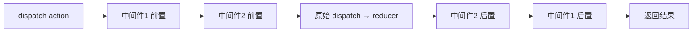

# 中间件机制

中间件解决一个问题：**在 dispatch 一个 action 之后、reducer 收到它之前，插入自定义逻辑** (打日志、处理异步、上报埋点……)。原生 Redux 的 reducer 是纯函数不能有副作用，所以异步和副作用全都靠中间件兜底。

## 设计范式：三层柯里化

每个中间件都长这个固定样子——`store => next => action => {}`，三层函数依次柯里化：

```js
function logger(store) {
  // store：拿到 dispatch、getState
  return function (next) {
    // next：链上的「下一个 dispatch」，调用它才把 action 继续往下传
    return function (action) {
      // action：当前派发的 action
      console.group(action.type);
      console.info('dispatching', action);
      const result = next(action); // 放行到下一个中间件 / reducer
      console.log('next state', store.getState());
      console.groupEnd();
      return result;
    };
  };
}
```

三层的含义：

- 第一层 `store`：`applyMiddleware` 注入，让中间件能 `getState` 和 `dispatch`。
- 第二层 `next`：上一个中间件包装出来的 dispatch，**不是**原始 dispatch。调 `next(action)` 表示放行。
- 第三层 `action`：真正处理 action 的地方。在 `next` 前后写代码，就分别是「进入」和「返回」两个时机。

## applyMiddleware 原理

`applyMiddleware` 做的事是：**把原始的 `store.dispatch` 用中间件层层包裹，重写成一个增强版 dispatch**。

```js
function applyMiddleware(...middlewares) {
  return (createStore) => (reducer, preloadedState) => {
    const store = createStore(reducer, preloadedState);
    let dispatch = () => {
      throw new Error('构造期间不允许 dispatch');
    };

    const middlewareAPI = {
      getState: store.getState,
      dispatch: (action) => dispatch(action), // 注意是闭包引用，指向最终的 dispatch
    };

    // 1. 每个中间件先吃进 store，得到 next => action => {} 形态的函数
    const chain = middlewares.map((mw) => mw(middlewareAPI));
    // 2. compose 把它们串成洋葱，最里层的 next 是原始 store.dispatch
    dispatch = compose(...chain)(store.dispatch);

    return { ...store, dispatch }; // 用增强后的 dispatch 覆盖原始的
  };
}

// 从右到左组合：compose(a, b, c)(x) === a(b(c(x)))
function compose(...fns) {
  if (fns.length === 0) return (arg) => arg;
  if (fns.length === 1) return fns[0];
  return fns.reduce((a, b) => (...args) => a(b(...args)));
}
```

核心就两步：每个中间件先注入 `store`，再用 `compose` 从右到左把它们串起来，最内层接上真正的 `store.dispatch`。

## 洋葱模型

多个中间件的执行顺序是「**先进后出、对称包裹**」，和 Koa 一样叫洋葱模型：`next(action)` 之前的代码按注册顺序执行，之后的代码按相反顺序执行。



以 `applyMiddleware(logger, thunk)` 为例，执行顺序是 `logger 进 → thunk 进 → reducer → thunk 出 → logger 出`。`compose` 从右到左组合，但因为最右的中间件的 `next` 指向更内层，**实际进入顺序是从左到右**。

:::info
和 Koa 洋葱模型的实现思路完全一致，区别只在 Redux 中间件是同步柯里化的三层结构、Koa 是 `(ctx, next)` 二元结构且 `next` 返回 Promise。`compose` 的「把下一个调用包成 next 传给当前层」是同一套技巧，可参考 [洋葱模型](/scenario/onion-middleware)。
:::

## redux-thunk：处理异步

最常用的异步中间件。**没有它，dispatch 只能接收纯对象**；有了它，dispatch 可以接收一个函数，这个函数会拿到 `dispatch` 和 `getState`，从而在里面发请求、等待、再 dispatch 结果。

```js
import { createStore, applyMiddleware } from 'redux';
import thunk from 'redux-thunk';

const store = createStore(reducer, applyMiddleware(thunk));

// 传函数而非对象 —— thunk 会拦截并执行它
function fetchUser(id) {
  return async (dispatch, getState) => {
    dispatch({ type: 'user/loading' });
    try {
      const res = await fetch(`/api/users/${id}`);
      dispatch({ type: 'user/loaded', payload: await res.json() });
    } catch (e) {
      dispatch({ type: 'user/failed', error: e.message });
    }
  };
}

store.dispatch(fetchUser(1)); // 派发的是函数
```

thunk 的源码极简，核心就一句判断「是函数就执行、否则放行」：

```js
function createThunkMiddleware(extraArgument) {
  return ({ dispatch, getState }) => (next) => (action) => {
    if (typeof action === 'function') {
      return action(dispatch, getState, extraArgument); // 是函数：执行它
    }
    return next(action); // 是普通对象：放行给下一个中间件
  };
}
```

## redux-saga 简述

`redux-saga` 用 **Generator 函数** 管理副作用，把异步流程写成「看起来同步」的声明式代码。它不像 thunk 直接执行函数，而是通过 yield 一个个「effect 描述对象」(`call`、`put`、`take`、`fork`……)，由 saga 中间件来真正执行。

```js
import { call, put, takeEvery } from 'redux-saga/effects';

function* fetchUserSaga(action) {
  try {
    const user = yield call(fetch, `/api/users/${action.id}`); // 描述「调用」
    yield put({ type: 'user/loaded', payload: user }); // 描述「dispatch」
  } catch (e) {
    yield put({ type: 'user/failed', error: e.message });
  }
}

function* rootSaga() {
  yield takeEvery('user/fetch', fetchUserSaga); // 监听 action
}
```

| 维度 | redux-thunk | redux-saga |
|------|-------------|------------|
| 载体 | 函数 | Generator |
| 心智成本 | 低，会写 async 就会 | 高，要懂 generator / effect |
| 复杂流程 | 嵌套 callback 容易乱 | 擅长并发、取消、防抖、轮询 |
| 可测试性 | 一般 | 好，effect 是纯对象易断言 |
| 适用场景 | 大多数项目 | 复杂异步编排的大型项目 |

:::tip
绝大多数项目用 thunk 就够了，**RTK 内置了 thunk**，无需额外安装。只有当异步流程非常复杂 (大量并发、需要取消 / 竞态控制) 时才考虑 saga。处理数据请求缓存则优先考虑 [RTK Query](./redux-toolkit.md)。
:::

## 参考

1. [Redux 中间件 - 官方文档](https://cn.redux.js.org/understanding/history-and-design/middleware)
2. [Redux-Thunk - GitHub](https://github.com/reduxjs/redux-thunk)
3. [Redux-Saga 官方文档](https://redux-saga.js.org/)
