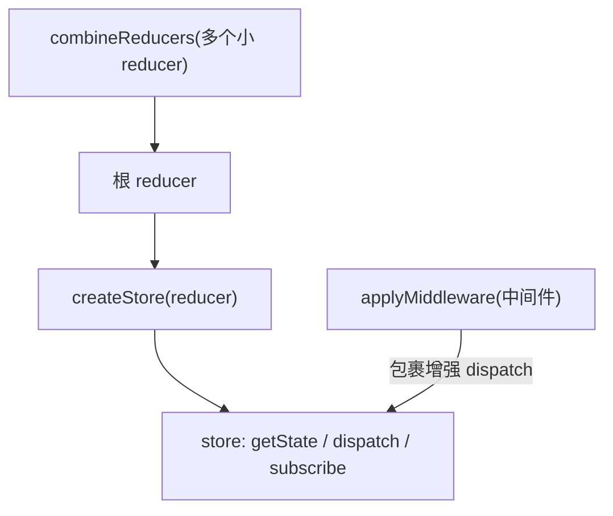

# 手写实现 Redux

把 Redux 拆开看，核心其实只有三个函数：`createStore`、`combineReducers`、`applyMiddleware`。手写一遍，原理就通了。

:::info
为什么不直接用一个全局对象当状态？比如 `export default { count: 0 }`，谁都能 `store.count = 1` 改它。问题是：**改了没人知道**——无法追踪谁在什么时候改了什么，视图也不会自动更新。Redux 的价值就是给状态变更加一个「收口」：只能通过 dispatch 改，改完通知所有订阅者。下面就来实现这个收口。
:::

## 一、实现 createStore

`createStore` 返回的 store 要有三个方法：

- `getState()`：读当前状态
- `dispatch(action)`：派发 action，触发状态更新并通知订阅者
- `subscribe(listener)`：注册监听器，状态变化时被调用，返回取消订阅的函数

```js
function createStore(reducer, preloadedState) {
  // 第一步：用闭包存住内部状态和监听器列表，外部无法直接访问
  let state = preloadedState;
  let listeners = [];

  // 第二步：getState 直接返回当前状态
  function getState() {
    return state;
  }

  // 第三步：subscribe 把监听器存起来，并返回一个「取消订阅」函数
  function subscribe(listener) {
    listeners.push(listener);
    return function unsubscribe() {
      listeners = listeners.filter((l) => l !== listener);
    };
  }

  // 第四步：dispatch 是唯一改状态的入口
  function dispatch(action) {
    // 4.1 用 reducer 算出新状态 (reducer 是纯函数，返回新对象)
    state = reducer(state, action);
    // 4.2 通知所有订阅者：状态变了，快来读新值
    listeners.forEach((listener) => listener());
    return action;
  }

  // 第五步：先派发一个内部 action，让每个 reducer 走 default 分支
  //         从而把 initialState 填进 state
  dispatch({ type: '@@redux/INIT' });

  return { getState, dispatch, subscribe };
}
```

用法：

```js
const initState = { count: 0 };

function counterReducer(state = initState, action) {
  switch (action.type) {
    case 'plus':
      return { ...state, count: state.count + 1 };
    case 'minus':
      return { ...state, count: state.count - 1 };
    default:
      return state; // 不认识的 action 原样返回，初始化时走这里
  }
}

const store = createStore(counterReducer);
const unsub = store.subscribe(() => console.log('新状态', store.getState()));

store.dispatch({ type: 'plus' });  // 新状态 { count: 1 }
store.dispatch({ type: 'plus' });  // 新状态 { count: 2 }
unsub();                            // 取消订阅
store.dispatch({ type: 'minus' }); // 不再打印
console.log(store.getState());     // { count: 1 }
```

:::tip
形象记忆：**store 像一个有门禁的金库。** `getState` 是隔着玻璃看看里面有多少钱 (只读)；`dispatch` 是唯一的存取款窗口，你递进去一张「业务单」(action)，柜员 (reducer) 按规则算出新余额；`subscribe` 是开通短信提醒，每次余额变动就给你发条短信 (调用监听器)。任何人都不能翻墙进金库直接拿钱——这就是「state 只读」。
:::

## 二、实现 combineReducers

应用大了，把所有逻辑写在一个 reducer 里会爆炸。`combineReducers` 让你按模块拆成多个小 reducer，再合并成一个根 reducer，每个小 reducer 只管自己那块 state。

```js
function combineReducers(reducers) {
  // reducers 形如 { counter: counterReducer, user: userReducer }
  // 第一步：取出所有 key，对应 state 树的各个分支
  const keys = Object.keys(reducers);

  // 第二步：返回一个新的「根 reducer」，签名仍是 (state, action) => newState
  return function rootReducer(state = {}, action) {
    const nextState = {};
    let hasChanged = false;

    // 第三步：遍历每个子 reducer，各自处理自己那一块 state
    for (const key of keys) {
      const reducer = reducers[key];
      const prevSlice = state[key];          // 这一块的旧 state
      const nextSlice = reducer(prevSlice, action); // 算出这一块的新 state
      nextState[key] = nextSlice;
      // 只要有一块变了，整体就算变了
      if (nextSlice !== prevSlice) hasChanged = true;
    }

    // 第四步：如果没有任何一块变化，返回旧 state，保持引用不变 (利于性能优化)
    return hasChanged ? nextState : state;
  };
}
```

用法：

```js
const rootReducer = combineReducers({
  counter: counterReducer,
  user: userReducer,
});

const store = createStore(rootReducer);
store.getState(); // { counter: { count: 0 }, user: {...} }
```

:::info
注意第四步的「引用不变」优化：如果这次 dispatch 没改动任何一块 state，就返回原来的 state 对象。react-redux 的 selector 靠 `===` 比较来决定要不要重渲，引用不变就能跳过渲染。
:::

## 三、实现 applyMiddleware

中间件让你在 dispatch 前后插入逻辑 (日志、异步……)。`applyMiddleware` 的本质是：**用中间件把原始的 `store.dispatch` 层层包裹，重写成一个增强版 dispatch。**

```js
// 辅助：从右到左组合函数。compose(a, b, c)(x) === a(b(c(x)))
function compose(...fns) {
  if (fns.length === 0) return (arg) => arg;
  if (fns.length === 1) return fns[0];
  return fns.reduce((a, b) => (...args) => a(b(...args)));
}

function applyMiddleware(...middlewares) {
  // 第一步：返回一个「增强版 createStore」，接管原始 createStore
  return (createStore) => (reducer, preloadedState) => {
    // 1.1 先用原始 createStore 造出基础 store
    const store = createStore(reducer, preloadedState);

    // 第二步：先占位一个 dispatch，构造阶段调用会报错
    //         (中间件初始化时不应该 dispatch)
    let dispatch = () => {
      throw new Error('构造期间不允许 dispatch');
    };

    // 第三步：给中间件提供的 API。注意 dispatch 用闭包包一层，
    //         这样中间件内部调用的永远是「最终增强版 dispatch」
    const middlewareAPI = {
      getState: store.getState,
      dispatch: (action) => dispatch(action),
    };

    // 第四步：每个中间件先吃进 API，得到 next => action => {} 形态
    const chain = middlewares.map((mw) => mw(middlewareAPI));

    // 第五步：用 compose 把中间件串成洋葱，最内层接上原始 store.dispatch
    dispatch = compose(...chain)(store.dispatch);

    // 第六步：用增强版 dispatch 覆盖原始的
    return { ...store, dispatch };
  };
}
```

配上一个 logger 中间件验证：

```js
// 中间件固定形态：store => next => action => {}
const logger = (store) => (next) => (action) => {
  console.log('dispatch 前:', store.getState());
  const result = next(action); // 放行到下一个中间件 / reducer
  console.log('dispatch 后:', store.getState());
  return result;
};

// 把 applyMiddleware 作为「增强器」传给 createStore
const store = applyMiddleware(logger)(createStore)(counterReducer);
store.dispatch({ type: 'plus' });
// dispatch 前: { count: 0 }
// dispatch 后: { count: 1 }
```

:::tip
形象记忆：**中间件像快递的层层包装。** 原始 dispatch 是一件商品，每个中间件给它套一层箱子 (`next` 指向里面那层)。你寄出 (dispatch) 时，从外往里一层层拆 (前置逻辑)，到最里层是真商品 (reducer 改 state)，再从里往外一层层封回 (后置逻辑)——这就是「洋葱模型」。中间件机制的详细原理见 [中间件机制](./中间件.md)。
:::

## 整体关系



## 参考

1. [Redux 源码 - GitHub](https://github.com/reduxjs/redux/tree/master/src)
2. [8k字 | Redux/react-redux/redux 中间件设计实现剖析 - 掘金](https://juejin.cn/post/6844904036013965325)
