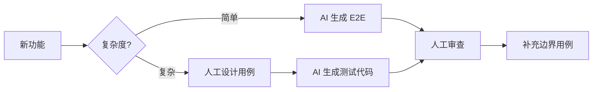

# AI 自动化测试

## 背景

软件测试是保障代码质量的关键环节。随着 AI 编程助手的普及，测试策略正在发生根本性变化：

- **代码生成速度加快** — AI 可以快速生成大量代码，测试需要跟上节奏
- **代码变动更频繁** — AI 辅助重构成本降低，代码结构变化更频繁
- **测试生成成本降低** — AI 同样可以生成测试代码

这促使我们重新思考：什么样的测试策略在 AI 时代最有效？

## 测试方案概览

### 前端测试方案

| 测试类型 | 测试对象 | 常用工具 | 执行速度 |
|---------|---------|---------|---------|
| 单元测试 | 函数、工具方法 | Jest、Vitest | 极快 |
| 组件测试 | UI 组件渲染与交互 | Testing Library、Vue Test Utils | 快 |
| 快照测试 | 组件输出结构 | Jest Snapshot | 快 |
| 集成测试 | 模块间协作 | Jest + MSW | 中等 |
| E2E 测试 | 完整用户流程 | Playwright、Cypress | 慢 |
| 视觉回归 | UI 样式变化 | Chromatic、Percy | 慢 |

### 后端测试方案

| 测试类型 | 测试对象 | 常用工具 | 执行速度 |
|---------|---------|---------|---------|
| 单元测试 | 函数、类方法 | Jest、pytest、JUnit | 极快 |
| 集成测试 | 服务间调用、数据库交互 | Supertest、pytest | 中等 |
| API 测试 | 接口契约、响应格式 | Postman、REST Assured | 中等 |
| 契约测试 | 服务间接口约定 | Pact | 中等 |
| E2E 测试 | 完整业务流程 | Playwright、Cypress | 慢 |
| 性能测试 | 负载、压力 | k6、JMeter | 慢 |

## 传统时代：测试金字塔

```
          /\
         /  \
        / E2E \          ← 少量：慢、脆弱、但最真实
       /------\
      / 集成测试 \        ← 适量：验证模块协作
     /----------\
    /   单元测试  \       ← 大量：快、稳定、易维护
   /--------------\
```

### 传统策略的核心原则

1. **底层测试为主** — 单元测试占 70%+
2. **追求高覆盖率** — 目标 80% 以上
3. **隔离外部依赖** — 大量使用 Mock
4. **TDD 驱动开发** — 先写测试再写代码

### 传统策略的优点

- 测试运行快，反馈及时
- 问题定位精准
- 重构有安全网
- CI/CD 友好

### 传统策略的缺点

- **Mock 地狱** — 大量 Mock 导致测试与实现耦合
- **维护成本高** — 代码变动需要同步更新大量测试
- **假阳性/假阴性** — Mock 可能掩盖真实问题
- **覆盖率陷阱** — 高覆盖率 ≠ 高质量

## AI 时代：测试奖杯

```
        ___________
       |           |
       |    E2E    |      ← 更多：AI 降低编写成本
       |___________|
      |             |
      |   集成测试   |     ← 核心：验证真实行为
      |_____________|
        |         |
        | 单元测试 |       ← 精简：只测复杂逻辑
        |_________|
           |   |
           |静态|          ← 基础：TypeScript + ESLint
           |___|
```

### AI 时代策略的核心转变

| 维度 | 传统策略 | AI 时代策略 |
|------|---------|------------|
| 测试重心 | 单元测试为主 | 集成/E2E 为主 |
| 覆盖率目标 | 追求 80%+ | 不追求数字，追求有效性 |
| Mock 使用 | 大量 Mock | 尽量用真实依赖 |
| 测试编写 | 手写为主 | AI 辅助生成 |
| 维护策略 | 保持测试同步 | 允许删除过时测试 |

### 为什么 E2E 测试更受青睐？

1. **编写成本降低**
   ```typescript
   // 告诉 AI："测试用户登录流程"
   // AI 生成：
   test('用户可以登录', async ({ page }) => {
     await page.goto('/login');
     await page.fill('[name="email"]', 'test@example.com');
     await page.fill('[name="password"]', 'password123');
     await page.click('button[type="submit"]');
     await expect(page).toHaveURL('/dashboard');
   });
   ```

2. **更接近用户视角** — 测试真实行为而非实现细节

3. **重构友好** — 内部实现变化不影响 E2E 测试

4. **发现真实问题** — 不会被 Mock 掩盖

### AI 时代策略的优点

- **更务实** — 测试真正重要的东西
- **维护成本低** — 测试数量减少，质量提升
- **重构自由** — 不被大量单测束缚
- **AI 加速** — 测试生成效率大幅提升

### AI 时代策略的缺点

- **E2E 运行慢** — CI 时间可能增加
- **调试困难** — E2E 失败时定位问题较难
- **环境依赖** — 需要稳定的测试环境
- **Flaky Tests** — E2E 容易出现不稳定测试

## 推荐策略

### 前端推荐方案

```
1. 静态类型检查（TypeScript）     → 拦截 80% 低级错误
2. E2E 覆盖核心用户路径           → 登录、支付、主流程
3. 复杂组件写组件测试             → 表单验证、状态机
4. 工具函数写单元测试             → 日期处理、格式化
5. 视觉回归（可选）               → UI 库、设计系统
```

### 后端推荐方案

```
1. 静态类型检查                   → TypeScript/Go/Rust
2. API 集成测试                   → 真实数据库 + 测试容器
3. 核心业务逻辑单元测试           → 计算、规则引擎
4. 契约测试（微服务）             → 服务间接口约定
5. E2E 冒烟测试                   → 关键业务流程
```

### 测试编写流程（AI 辅助）



## 测试工程师的角色变化

### 传统测试工程师职责

- 编写测试用例
- 手工执行测试
- 维护测试脚本
- 追踪覆盖率指标

### AI 时代测试工程师职责

| 减少的工作 | 增加的工作 |
|-----------|-----------|
| 手写重复测试代码 | 设计测试策略 |
| 手工回归测试 | 审查 AI 生成的测试 |
| 维护大量单测 | 构建测试基础设施 |
| 追踪覆盖率数字 | 分析测试有效性 |

### 是否还需要测试工程师？

**需要，但角色转型：**

1. **测试架构师** — 设计整体测试策略，搭建测试平台
2. **质量教练** — 指导开发团队编写有效测试
3. **AI 测试专家** — 利用 AI 工具提升测试效率
4. **探索性测试** — 发现 AI 和自动化难以覆盖的问题

**可能减少的岗位：**

- 纯手工测试执行
- 简单脚本编写
- 重复性回归测试

**结论**：测试工程师不会消失，但需要向更高价值的工作转型。

## 实践建议

### 1. 渐进式迁移

```
阶段 1：引入 E2E 测试覆盖核心流程
阶段 2：审计现有单测，删除低价值测试
阶段 3：用 AI 补充缺失的关键测试
阶段 4：建立测试有效性度量
```

### 2. 测试有效性度量

不再追踪覆盖率，而是关注：

- **缺陷逃逸率** — 生产环境发现的 Bug / 总 Bug
- **测试稳定性** — Flaky Test 比例
- **反馈时间** — 从提交到测试完成的时间
- **测试 ROI** — 测试发现的问题 / 测试维护成本

### 3. AI 辅助测试工具

| 工具 | 用途 |
|-----|------|
| Claude / Copilot | 生成测试代码 |
| Playwright Codegen | 录制 E2E 测试 |
| Meticulous | AI 回归测试 |
| Testim | AI 驱动的测试维护 |
| Midscene.js | 自然语言驱动的 UI 自动化 |

### Midscene.js

Midscene.js 是一个视觉驱动的 UI 自动化库，用视觉模型（看截图）代替 DOM 选择器来操作界面——不需要写 `querySelector`，直接用自然语言描述操作。

```typescript
// 传统 Playwright
await page.fill('[data-testid="email-input"]', 'test@example.com');
await page.click('button[type="submit"]');

// Midscene.js
await ai('在邮箱输入框填入 test@example.com，然后点击登录按钮');
```

核心优势：**对 UI 变化鲁棒**。传统 E2E 测试最大的痛点是选择器脆弱——组件重构后 `data-testid` 一改，测试全挂。Midscene 基于视觉理解，只要界面长得差不多，测试就不会因为 DOM 结构变化而失败。

支持 Web（Playwright/Puppeteer）、桌面（macOS/Windows）、移动端（Android/iOS），统一 API。

- 项目地址：https://github.com/web-infra-dev/midscene

## 总结

| 维度 | 传统策略 | AI 时代策略 |
|------|---------|------------|
| 核心理念 | 测试金字塔，单测为主 | 测试奖杯，E2E/集成为主 |
| 覆盖率 | 追求 80%+ | 追求有效性 |
| 编写方式 | 手写 | AI 辅助生成 |
| 维护成本 | 高 | 低 |
| 测试工程师 | 编写执行 | 策略设计 |

**一句话总结**：AI 时代的测试策略是「少而精」— 用 AI 快速生成 E2E 测试覆盖核心路径，精选单测保护复杂逻辑，放弃对覆盖率数字的执念。
