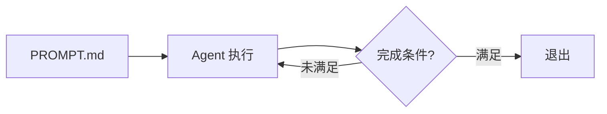

# Ralph Wiggum 模式

让 AI Agent 在自主循环中运行，每轮执行完成后自动重启，直到满足预设的完成条件为止。

名字来自《辛普森一家》里的 Ralph Wiggum——热情、偶尔天才、但经常出错，需要反复迭代才能达到目标。

## 核心机制

最原始的形式是一个 Bash 循环：

```bash
while :; do cat PROMPT.md | claude; done
```

每一轮迭代，Agent 都能看到前几轮修改过的文件和 git 历史，在此基础上继续推进，直到触发停止条件。



## Claude Code 插件

Geoffrey Huntley 提出这个技术后，Anthropic 将其集成为 Claude Code 官方插件，在基础循环上增加了工程化保障：

- **智能退出检测**：Agent 认为完成时，插件拦截退出信号，重新注入 prompt 继续迭代
- **限速与熔断**：防止无限循环和 API 过度消耗
- **最大迭代次数**：作为兜底安全阀

## 适用场景

这个模式的前提是**有明确、可验证的完成条件**。最典型的搭配是 TDD——测试全部通过即退出：

- 从零构建有完整测试覆盖的功能模块
- 大规模代码迁移（如升级框架版本）
- 修复一批已知失败的测试

:::warning
不适合需要人工判断的任务，或没有明确完成标准的开放性需求——没有停止条件的循环会一直跑下去，直到烧光 token。
:::

## 与 SDD 的关系

Ralph Wiggum 模式是执行层的自动化，SDD/SRDD 是上下文层的结构化。两者可以叠加：用 `constitution.md`、`spec.md`、`tasks.md` 构建清晰的上下文，再用 Ralph Wiggum 模式让 Agent 自主跑完整个任务清单。
