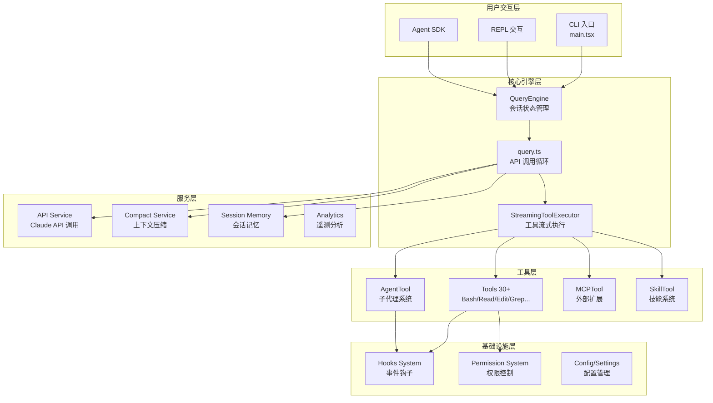
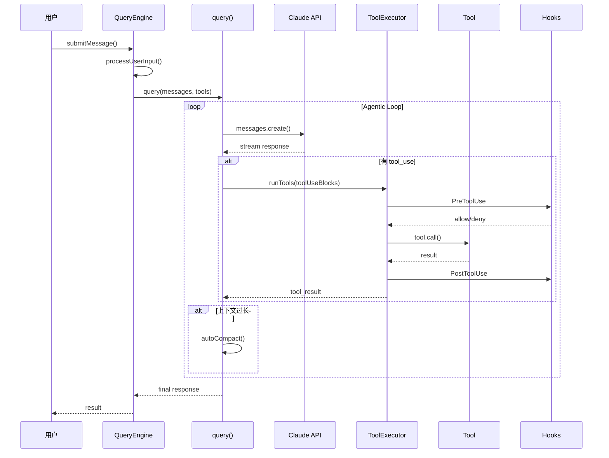
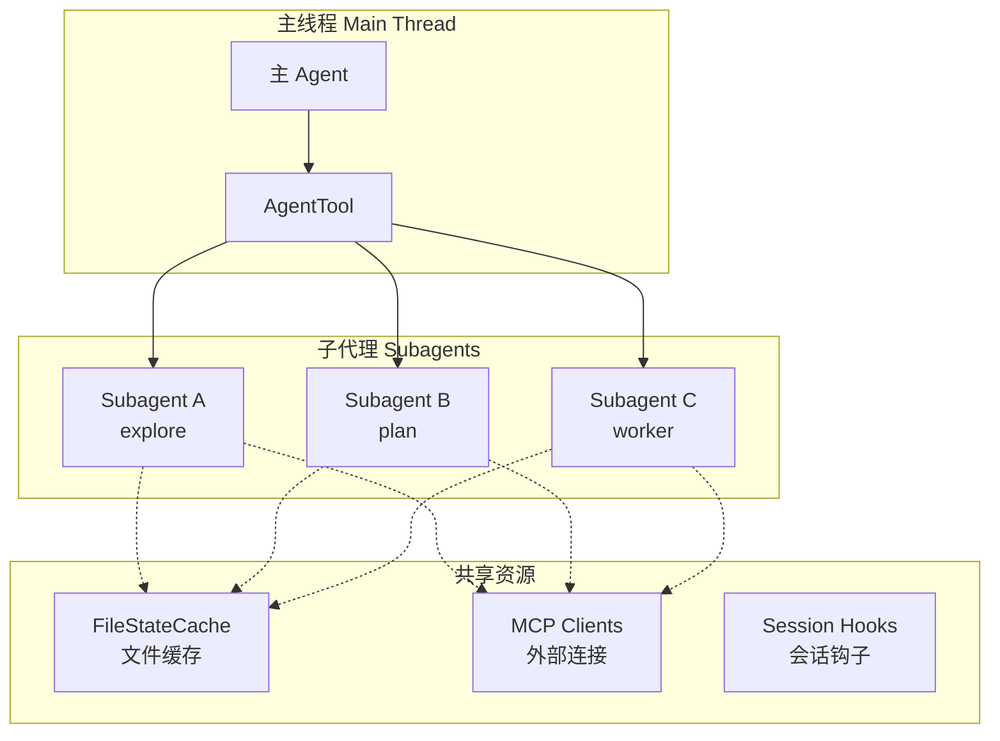
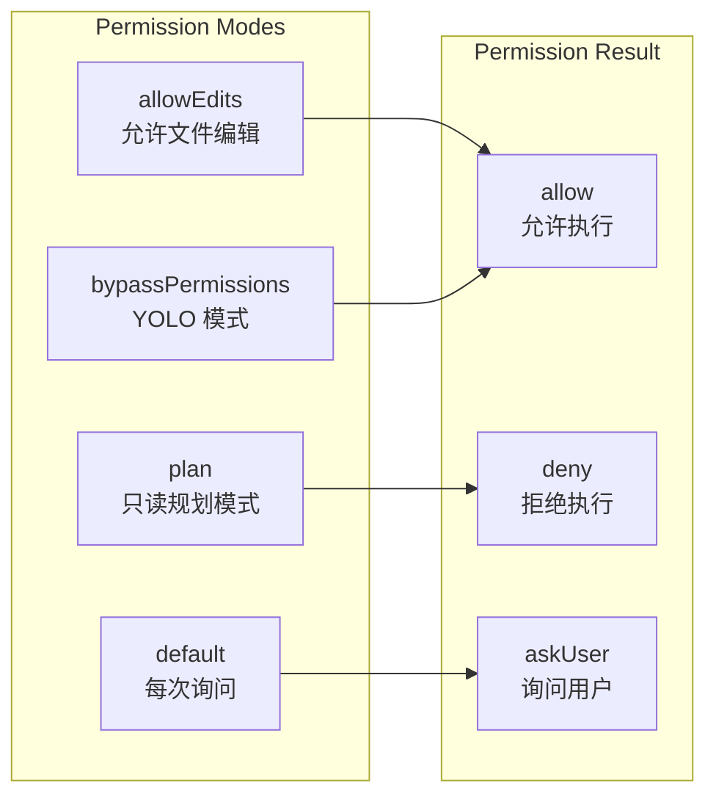
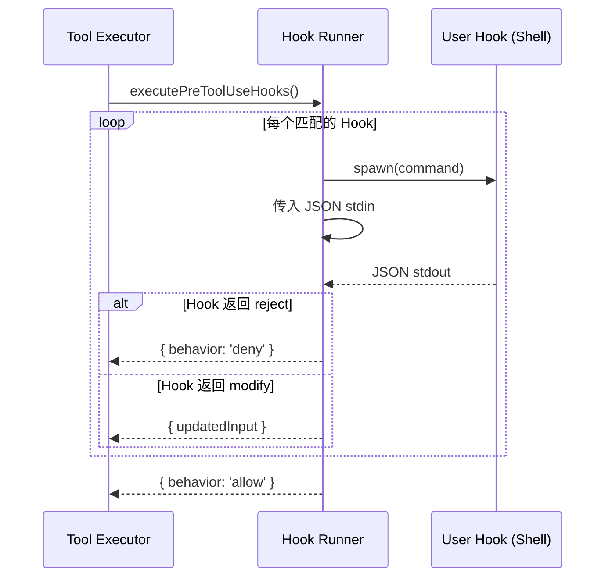
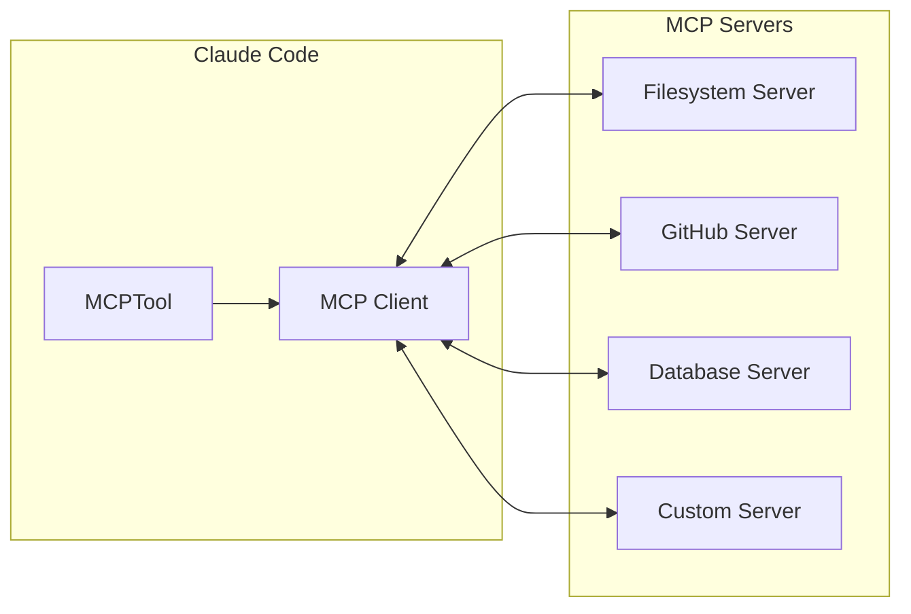
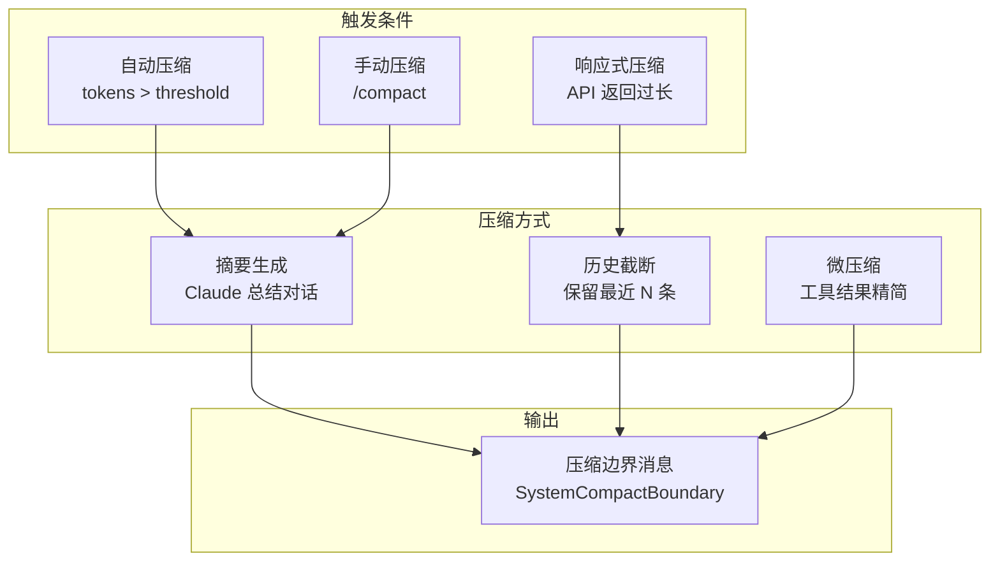

# Claude Code 源码解析

基于 Claude Code v2.1.88 反编译源码的架构分析。源码通过 npm 包内的 source map 还原，包含约 1884 个 TypeScript 源文件。

## 整体架构



## 核心数据流

### 请求处理流程



## Tool 系统设计

### Tool 接口定义

源码中 `Tool.ts` 定义了统一的工具接口：

```typescript
type Tool<Input, Output, Progress> = {
  name: string
  inputSchema: ZodSchema        // 输入参数校验

  // 核心方法
  call(args, context, canUseTool, parentMessage, onProgress): Promise<ToolResult>
  checkPermissions(input, context): Promise<PermissionResult>

  // 元信息
  isEnabled(): boolean
  isReadOnly(input): boolean
  isDestructive(input): boolean
  isConcurrencySafe(input): boolean

  // 渲染
  renderToolUseMessage(input, options): ReactNode
  renderToolResultMessage(content, progress, options): ReactNode

  // 搜索优化
  searchHint?: string           // 帮助模型通过关键词找到此工具
  shouldDefer?: boolean         // 延迟加载，需通过 ToolSearch 发现
}
```

### 内置工具清单

| 工具 | 文件 | 功能 |
|-----|------|------|
| Bash | `BashTool/` | Shell 命令执行 |
| Read | `FileReadTool/` | 文件读取（支持图片/PDF） |
| Edit | `FileEditTool/` | 精确字符串替换 |
| Write | `FileWriteTool/` | 文件写入 |
| Glob | `GlobTool/` | 文件模式匹配 |
| Grep | `GrepTool/` | 内容搜索（ripgrep） |
| Agent | `AgentTool/` | 子代理派生 |
| MCP | `MCPTool/` | MCP 工具调用 |
| LSP | `LSPTool/` | 语言服务器协议 |
| WebFetch | `WebFetchTool/` | 网页内容获取 |
| WebSearch | `WebSearchTool/` | 网络搜索 |

### 工具执行器 - StreamingToolExecutor

工具执行采用流式处理，支持：

1. **并行执行**: 通过 `isConcurrencySafe` 判断是否可并行
2. **进度报告**: 通过 `onProgress` 回调实时更新
3. **中断处理**: 支持用户中断正在执行的工具

```typescript
// services/tools/StreamingToolExecutor.ts
class StreamingToolExecutor {
  async execute(toolUseBlocks, context) {
    // 1. 分类：并发安全 vs 串行
    const { concurrent, sequential } = classifyTools(toolUseBlocks)

    // 2. 并行执行并发安全的工具
    const concurrentResults = await Promise.all(
      concurrent.map(block => this.executeTool(block, context))
    )

    // 3. 串行执行其余工具
    for (const block of sequential) {
      await this.executeTool(block, context)
    }
  }
}
```

## Agent 子代理系统

### 架构设计



### 内置 Agent 类型

| Agent | 文件 | 用途 |
|-------|------|------|
| general-purpose | `generalPurposeAgent.ts` | 通用任务代理 |
| Explore | `exploreAgent.ts` | 代码库探索 |
| Plan | `planAgent.ts` | 实现方案规划 |
| verification | `verificationAgent.ts` | 代码验证 |
| claude-code-guide | `claudeCodeGuideAgent.ts` | 使用指南查询 |

### 上下文继承

子代理创建时通过 `createSubagentContext` 继承父级上下文：

```typescript
// utils/forkedAgent.ts
function createSubagentContext(parentContext, options) {
  return {
    ...parentContext,
    // 共享文件缓存（可选克隆）
    readFileState: options.shareCache
      ? parentContext.readFileState
      : cloneFileStateCache(parentContext.readFileState),
    // 共享 MCP 客户端
    mcpClients: parentContext.options.mcpClients,
    // 独立的 AppState setter（异步代理不更新主线程状态）
    setAppState: options.isAsync ? noop : parentContext.setAppState,
  }
}
```

### Coordinator 模式

多代理协调模式（实验性），主代理作为「调度器」：

```typescript
// coordinator/coordinatorMode.ts
function getCoordinatorSystemPrompt() {
  return `
You are a **coordinator**. Your job is to:
- Help the user achieve their goal
- Direct workers to research, implement and verify code changes
- Synthesize results and communicate with the user

Your Tools:
- Agent - Spawn a new worker
- SendMessage - Continue an existing worker
- TaskStop - Stop a running worker

Parallelism is your superpower. Launch independent workers concurrently.
`
}
```

## 权限系统

### 权限模式



### 权限检查流程

```typescript
// utils/permissions/permissions.ts
async function checkPermission(tool, input, context): Promise<PermissionResult> {
  // 1. 工具自身权限检查
  const toolResult = await tool.checkPermissions(input, context)
  if (toolResult.behavior !== 'allow') return toolResult

  // 2. 全局权限规则匹配
  const rules = context.toolPermissionContext

  // 2a. 检查 alwaysDeny 规则
  if (matchesRule(rules.alwaysDenyRules, tool, input)) {
    return { behavior: 'deny', reason: 'Matched deny rule' }
  }

  // 2b. 检查 alwaysAllow 规则
  if (matchesRule(rules.alwaysAllowRules, tool, input)) {
    return { behavior: 'allow', updatedInput: input }
  }

  // 3. Auto Mode 分类器（YOLO 模式）
  if (context.mode === 'bypassPermissions') {
    const classifierResult = await runAutoModeClassifier(tool, input)
    if (classifierResult === 'safe') return { behavior: 'allow' }
  }

  // 4. 默认询问用户
  return { behavior: 'askUser', ... }
}
```

### Bash 命令安全分类

```typescript
// utils/permissions/bashClassifier.ts
const DANGEROUS_PATTERNS = [
  /rm\s+(-rf?|--recursive)/,    // 递归删除
  />\s*\/dev\/sd[a-z]/,          // 写入块设备
  /mkfs/,                         // 格式化
  /dd\s+/,                        // 磁盘操作
  /chmod\s+777/,                  // 危险权限
]

function classifyBashCommand(command: string): 'safe' | 'dangerous' | 'unknown' {
  for (const pattern of DANGEROUS_PATTERNS) {
    if (pattern.test(command)) return 'dangerous'
  }
  // ...更多规则
}
```

## Hooks 事件系统

### Hook 类型

| Hook | 触发时机 | 用途 |
|------|---------|------|
| PreToolUse | 工具执行前 | 拦截/修改/取消 |
| PostToolUse | 工具执行后 | 记录/通知 |
| Notification | 需要通知时 | 桌面提醒 |
| Stop | 任务完成时 | 清理/报告 |
| SessionStart | 会话开始 | 初始化 |
| SessionEnd | 会话结束 | 清理 |
| SubagentStart | 子代理启动 | |
| SubagentStop | 子代理结束 | |

### Hook 执行流程



### Hook 输入输出格式

```typescript
// 输入（通过 stdin 传递）
type PreToolUseHookInput = {
  hook_type: 'pre_tool_use'
  tool_name: string
  tool_input: Record<string, unknown>
  session_id: string
  agent_id?: string
  cwd: string
}

// 输出（通过 stdout 返回）
type HookJSONOutput = {
  // 同步响应
  decision?: 'approve' | 'reject' | 'modify' | 'skip'
  reason?: string
  updatedInput?: Record<string, unknown>

  // 异步响应
  continue_session?: boolean
  attachments?: Attachment[]
  permissions?: PermissionUpdate[]
}
```

## MCP 集成

### MCP 架构



### MCP 工具命名

```typescript
// services/mcp/normalization.ts
function normalizeToolName(serverName: string, toolName: string): string {
  // mcp__<server>__<tool>
  return `mcp__${sanitize(serverName)}__${sanitize(toolName)}`
}

// 例如: mcp__github__create_issue
```

### 连接管理

```typescript
// services/mcp/client.ts
async function connectToServer(config: MCPServerConfig) {
  const transport = new StdioClientTransport({
    command: config.command,
    args: config.args,
    env: expandEnvVars(config.env),
  })

  const client = new MCPClient()
  await client.connect(transport)

  // 获取工具列表
  const tools = await client.listTools()
  return { client, tools }
}
```

## 上下文压缩 (Compact)

### 压缩策略



### 压缩实现

```typescript
// services/compact/compact.ts
async function compactConversation(messages, options) {
  // 1. 生成对话摘要
  const summary = await generateSummary(messages)

  // 2. 创建压缩边界消息
  const boundaryMessage: SystemCompactBoundaryMessage = {
    type: 'system',
    subtype: 'compact_boundary',
    content: summary,
    timestamp: Date.now(),
    originalMessageCount: messages.length,
  }

  // 3. 返回压缩后的消息数组
  return [boundaryMessage, ...recentMessages]
}
```

## Skills 技能系统

### 内置技能

| 技能 | 文件 | 功能 |
|-----|------|------|
| /commit | - | Git 提交 |
| /review | - | 代码审查 |
| /simplify | `simplify.ts` | 代码简化 |
| /verify | `verify.ts` | 代码验证 |
| /remember | `remember.ts` | 记忆存储 |
| /loop | `loop.ts` | 循环执行 |
| /debug | `debug.ts` | 调试信息 |

### 技能加载

```typescript
// skills/loadSkillsDir.ts
async function loadSkillsFromDir(dir: string): Promise<Skill[]> {
  const files = await glob('**/*.md', { cwd: dir })

  return Promise.all(files.map(async file => {
    const content = await readFile(join(dir, file))
    const { frontmatter, body } = parseFrontmatter(content)

    return {
      name: frontmatter.name || basename(file, '.md'),
      description: frontmatter.description,
      prompt: body,
      arguments: frontmatter.arguments,
    }
  }))
}
```

## 面试要点

### 1. 为什么采用 Tool-based 架构？

**回答要点**:
- Tool 是 Claude API 原生支持的扩展机制
- 每个 Tool 有明确的输入输出 Schema，便于模型理解
- Tool 可以组合、嵌套（Agent 调用 Agent）
- 权限控制可以精确到每个 Tool

### 2. 如何解决 LLM 上下文长度限制？

**回答要点**:
- **自动压缩 (Auto Compact)**: 监控 token 用量，超过阈值时生成摘要
- **微压缩 (Micro Compact)**: 精简大型工具结果
- **文件缓存 (FileStateCache)**: 避免重复读取相同文件
- **压缩边界消息**: 保留最近上下文，历史变为摘要

### 3. 多 Agent 协作的设计思路？

**回答要点**:
- **扁平化**: 所有子代理直接向主代理汇报，避免复杂层级
- **上下文共享**: 文件缓存和 MCP 连接在代理间共享
- **并行执行**: 并发安全的代理可以同时运行
- **Coordinator 模式**: 主代理专注调度，不执行具体任务

### 4. 权限系统如何平衡安全与效率？

**回答要点**:
- **多级模式**: default → allowEdits → bypassPermissions
- **规则匹配**: alwaysAllow/alwaysDeny/alwaysAsk
- **YOLO 分类器**: 自动判断命令安全性
- **Hooks 拦截**: 用户可自定义权限逻辑

### 5. 对通用 AI Agent 的启示

**架构启示**:
1. **Tool-first**: 把能力封装成 Tool，而不是 hardcode
2. **权限分层**: 不同场景不同权限级别
3. **上下文管理**: 主动压缩而非被动截断
4. **可扩展性**: MCP/Hooks/Skills 多种扩展机制

**工程启示**:
1. **渐进式信任**: 从询问模式到自动模式
2. **可观测性**: 详尽的日志和遥测
3. **优雅降级**: API 错误重试、模型回退
4. **流式优先**: 用户体验优先于批量处理

## 代码结构速查

```
restored-src/src/
├── main.tsx              # CLI 入口
├── QueryEngine.ts        # 会话引擎
├── query.ts              # API 调用循环
├── Tool.ts               # Tool 接口定义
├── tools/                # 30+ 工具实现
│   ├── AgentTool/        # 子代理系统
│   ├── BashTool/         # Shell 执行
│   ├── FileEditTool/     # 文件编辑
│   └── MCPTool/          # MCP 调用
├── services/
│   ├── api/              # Claude API
│   ├── compact/          # 上下文压缩
│   ├── mcp/              # MCP 客户端
│   └── tools/            # 工具执行器
├── hooks/                # React Hooks
├── utils/
│   ├── hooks.ts          # 事件钩子
│   └── permissions/      # 权限系统
├── coordinator/          # 多代理协调
├── skills/               # 技能系统
└── commands/             # 斜杠命令
```
