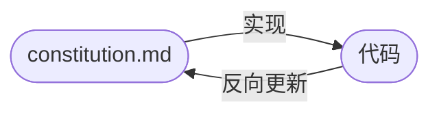

# Roundtrip 机制

SDD 解决了「按规范写代码」的问题，但随着项目持续迭代，规范本身会逐渐与代码脱节。SRDD 在此基础上引入 roundtrip 机制，让规范随代码同步演进。

## SDD 的局限

**文档与代码漂移**：代码在迭代，`constitution.md` 不会自动更新。时间一长，`constitution.md` 描述的是「过去的系统」。

**上下文窗口瓶颈**：`spec.md`、`plan.md`、`tasks.md` 加起来几万字，AI Agent 开始「读不完」，架构一致性悄悄下滑。

**决策上下文丢失**：没有人记得上个月为什么选了 A 方案而不是 B 方案，下次 AI Agent 又把 B 方案翻出来，绕一圈回到原点。

## 从 SDD 到 SRDD

**Spec-Roundtrip Driven Development (SRDD，规范回路开发)** 的关键转变是：

> 规范不是合同，而是活文档——它描述的是代码当前的状态，而不是冻结的约定。

代码才是最终的真相来源。当代码演进之后，要定期 **从代码中反向更新 `constitution.md`**，形成闭环——这个循环同时解决了上面三个问题：`constitution.md` 与代码始终对齐，AI 每次拿到的都是新鲜的上下文，设计决策也被沉淀进 `constitution.md` 不再丢失。



这也带来了一个重要的优先级调整：**一致性优先于正确性**——这里的「正确性」指局部最优解，不是 bug 的对错。系统内部风格和结构的一致，比某一处局部最优解更有价值。AI 在一致的代码库里工作效率成倍提升，而 roundtrip 正是维持这种一致性的机制。

## 实施步骤

目前尚无自动化工具支持 roundtrip，需要手动执行：

**第一步：分析差异**

```
@constitution.md @src/
分析当前代码库的实际结构，找出与 constitution.md 描述不符的地方。
```

**第二步：审查结果**，确认哪些是需要写进 `constitution.md` 的真实变化。

**第三步：更新 `constitution.md`**，只更新有实际变化的章节。

:::tip 触发时机
- 一个完整功能合并后、启动下一个重要功能之前
- 感觉 `constitution.md` 与代码明显脱节时
:::

:::warning
不要让 AI 一次性重写整个 `constitution.md`。每次 roundtrip 只更新有实际变化的章节。
:::
