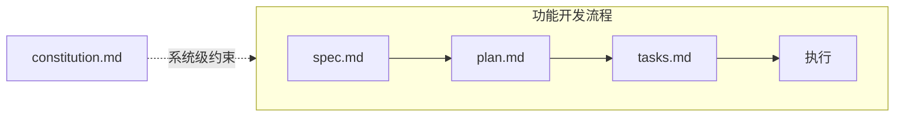

# Speckit 工作流

传统开发中，代码才是核心，规范只是启动前的脚手架——写完就丢。SDD 反转了这个顺序：规范成为权威来源，直接驱动实现，而不只是指导它。

[Speckit](https://github.github.com/spec-kit/) 以 `constitution.md` 作为系统级约束，在此基础上将功能开发拆成四步，前三步各产出一个文件，确认后才进入下一步。



## `constitution.md` — 系统宪法

描述整个项目的 **架构、技术约定和设计决策**，是所有功能 spec 的上层约束。

与 `spec.md` 的区别：`spec.md` 是功能级的、一次性的；`constitution.md` 是系统级的、长期存活的。

典型内容：

```markdown
# 系统宪法

## 架构概述
前后端分离，Next.js App Router + PostgreSQL + Redis

## 技术约定
- 所有外部 API 调用集中在 src/services/ 层
- 数据库访问只通过 Repository 模式，不直接在 controller 写 SQL
- 错误处理统一使用 AppError 类

## 关键设计决策
- 选择 JWT 无状态认证而非 Session，原因：需要支持多端
- Redis 仅用于缓存和黑名单，不做主数据存储
```

## `spec.md` — 需求规范

`spec.md` 定义 **目标和约束**。

```markdown
# Feature: 用户认证模块

## 目标
实现基于 JWT 的无状态用户认证

## 功能需求
- 用户注册（邮箱 + 密码，密码 bcrypt 加密）
- 用户登录（返回 access token + refresh token）
- Token 刷新（refresh token 有效期内自动续期）
- 登出（服务端加入黑名单）

## 非功能需求
- access token 有效期：15 分钟
- refresh token 有效期：7 天

## 不做的事
- 第三方 OAuth 登录（下个迭代）
- 多设备管理
```

:::tip
明确「不做什么」比描述功能本身更重要——AI 会脑补你没写的部分。
:::

## `plan.md` — 实现计划

`spec.md` 确认后，将需求转化为技术方案，人工确认后再执行。

```markdown
# 实现计划

## 技术选型
- 认证库：jsonwebtoken
- 加密：bcryptjs（salt rounds: 10）
- 存储：PostgreSQL（用户表）+ Redis（token 黑名单）

## 模块划分
1. auth.service.js — 注册、登录、Token 生成与验证
2. auth.controller.js — HTTP 路由层
3. auth.middleware.js — Token 拦截器

## 数据模型
users: id, email, password_hash, created_at
token_blacklist: jti, expires_at（Redis TTL 自动清理）
```

## `tasks.md` — 任务清单

`plan.md` 确认后，将 plan 拆解为 **可独立执行、可验收的最小步骤**。

```markdown
## 基础设施
- [x] 创建 users 表 migration
- [x] 配置 Redis 连接

## 认证核心
- [ ] 实现密码 hash 和验证
- [ ] 实现 JWT 生成和解析
- [ ] 实现注册接口
- [ ] 实现登录接口

## 安全
- [ ] 实现 Token 黑名单（登出）
- [ ] 添加请求频率限制
```

:::tip 持久化
三个核心文件提交进 git，作为项目的持久上下文。新成员加入或切换 AI 工具时，直接从这三个文件恢复开发状态。
:::
