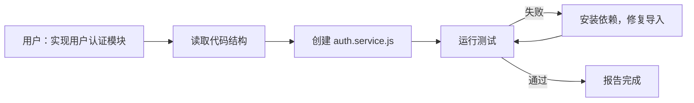

# AI Coding 的演变

AI 与开发工作流的融合程度，可以分为三个层级。层级越高，AI 介入越深，开发者的角色也随之改变。

## L1：问答

以网页版 AI 对话工具为代表 (ChatGPT、Gemini、DeepSeek 等)。

典型工作流：遇到报错或卡点 → 复制代码/错误信息到对话框 → 读取回答 → 将代码粘贴回 IDE。

AI 第一次能够真正「理解」问题并给出有帮助的回答，但 IDE 和 AI 是两个独立的窗口，开发者充当中间人，负责在两者之间传递上下文。

局限：每次对话从零开始，AI 不了解项目结构。开发者需要扮演「人肉序列化器」——把大脑和 IDE 里的复杂情境，压缩成 AI 能理解的文字，上下文摩擦力极高。

## L2：嵌入

AI 进入 IDE，这一层级内部经历了从补全到对话的演进。

**GitHub Copilot** 是早期代表，支持从注释或函数签名触发行内补全。

```javascript
// 读取 CSV 文件，返回每列的均值
function calculateColumnMeans(filepath) {
  // Copilot 从注释生成完整实现
}
```

**Cursor** 将 AI 的感知范围从「当前文件」扩展到「整个代码库」，并在 IDE 内引入对话——开发者可以直接和 AI 协商：「重构这个函数」「为什么测试失败」。

局限：
- **被动**：只响应显式指令，不会主动发起任务。修改了一个核心 API，它不会主动提醒下游模块受影响。
- **视野局限**：对当前打开的文件理解透彻，但对整个项目的宏观架构和模块依赖认知不足。
- **行动受限**：行动空间绑定在本地 IDE 环境里，无法在远程服务器、CI Runner 或 Docker 容器中独立执行任务。

## L3：自主

**Claude Code** 和 **Codex** 是这一层级的代表工具，均为在终端独立运行的 AI Agent。

L3 相比 L2 有两个核心突破：

**主动规划**：不再只是被动响应，而是主动规划、执行、遇到问题会反问或自行修复。对话从「请告诉我怎么做」变成「我打算这么做，请批准」。人的角色从「写代码的人」变成「定义目标、审查结果的人」。

**动手执行**：作为独立进程，可部署到服务器、CI Runner、Docker 等任意环境，主动读写文件、执行 Shell 命令。Cursor 和 Copilot 后来也推出了 Agent 模式，但行动始终绑定在本地 IDE 环境里，无法做到这一点。

SWE-bench 得分从 L1/L2 时接近 0% 到 Claude Code 的 72%，不只是量变，是质变。



局限：
- **意图要求高**：任务描述模糊时容易跑偏，中途纠正成本高。
- **操作风险**：自主执行意味着可能产生破坏性操作，关键节点需要人工审批。
- **成本**：多轮工具调用，token 消耗远高于 L1/L2。

克服这些局限的关键，是在交给 AI 执行之前，把目标、约束和验收标准写清楚——即 **[规范驱动开发 (SDD)](../methodology/sdd.md)** 的核心思路。L3 的局限本质上把问题抛回给了开发者：AI 自主空间越大，对人的规划能力要求越高。

:::tip 组合使用
L3 并不淘汰 L1/L2，熟练的开发者会根据任务性质在三者之间灵活切换。问一个问题用 L1，修复一个小 bug 用 L2，开发完整功能用 L3。层级越高，意味着成本越大，这三者应该结合使用。
:::
