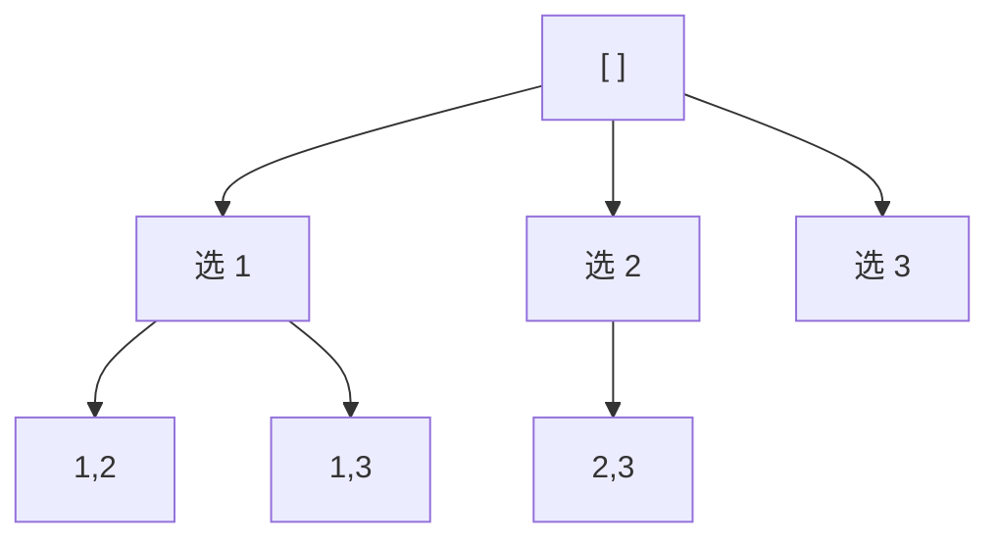

# 回溯

**回溯 = DFS + 撤销选择。** 它在一棵决策树上做深度优先搜索，每一步做一个选择，走到底或走不通时**撤销选择、回退一步**，再尝试别的分支，直到找出所有满足条件的解。专治「列举所有可能的解」这类问题：排列、组合、子集、棋盘类 (N 皇后、数独)、切割问题等。

:::tip 形象记忆
回溯就像**走迷宫时在岔路口做标记**：每到一个路口选一个方向走进去，墙上画个箭头记下「我从这来的」；走到死胡同就**擦掉箭头退回路口** (撤销选择)，换另一个方向再试。把所有方向都试遍，就找出了所有走法。「擦掉箭头」这个动作就是回溯的灵魂。
:::

## 和 DP 的分界

回溯和 [动态规划](./dynamic-programming.md) 经常被一起讨论，但分工清晰：

- **回溯**：要列举出**所有具体的解** (每一种排列长什么样)。它在意「过程」，复杂度通常是指数级 `O(2^n)` 或 `O(n!)`，因为本就要穷举。
- **DP**：只要一个**最优值或方案总数** (最少几步、有多少种走法)，不关心每个解的具体长相，靠状态合并把指数级压到多项式级。

简单判断：**问「有哪些」用回溯，问「最优值/总数」用 DP**。

## 回溯框架

所有回溯题都是同一个骨架，核心是三要素——**路径** (已经做的选择)、**选择列表** (当前能做的选择)、**结束条件**：

```js
function backtrack(路径, 选择列表) {
  // 第一步：先写结束条件——路径满足要求就收集一个解
  if (满足结束条件) {
    结果.push([...路径]); // 注意拷贝，下面解释
    return;
  }

  // 第二步：遍历当前能做的每个选择
  for (const 选择 of 选择列表) {
    做选择;                      // 第三步：把选择加入路径
    backtrack(路径, 新的选择列表); // 第四步：基于这个选择继续往下走
    撤销选择;                    // 第五步：还原现场 ← 回溯的精髓
  }
}
```



:::warning
收集解时一定要 `[...路径]` 拷贝一份再存。路径是同一个数组在整个递归里反复增删，如果直接 `结果.push(路径)`，存进去的是引用，最后会全部变成空数组或被后续操作污染。
:::

:::tip
「做选择」和「撤销选择」必须**成对出现**，且对称地包住递归调用。撤销就是把刚做的选择原样还原 (数组 `push` 对应 `pop`)，让回退后的状态和进入这层分支前完全一致。
:::

## 三大经典题型

排列、组合、子集是回溯的三块基石，区别全在**选择列表怎么定**和**要不要去重/讲顺序**。

### 全排列

给不含重复数字的数组，返回所有排列。

:::tip 形象记忆
全排列像**给 3 个人排队照相**：第一个位置谁都能站，第二个位置从剩下的人里挑，第三个位置站最后一个人。`used` 数组就是「谁已经站好了」的花名册，站过的人不能再选。
:::

每个位置可以选任何**还没用过**的数，所以要一个 `used` 标记：

```js
function permute(nums) {
  // 第一步：准备结果、当前路径、花名册
  const res = [];
  const path = [];
  const used = new Array(nums.length).fill(false);

  function backtrack() {
    // 第二步：路径填满了，说明排好一队人，收集
    if (path.length === nums.length) {
      res.push([...path]);
      return;
    }

    // 第三步：每个位置都从头扫一遍所有人
    for (let i = 0; i < nums.length; i++) {
      if (used[i]) continue; // 站过的人跳过

      // 第四步：选这个人 → 登记 + 入列
      used[i] = true;
      path.push(nums[i]);

      backtrack(); // 第五步：去排下一个位置

      // 第六步：撤销——让这个人退出来，给别的排法让位
      path.pop();
      used[i] = false;
    }
  }

  backtrack();
  return res;
}
```

排列**讲顺序** (`[1,2]` 和 `[2,1]` 是两个解)，所以每次都从头遍历，靠 `used` 排除自己。

### 组合 / 子集

组合和子集**不讲顺序** (`[1,2]` 和 `[2,1]` 算同一个)，靠一个 `start` 指针保证只往后选，天然避免重复。

:::tip 形象记忆
子集像**从冰箱里挑食材做菜**：每种食材只面对「放或不放」两个选择，挑出来的组合不讲先后顺序——「番茄 + 鸡蛋」和「鸡蛋 + 番茄」是同一道菜。`start` 指针保证你只往后翻冰箱，不会回头重复拿。
:::

```js
// 子集：每个节点都是一个解，不需要结束条件提前 return
function subsets(nums) {
  // 第一步：准备结果和当前路径
  const res = [];
  const path = [];

  function backtrack(start) {
    // 第二步：每走到一个节点，当前路径本身就是一个子集，先收下
    res.push([...path]);

    // 第三步：从 start 往后挑食材，不回头
    for (let i = start; i < nums.length; i++) {
      path.push(nums[i]);   // 放入这个食材
      backtrack(i + 1);     // 继续往后挑，下一层从 i+1 开始
      path.pop();           // 撤销——把它拿出来，试不放它的组合
    }
  }

  backtrack(0);
  return res;
}
```

:::info
**排列用 `used`、组合/子集用 `start`**，这是区分三类问题的关键。讲顺序就每次从头扫 + `used` 标记；不讲顺序就用 `start` 只向后选。要在有重复元素的数组里去重，则先排序，再在同一层用 `if (i > start && nums[i] === nums[i-1]) continue` 跳过相邻重复值。
:::

## 剪枝：回溯的提速关键

暴力穷举很慢，**剪枝**就是在明显走不通的分支提前 `return` 或 `continue`，砍掉整棵子树。

:::tip 形象记忆
剪枝像**逛超市买够 3 样东西就走**：如果货架上剩的商品还不够凑满 3 样，就没必要再往里走了，直接掉头。提前判断「此路注定凑不齐」，省下整段无用功。
:::

比如组合问题里，如果剩下的元素个数已经不够凑满目标长度，就没必要继续：

```js
// 从 1..n 中选 k 个数的组合，剪枝版
function combine(n, k) {
  const res = [];
  const path = [];

  function backtrack(start) {
    // 第一步：凑够 k 个就收集
    if (path.length === k) {
      res.push([...path]);
      return;
    }

    // 第二步：剪枝——还需 k - path.length 个，
    // i 最多从 n - (k - path.length) + 1 开始，再往后剩的数量就不够了
    for (let i = start; i <= n - (k - path.length) + 1; i++) {
      path.push(i);     // 做选择
      backtrack(i + 1); // 往后挑
      path.pop();       // 撤销选择
    }
  }

  backtrack(1);
  return res;
}
```

剪枝不改变结果，只减少无效搜索，是回溯题从「能过」到「跑得快」的分水岭。

## 小结

- 回溯 = **DFS + 撤销选择**，专治「列举所有解」的问题；问「最优值/总数」则用 DP。
- 框架三要素：**路径、选择列表、结束条件**；「做选择」和「撤销选择」必须成对、对称地包住递归。
- 收集解时务必 `[...path]` 拷贝，否则存的是会被污染的引用。
- 三类题的分水岭：**排列用 `used` (讲顺序)，组合/子集用 `start` (不讲顺序)**，去重先排序再跳过同层相邻重复。
- 用**剪枝**砍掉注定失败的分支，是回溯提速的核心手段。

> ## 一句话口诀
>
> **走迷宫做标记，死路就擦掉退回去；排列查花名册讲顺序，组合用指针往后挑，凑不够趁早剪枝掉头。**
