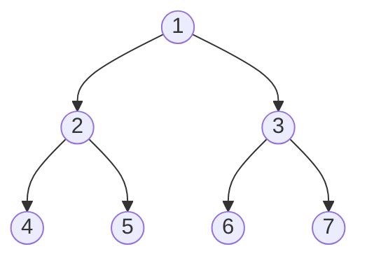
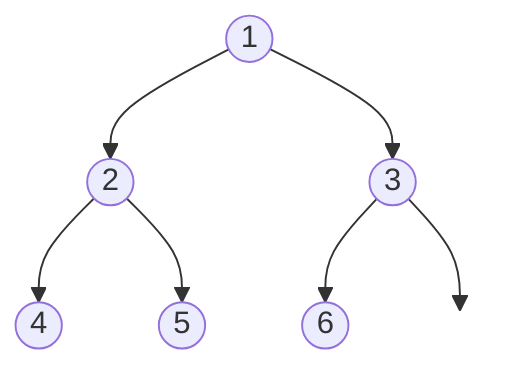
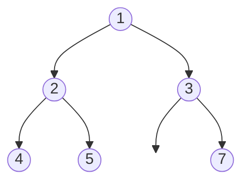
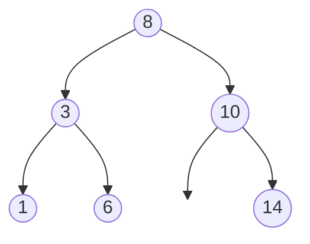
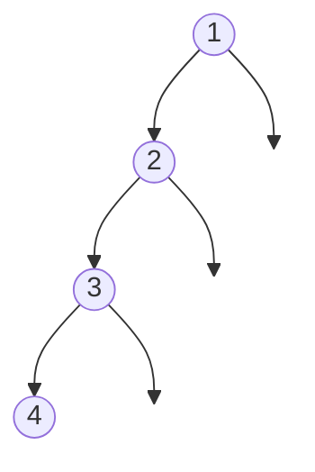
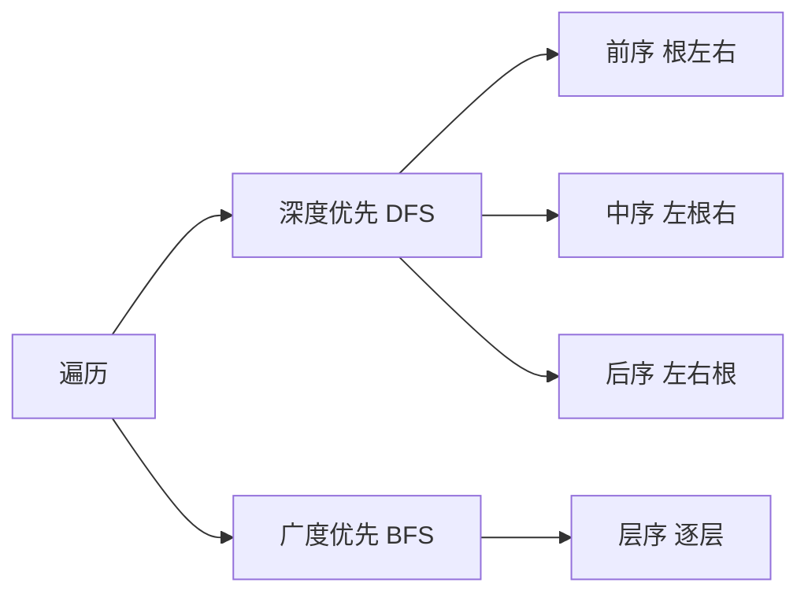

# 二叉树

**几乎所有二叉树题目，都是「遍历」框架里换一个时机做事。** 二叉树是每个节点最多有两个子节点 (左、右) 的树形结构，是链表的「分叉」版本，也是面试里出现频率最高的数据结构之一。先讲清楚结构，再讲透遍历，剩下的全是变体。

:::tip 形象记忆
把二叉树想成**一个家族的族谱**：最上面是老祖宗 (根节点)，每个人最多生两个孩子，没有孩子的就是叶子节点。所有「统计家族人数」「找两个人的共同祖先」「按辈分排队」之类的问题，都是沿着族谱走一遍、在合适的时机记一笔。
:::

## 基本概念



| 术语 | 含义 |
|------|------|
| 根节点 (root) | 最顶层、没有父节点的节点，上图的 `1` |
| 叶子节点 (leaf) | 没有子节点的节点，上图的 `4 5 6 7` |
| 节点的度 | 子节点个数，二叉树中每个节点的度 ≤ 2 |
| 深度 (depth) | 从根到该节点的边数，根的深度为 0 |
| 高度 (height) | 从该节点到最远叶子的边数，叶子的高度为 0 |
| 层 (level) | 深度相同的节点在同一层，通常从第 1 层开始数 |

:::info
**深度**自顶向下数 (从根出发)，**高度**自底向上数 (从叶子出发)。整棵树的高度 = 根节点的高度 = 最大深度。
:::

## 几种特殊的二叉树

### 满二叉树 (完美二叉树)

每个非叶节点都有左右两个孩子，且所有叶子都在同一层，长成一个完美的三角形。


高度为 `h` 时恰好有 `2^(h+1) - 1` 个节点，不多不少。

### 完全二叉树

除最后一层外都填满，且最后一层节点**全部靠左连续排列**，中间不留空洞。堆 (heap) 就是用数组存储的完全二叉树。

✅ 是完全二叉树——最后一层 `4 5 6` 从左到右连续：



❌ 不是完全二叉树——节点 `3` 左孩子空着却挂了右孩子 `7`，最后一层出现空洞：



:::info
**满**要求每层都填满 (完美三角形)；**完全**允许最后一层不满，但必须从左往右连续、不留空。满二叉树一定是完全二叉树，反之不成立。
:::

### 二叉搜索树 (BST)

对任意节点，**左子树所有值 < 它 < 右子树所有值**。



关键性质：**中序遍历结果是升序** → `1 3 6 8 10 14`。这条单独记牢，是高频考点。

### 平衡二叉树 (AVL)

任意节点的左右子树高度差不超过 1。

✅ 平衡——每个节点的左右子树高度差都 ≤ 1：


❌ 失衡——节点 `1` 左子树高 2、右子树高 0，差值为 2：



平衡保证树高维持在 `O(log n)`，查找、插入、删除都稳定在 `O(log n)`，不会退化成链表。红黑树是工程上更常用的近似平衡树。

:::tip
图中透明的空节点 `( )` 用来占位，表达「左孩子为空、右孩子存在」这类结构——否则单个孩子会被画到正中间，看不出左右。
:::

## 如何表示一棵树

**链式存储**是题目里最常见的形式，每个节点持有左右孩子的引用：

```js
function TreeNode(val, left, right) {
  this.val = val;
  this.left = left === undefined ? null : left;
  this.right = right === undefined ? null : right;
}
```

**数组存储**适合完全二叉树 (如堆)：下标 `i` 的节点，左孩子在 `2i + 1`，右孩子在 `2i + 2`，父节点在 `Math.floor((i - 1) / 2)`。非完全二叉树用数组会浪费大量空位，一般不用。

## 遍历是一切的核心

遍历就是「按某种顺序访问每个节点一次」。分两大类：

- **深度优先 (DFS)**：一条路走到底再回头，靠**递归**或**栈**实现，又按访问根节点的时机分前序、中序、后序。
- **广度优先 (BFS)**：一层一层地访问，靠**队列**实现，即层序遍历。



「前/中/后」指的是**根节点在什么时机被处理**：根在最前是前序，在中间是中序，在最后是后序。左、右子树永远是先左后右。

以上面那棵树为例：

| 遍历方式 | 顺序 | 结果 |
|----------|------|------|
| 前序 | 根 → 左 → 右 | `1 2 4 5 3 6 7` |
| 中序 | 左 → 根 → 右 | `4 2 5 1 6 3 7` |
| 后序 | 左 → 右 → 根 | `4 5 2 6 7 3 1` |
| 层序 | 逐层从左到右 | `1 2 3 4 5 6 7` |

### 递归遍历

递归写法是同一个模板，差别只在「处理根节点」那行代码摆在哪：

```js
function traverse(node, res) {
  if (node === null) return; // 递归出口：空节点直接返回

  // res.push(node.val);   ← 放这里是【前序】
  traverse(node.left, res);
  // res.push(node.val);   ← 放这里是【中序】
  traverse(node.right, res);
  // res.push(node.val);   ← 放这里是【后序】
}
```

:::tip
这三个位置正好对应递归栈的三个时机：刚进入节点 (前序)、左子树处理完回来 (中序)、左右都处理完准备离开 (后序)。理解了这一点，前中后序就不用死记。
:::

### 迭代遍历

递归本质是系统帮你维护了一个栈，手动迭代就是自己用栈模拟。前序最直观——出栈时处理，先压右孩子再压左孩子 (保证左孩子先出栈)：

```js
function preorder(root) {
  // 第一步：空树直接返回
  if (root === null) return [];
  // 第二步：准备结果数组，把根节点压入栈
  const res = [];
  const stack = [root];

  // 第三步：栈不空就一直处理
  while (stack.length > 0) {
    // 第四步：弹出栈顶并处理 (前序：一弹出就记录)
    const node = stack.pop();
    res.push(node.val);
    // 第五步：先压右、后压左，这样下次弹出的才是左孩子
    if (node.right) stack.push(node.right);
    if (node.left) stack.push(node.left);
  }

  return res;
}
```

:::warning
中序、后序的迭代写法比前序绕，面试里能默写递归 + 讲清前序迭代通常就够了。中序迭代的思路是「一路向左压栈，弹出时处理再转向右子树」，后序可以用「前序的『根右左』再整体反转」取巧。
:::

### 层序遍历 (BFS)

用队列：取出队首节点处理，再把它的左右孩子入队。

:::tip 形象记忆
层序遍历像**排队进游乐场，按队伍一排一排放行**。`size = queue.length` 是「当前这一排有多少人」，只放行这么多个，正好把每一层切开，下一排 (孩子们) 已经在队尾等着了。
:::

要分层时，每轮循环先记录当前队列长度，只处理这么多个，就天然切开了每一层：

```js
function levelOrder(root) {
  // 第一步：空树返回空数组
  if (root === null) return [];
  // 第二步：根节点入队
  const res = [];
  const queue = [root];

  // 第三步：队列不空就一层一层处理
  while (queue.length > 0) {
    // 第四步：先记下「这一层有几个节点」，作为本轮放行人数
    const size = queue.length;
    const level = [];

    // 第五步：只处理这一层的 size 个节点，把它们的孩子排进队尾
    for (let i = 0; i < size; i++) {
      const node = queue.shift();
      level.push(node.val);
      if (node.left) queue.push(node.left);
      if (node.right) queue.push(node.right);
    }

    // 第六步：这一层收集完，放进结果
    res.push(level);
  }

  return res;
}
```

## 解题框架：两种思维

绝大多数二叉树题目都可以归到两种思路，想清楚用哪种，代码自然就出来了：

**1. 遍历思维 (回溯式)**：用一个外部变量记录答案，遍历整棵树时不断更新它。函数本身不返回值，靠「副作用」积累结果。

**2. 分解思维 (分治式)**：把问题拆成「左子树的答案」和「右子树的答案」，再合并出当前节点的答案。函数有明确的返回值。

以**求最大深度**为例，两种思维各写一遍：

```js
// 分解思维：当前树的深度 = 左右子树深度的最大值 + 1
function maxDepth(root) {
  // 第一步：出口——空树深度为 0
  if (root === null) return 0;
  // 第二步：信任递归，拿到左右子树各自的深度
  const left = maxDepth(root.left);
  const right = maxDepth(root.right);
  // 第三步：合并——比更深的孩子再深一层
  return Math.max(left, right) + 1;
}
```

```js
// 遍历思维：遍历到每个节点时，用当前深度更新全局最大值
function maxDepth(root) {
  // 第一步：准备一个外部变量存答案
  let res = 0;

  function traverse(node, depth) {
    // 第二步：空节点不处理
    if (node === null) return;
    // 第三步：走到叶子时，用当前深度刷新最大值
    if (node.left === null && node.right === null) {
      res = Math.max(res, depth);
    }
    // 第四步：带着 depth+1 继续往左右走
    traverse(node.left, depth + 1);
    traverse(node.right, depth + 1);
  }

  traverse(root, 1);
  return res;
}
```

:::tip
**优先考虑分解思维**：能用子问题的答案推出原问题答案 (如最大深度、是否平衡、最近公共祖先)，代码往往更短更清晰。当答案不是「子树答案的简单合并」时 (如求所有满足条件的路径)，再用遍历思维配合回溯。
:::

## 如何理解分治递归

分治式的递归之所以难懂，几乎都是因为一件事——**试图在脑子里展开调用栈**：进左子树、再进左子树、再进……人脑的「栈」两三层就乱了，越想越晕。放弃这种想法，换成下面这套。

### 心法一：信任递归契约

递归函数有一份「契约」：**它的定义说它返回什么，你就假设它真的能返回，不去想内部怎么实现。**

写函数体时遇到 `maxDepth(root.left)`，**不准往里钻**，就当它已经正确算好了「左子树的最大深度」并把数字递给你。你唯一的任务是：拿到左右子树的答案，拼出当前这棵树的答案。

```js
function maxDepth(root) {
  if (root === null) return 0;        // ① 出口
  const left = maxDepth(root.left);   // ② 信任：左子树深度已算好，别往里钻
  const right = maxDepth(root.right); // ③ 信任：右子树深度也算好了
  return Math.max(left, right) + 1;   // ④ 合并：我比更深的孩子再深一层
}
```

### 心法二：包工头类比

把每个节点想成一个**包工头**，任务是「数清我手下总共多少人」：他不亲自数，而是问**左组长**多少人、问**右组长**多少人，两个数字加上自己 (+1) 上报。左组长怎么数的？同样的套路，再往下分包。

你作为规则的设计者，**只需要设计一个包工头的行为** (问左、问右、加自己)，剩下交给规则自我复制。**管一个节点就够了，不用管整棵树。**

### 心法三：三步法

每道分治题都套这个：

1. **写清函数定义 (契约)**：输入是什么，返回值代表什么。最重要，定义模糊后面全乱。
2. **写 base case (出口)**：最小情形直接返回，二叉树里通常是 `if (root === null) return 某个值`。
3. **假设子问题已解决，写合并逻辑**：调用自己处理左右孩子，把结果拼成当前答案。

### 心法四：验证只画一层

检查写得对不对，**不要画整棵递归树**，只画三个节点：

```
     ?         ← 当前节点：用下面两个孩子的返回值能算对吗？
    / \
  [3] [5]      ← 假装孩子已返回 3 和 5
```

代入 `max(3, 5) + 1 = 6`，对。**只要「一层」的逻辑对、base case 对，整棵树必然对**——这就是数学归纳法，不需要你在脑子里跑完全程。

### 为什么分治总在后序位置

分治必须**先拿到左右孩子的返回值才能合并**，所以合并动作必然发生在「左右子树都递归完之后」，也就是 [遍历的三时机](#递归遍历) 里的**后序位置**：

```js
const left = maxDepth(root.left);
const right = maxDepth(root.right);
// ↓ 后序位置：左右答案都到手，在这里合并
return Math.max(left, right) + 1;
```

这是一个非常可靠的信号：**只要发现「当前答案需要依赖子树的返回值」，就用分治，且合并代码写在后序位置。**

而**遍历思维不绑定某个位置**——它靠外部变量和参数传递，处理节点的时机是自由的，前、中、后序都行，看你需要在什么时候做事：

- 进入节点马上就能处理 (如收集节点值、用传入的 `depth` 更新答案) → **前序位置**，这是最常见的情况。
- BST 想拿到升序序列 → **中序位置** (BST 中序即升序)。
- 需要先看完子树再处理当前节点 → **后序位置** (这时往往已接近分治)。

所以两种思维真正的分界**不是「前序还是后序」，而是「靠不靠返回值」**：靠返回值合并就是分治 (必然后序)；靠外部变量积累就是遍历 (位置自由，默认前序)。

:::tip
一句话记住：**别展开栈，信任契约；只设计一个节点的行为，把合并写在后序位置，剩下交给归纳法。**
:::

## 复杂度

任何遍历都要访问每个节点一次，时间复杂度恒为 `O(n)`。空间复杂度取决于递归栈 (或显式栈/队列) 的深度：

- DFS 递归：最坏 `O(n)` (退化成链表的斜树)，平衡时 `O(log n)`。
- BFS：最坏 `O(n)` (最后一层节点最多，约占一半)。

## 小结

- 二叉树的本质是**遍历**，前中后序的区别只是「处理根节点的时机」，对应递归的三个位置。
- DFS 用栈 (递归就是隐式栈)，BFS 用队列，分层靠「每轮先记录队列长度」。
- 解题先问自己：能用子问题答案合并吗？能就用**分解思维** (有返回值)，不能就用**遍历思维** (外部变量 + 回溯)。
- BST 的中序遍历是升序，这条性质单独记牢。

> ## 一句话口诀
>
> **二叉树就是族谱走一遍，前中后序只差「处理根」的时机；能靠子树返回值合并就用分治写在后序，靠外部变量积累就用遍历；别展开栈，信任契约只管一个节点。**
