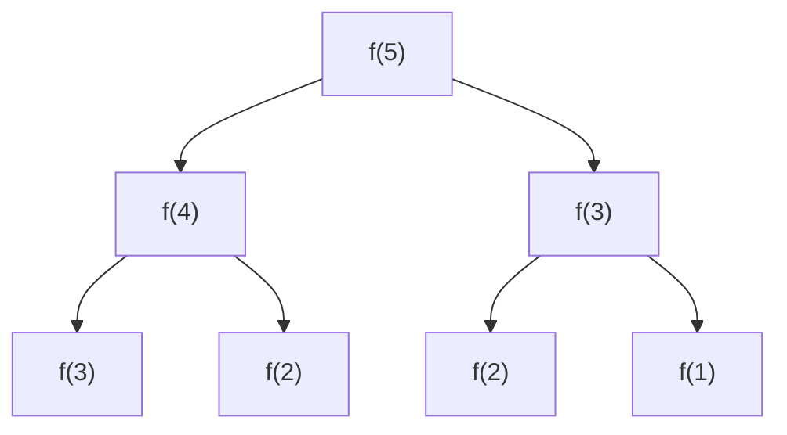

# 动态规划

动态规划 (Dynamic Programming, DP) 是把一个大问题拆成**重叠的子问题**，用一张表记住子问题的答案，避免重复计算。它不是某个具体算法，而是一种「用空间换时间」的解题思路。

DP 之所以让人头疼，是因为它没有固定模板，难在**想出状态和转移方程**。但解题步骤是固定的，按套路走就能把模糊的题目拆解清楚。

## 什么样的问题能用 DP

一个问题能用 DP，必须同时满足两个条件：

- **最优子结构**：原问题的最优解，可以由子问题的最优解组合出来。比如「爬到第 10 阶的方法数」= 「爬到第 9 阶」+「爬到第 8 阶」。
- **重叠子问题**：递归求解时，同一个子问题被反复计算多次。这正是 DP 用「记忆」来优化的地方。

:::info
对比一下：**分治** (如归并排序) 的子问题互相**独立**、不重叠，所以不需要记忆；**贪心**只看当前局部最优，不回头考虑子问题组合。只有「最优子结构 + 重叠子问题」同时成立，才轮到 DP 出场。
:::

## 从暴力递归到 DP：斐波那契

`f(n) = f(n-1) + f(n-2)`，最能体现 DP 的演进过程。

**暴力递归**，时间复杂度 `O(2^n)`，因为大量子问题被重复计算：

```js
function fib(n) {
  if (n < 2) return n;
  return fib(n - 1) + fib(n - 2);
}
```



上图里 `f(3)`、`f(2)` 都被算了不止一次——这就是**重叠子问题**。

**记忆化递归 (自顶向下)**：用数组缓存算过的结果，复杂度直接降到 `O(n)`：

```js
function fib(n, memo = {}) {
  if (n < 2) return n;
  if (memo[n] !== undefined) return memo[n]; // 命中缓存
  memo[n] = fib(n - 1, memo) + fib(n - 2, memo);
  return memo[n];
}
```

**DP 数组 (自底向上)**：把递归反过来，从最小的子问题开始递推，填满整张表：

```js
function fib(n) {
  if (n < 2) return n;
  const dp = new Array(n + 1);
  dp[0] = 0;
  dp[1] = 1; // base case
  for (let i = 2; i <= n; i++) {
    dp[i] = dp[i - 1] + dp[i - 2]; // 状态转移
  }
  return dp[n];
}
```

:::tip
**自顶向下 (记忆化递归)** 和 **自底向上 (DP 数组)** 是同一思路的两种写法，复杂度一样。前者更接近朴素递归的思维、好写；后者没有递归栈开销、便于做空间优化。面试两种都该会，能互相转换。
:::

## 解 DP 的五个步骤

拿到一道 DP 题，按这五步走，再难的题也能拆开：

1. **确定 dp 数组的含义**：`dp[i]` 到底代表什么？这是最关键、最难的一步。定义错了，后面全错。
2. **确定状态转移方程**：`dp[i]` 怎么由 `dp[i-1]`、`dp[i-2]`... 推导出来。
3. **确定初始化 (base case)**：最小子问题的值，递推的起点。
4. **确定遍历顺序**：从前往后还是从后往前？保证算 `dp[i]` 时它依赖的状态都已经算好。
5. **举例验证**：手动填一遍表，检查结果对不对。

## 经典题型

### 一维 DP：凑零钱 (最值型)

给定硬币面额 `coins` 和目标金额 `amount`，求凑出该金额所需的**最少硬币数**。

- `dp[i]`：凑出金额 `i` 所需的最少硬币数。
- 转移方程：`dp[i] = min(dp[i], dp[i - coin] + 1)`，遍历每种硬币。
- base case：`dp[0] = 0` (凑 0 元需要 0 枚)。

```js
function coinChange(coins, amount) {
  const dp = new Array(amount + 1).fill(Infinity);
  dp[0] = 0;

  for (let i = 1; i <= amount; i++) {
    for (const coin of coins) {
      if (coin <= i) {
        dp[i] = Math.min(dp[i], dp[i - coin] + 1);
      }
    }
  }

  return dp[amount] === Infinity ? -1 : dp[amount];
}
```

### 二维 DP：编辑距离

求把字符串 `word1` 变成 `word2` 的最少操作数 (可插入、删除、替换一个字符)。两个字符串各取一段做子问题，天然是二维。

- `dp[i][j]`：把 `word1` 前 `i` 个字符变成 `word2` 前 `j` 个字符的最少操作数。
- 转移方程：
  - 当 `word1[i-1] === word2[j-1]`：`dp[i][j] = dp[i-1][j-1]` (字符相同，不用操作)。
  - 否则取三者最小 + 1：`dp[i-1][j-1]` (替换)、`dp[i-1][j]` (删除)、`dp[i][j-1]` (插入)。

```js
function minDistance(word1, word2) {
  const m = word1.length;
  const n = word2.length;
  const dp = Array.from({ length: m + 1 }, () => new Array(n + 1).fill(0));

  // base case：一方为空串，操作数 = 另一方长度
  for (let i = 0; i <= m; i++) dp[i][0] = i;
  for (let j = 0; j <= n; j++) dp[0][j] = j;

  for (let i = 1; i <= m; i++) {
    for (let j = 1; j <= n; j++) {
      if (word1[i - 1] === word2[j - 1]) {
        dp[i][j] = dp[i - 1][j - 1];
      } else {
        dp[i][j] = Math.min(
          dp[i - 1][j - 1], // 替换
          dp[i - 1][j],     // 删除
          dp[i][j - 1],     // 插入
        ) + 1;
      }
    }
  }

  return dp[m][n];
}
```

:::tip
二维 DP 的 `dp[i][j]` 大多形如「字符串/数组 1 的前 `i` 个 + 字符串/数组 2 的前 `j` 个」，转移时盯住 `dp[i][j]` 由左 (`j-1`)、上 (`i-1`)、左上 (`i-1,j-1`) 三个方向哪几个推来，是这类题的通用切入点。
:::

## 空间优化：滚动数组

观察凑零钱的 `dp[i]` 只依赖前面的状态，斐波那契的 `dp[i]` 只依赖 `dp[i-1]` 和 `dp[i-2]`——既然只用到最近几个状态，就没必要存整张表，用几个变量滚动覆盖即可，空间从 `O(n)` 降到 `O(1)`：

```js
function fib(n) {
  if (n < 2) return n;
  let prev = 0, curr = 1;
  for (let i = 2; i <= n; i++) {
    [prev, curr] = [curr, prev + curr]; // 滚动覆盖
  }
  return curr;
}
```

二维 DP 若 `dp[i][j]` 只依赖上一行 `dp[i-1][*]`，也能把二维压成一维滚动数组，是常见的进阶优化。

## 小结

- DP 的前提是**最优子结构 + 重叠子问题**，用「记忆」消除重复计算，本质是空间换时间。
- 拿到题先走**五步法**：定义 dp 含义 → 转移方程 → base case → 遍历顺序 → 举例验证，其中**定义 dp 含义最关键**。
- 自顶向下 (记忆化递归) 和自底向上 (DP 数组) 是同一思路两种写法，能互转。
- 当状态只依赖最近几个时，用**滚动数组**把空间优化到 `O(1)`。
