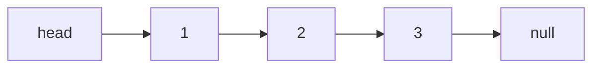

# 链表

链表用**节点的引用**把数据串起来，每个节点存一个值和指向下一个节点的指针。和数组比，它**插入删除是 `O(1)`** (改指针即可)，但**随机访问是 `O(n)`** (必须从头遍历)。

链表题的难点不在算法，而在**指针操作的细节**：断链、丢失后继、边界节点。两个技巧能解决大部分问题——**虚拟头节点**和**双指针**。

## 结构

```js
function ListNode(val, next) {
  this.val = val;
  this.next = next === undefined ? null : next;
}
```



## 技巧一：虚拟头节点 (dummy)

很多操作 (删除、插入) 在处理**头节点**时是特殊情况，因为头节点没有前驱。在真实头节点前面加一个**虚拟头节点 `dummy`**，让所有节点都有前驱，就能用统一逻辑处理，最后返回 `dummy.next`:

```js
function removeElements(head, val) {
  const dummy = new ListNode(0, head); // 虚拟头，指向真实头
  let cur = dummy;

  while (cur.next) {
    if (cur.next.val === val) {
      cur.next = cur.next.next; // 删除：跳过下一个节点
    } else {
      cur = cur.next;
    }
  }

  return dummy.next; // 真实头可能已被删，返回 dummy.next
}
```

:::tip
凡是**可能改动头节点**的链表题 (删除、头插、合并)，先建一个 `dummy` 指向 head，能消除大量边界判断。这是链表题最实用的一招。
:::

## 技巧二：反转链表

反转是链表最经典的操作，核心是用三个指针 `prev`、`cur`、`next` 逐个掉转指针方向。**保存后继再断链**是不丢节点的关键：

```js
function reverseList(head) {
  let prev = null;
  let cur = head;

  while (cur) {
    const next = cur.next; // 先存住后继，否则掉转后就找不到了
    cur.next = prev;       // 掉转指针方向
    prev = cur;            // prev 前进
    cur = next;            // cur 前进
  }

  return prev; // prev 最终指向原链表的尾，即新链表的头
}
```

递归写法更简洁，但要理解「反转后子链表的头不变，只需把当前节点接到尾部」:

```js
function reverseList(head) {
  if (head === null || head.next === null) return head; // 递归出口
  const newHead = reverseList(head.next); // 先反转后面的
  head.next.next = head; // 把自己接到下一个节点后面
  head.next = null;      // 断开自己原来的指针
  return newHead;        // 新头始终是原链表的尾
}
```

## 技巧三：快慢指针

快慢指针 (详见 [双指针](./two-pointers.md)) 在链表里尤其常用：

- **找中点**：快指针走两步、慢指针走一步，快指针到尾时慢指针在中点。
- **判断有环 / 找环入口**：Floyd 判圈，快慢相遇即有环。
- **删除倒数第 N 个节点**：快指针先走 N 步，再快慢同步走，快指针到尾时慢指针正好在倒数第 N+1 个 (配合 dummy 处理删头)。

```js
// 删除倒数第 N 个节点
function removeNthFromEnd(head, n) {
  const dummy = new ListNode(0, head);
  let fast = dummy;
  let slow = dummy;

  for (let i = 0; i < n; i++) fast = fast.next; // 快指针先走 n 步

  while (fast.next) { // 同步走到尾
    fast = fast.next;
    slow = slow.next;
  }

  slow.next = slow.next.next; // slow 停在待删节点的前一个
  return dummy.next;
}
```

## 小结

- 链表插删 `O(1)`、随机访问 `O(n)`，题目难在指针细节而非算法。
- **虚拟头节点 dummy** 消除头节点的边界特判，凡可能动头就用它。
- **反转链表**：迭代用 `prev/cur/next` 三指针，务必「先存后继再断链」；递归记「新头是原尾」。
- **快慢指针**解决找中点、判环、删倒数第 N 个，是链表双指针的主场。
