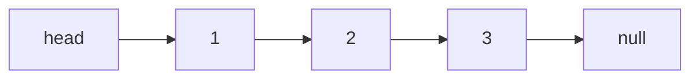

# 链表

**结论先行**：链表用 **节点的引用** 把数据串起来，每个节点存一个值和指向下一个节点的指针。和数组比，它 **插入删除是 `O(1)`**（改指针即可），但 **随机访问是 `O(n)`**（必须从头遍历）。链表题的难点不在算法，而在 **指针操作的细节**：断链、丢失后继、边界节点。两个技巧能解决大部分问题——**虚拟头节点** 和 **双指针**。

:::info
**生活类比：寻宝纸条**。链表就像一串寻宝纸条：每张纸条写着一句线索（值），外加「下一张藏在哪」（指针）。想拿第 5 张，必须从第 1 张顺着线索一张张找过去（随机访问 O(n)）；但想在中间塞一张新纸条，只需改两张纸条上的「下一张地址」，毫不费力（插入 O(1)）。链表题最怕的就是改地址时手一抖，把后面整串纸条弄丢了——这就是「丢失后继」。
:::

## 结构

```js
function ListNode(val, next) {
  this.val = val;
  this.next = next === undefined ? null : next;
}
```



## 技巧一：虚拟头节点 (dummy)

很多操作（删除、插入）在处理 **头节点** 时是特殊情况，因为头节点没有前驱。在真实头节点前面加一个 **虚拟头节点 `dummy`**，让所有节点都有前驱，就能用统一逻辑处理，最后返回 `dummy.next`。

:::info
**生活类比：排队时多设一个「队头桩」**。一队人，你要把队伍里所有姓王的请出去。麻烦在排头那个人——他前面没人，没法用「让前一个人指向后一个人」的统一动作。解决办法：在队伍最前面立一个木桩（dummy），让木桩「指向」第一个真人。现在连排头都有了前驱，所有人一视同仁地处理，最后从木桩后面读出新队伍即可。
:::

```js
function removeElements(head, val) {
  // 第一步：建虚拟头，让它指向真实头，这样真实头也有了前驱
  const dummy = new ListNode(0, head);

  // 第二步：用 cur 站在「待检查节点的前一个」位置往后走
  let cur = dummy;
  while (cur.next) {
    // 第三步：发现下一个节点要删，就让 cur 跳过它（改指针）
    if (cur.next.val === val) {
      cur.next = cur.next.next;
    } else {
      cur = cur.next; // 不删才前进，保证删完后还能检查新的下一个
    }
  }

  // 第四步：真实头可能已被删，返回 dummy.next 才是新的头
  return dummy.next;
}
```

:::tip
凡是 **可能改动头节点** 的链表题（删除、头插、合并），先建一个 `dummy` 指向 head，能消除大量边界判断。这是链表题最实用的一招。
:::

## 技巧二：反转链表

反转是链表最经典的操作，核心是用三个指针 `prev`、`cur`、`next` 逐个掉转指针方向。**保存后继再断链** 是不丢节点的关键。

:::info
**生活类比：单行道改方向**。一条单行道上的车依次首尾相接，你要让整条路反向。对每辆车操作前，必须先记住「我后面是哪辆车」（存 next），否则一旦把箭头掉头指向前车，就再也找不到后面那串车了。记住后继 → 掉头 → 自己往后挪——逐辆处理，整条路就反过来了。
:::

```js
function reverseList(head) {
  // 第一步：prev 是「已反转部分的头」，初始为空；cur 是当前要处理的节点
  let prev = null;
  let cur = head;

  while (cur) {
    // 第二步：先存住后继，否则下一行掉转指针后就找不到它了
    const next = cur.next;

    // 第三步：掉转方向，让当前节点指向前一个
    cur.next = prev;

    // 第四步：prev 和 cur 一起往后挪一格
    prev = cur;
    cur = next;
  }

  // 第五步：cur 走到 null 时，prev 正停在原链表的尾，也就是新链表的头
  return prev;
}
```

递归写法更简洁，但要理解「反转后子链表的头不变，只需把当前节点接到尾部」：

```js
function reverseList(head) {
  // 第一步：递归出口——空链表或只剩一个节点，直接返回
  if (head === null || head.next === null) return head;

  // 第二步：先把后面的整段反转好，newHead 是原链表的尾（始终不变）
  const newHead = reverseList(head.next);

  // 第三步：此时 head.next 是已反转段的尾，把自己接到它后面
  head.next.next = head;

  // 第四步：断开自己原来的指针，避免成环
  head.next = null;

  return newHead;
}
```

## 技巧三：快慢指针

快慢指针（详见 [双指针](./two-pointers.md)）在链表里尤其常用：

- **找中点**：快指针走两步、慢指针走一步，快指针到尾时慢指针在中点。
- **判断有环 / 找环入口**：Floyd 判圈，快慢相遇即有环。
- **删除倒数第 N 个节点**：快指针先走 N 步，再快慢同步走，快指针到尾时慢指针正好在倒数第 N+1 个（配合 dummy 处理删头）。

:::info
**生活类比：拉开固定间距找尾巴**。要删倒数第 N 个，难点是「倒数」得先知道总长。快慢指针的巧法：让快指针先往前走 N 步，这样快慢之间永远隔着 N 个身位；再让两人同步前进，当快指针撞到队尾时，慢指针恰好停在「待删节点的前一个」。就像两人用一根长 N 的绳子绑着走，前面的人到墙根，后面的人自然停在固定距离处。
:::

```js
function removeNthFromEnd(head, n) {
  // 第一步：建 dummy，应对「要删的正好是头节点」这种边界
  const dummy = new ListNode(0, head);
  let fast = dummy;
  let slow = dummy;

  // 第二步：快指针先走 n 步，拉开 n 个身位
  for (let i = 0; i < n; i++) {
    fast = fast.next;
  }

  // 第三步：快慢同步前进，直到快指针到达尾节点
  while (fast.next) {
    fast = fast.next;
    slow = slow.next;
  }

  // 第四步：此时 slow 停在待删节点的前一个，跳过它即删除
  slow.next = slow.next.next;
  return dummy.next;
}
```

## 小结

- 链表插删 `O(1)`、随机访问 `O(n)`，题目难在指针细节而非算法。
- **虚拟头节点 dummy** 消除头节点的边界特判，凡可能动头就用它。
- **反转链表**：迭代用 `prev/cur/next` 三指针，务必「先存后继再断链」；递归记「新头是原尾」。
- **快慢指针** 解决找中点、判环、删倒数第 N 个，是链表双指针的主场。
