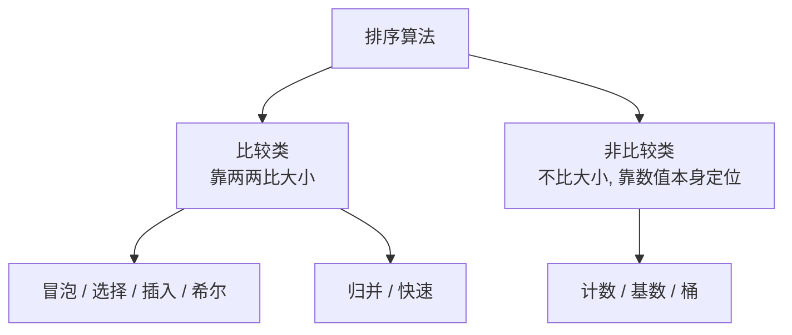
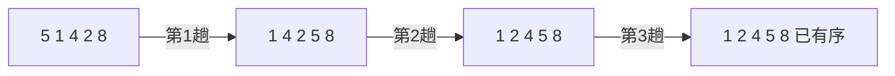
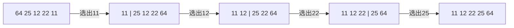
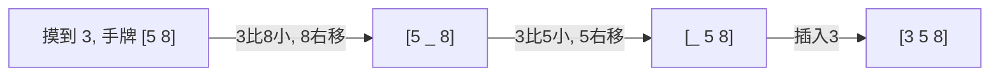
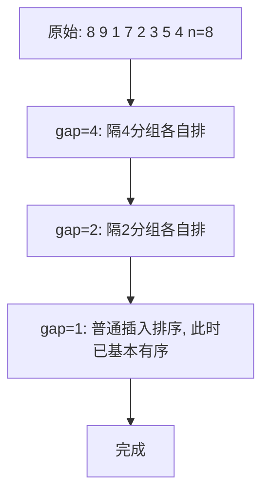
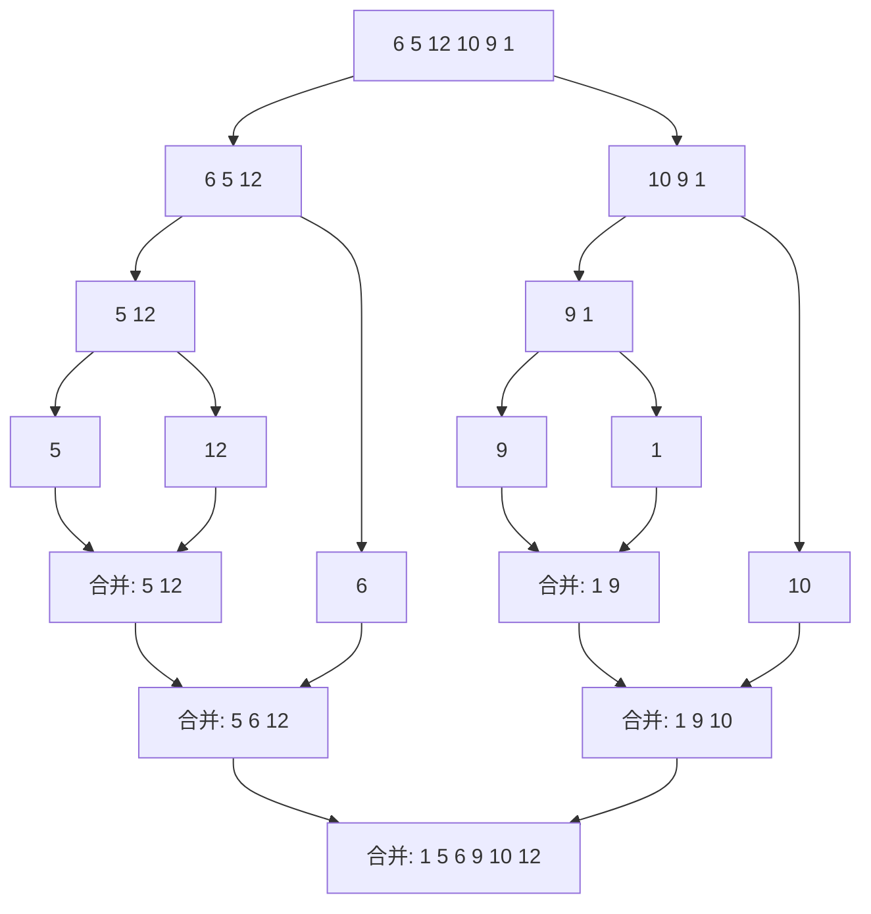
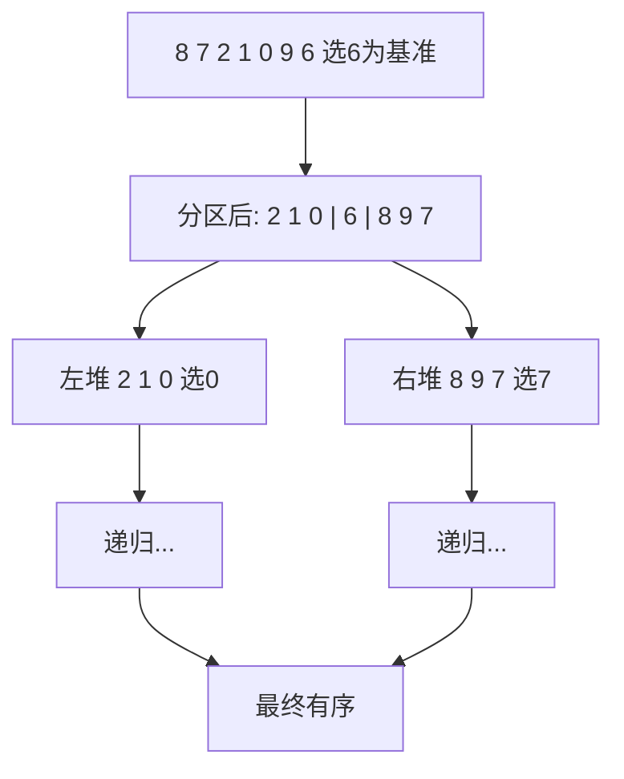
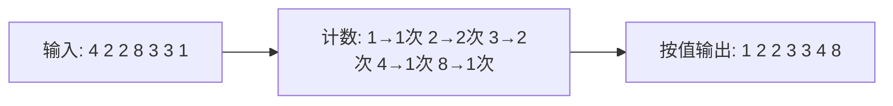
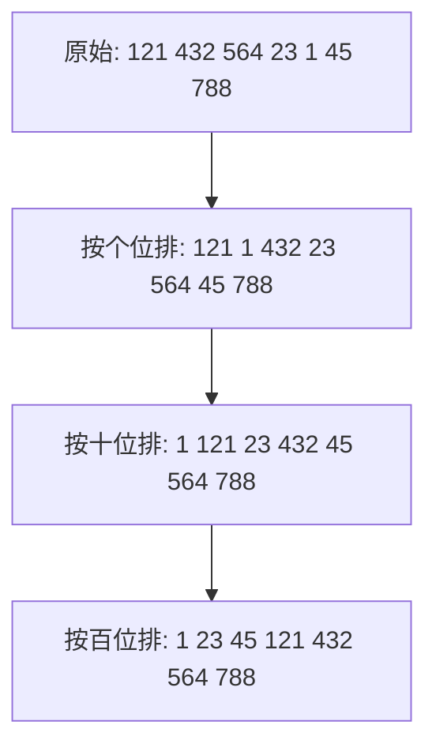
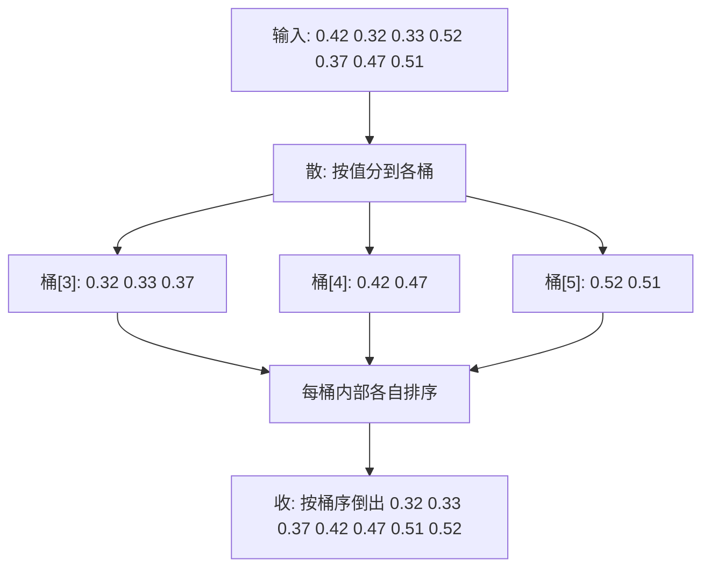

# 排序

排序就是把一组数据按某个规则（升序或降序）重新排列。下面这张表是全文索引，先看结论：

| 排序 | 平均时间 | 最坏时间 | 空间 | 稳定 | 一句话记忆 |
| :--- | :--- | :--- | :--- | :--- | :--- |
| 冒泡排序 | O(n²) | O(n²) | O(1) | 稳定 | 大泡泡一路冒到顶 |
| 选择排序 | O(n²) | O(n²) | O(1) | 不稳定 | 每轮选最小的拎出来 |
| 插入排序 | O(n²) | O(n²) | O(1) | 稳定 | 理扑克牌往左插 |
| 希尔排序 | O(n^1.3) | O(n²) | O(1) | 不稳定 | 跳着比的插入排序 |
| 归并排序 | O(n log n) | O(n log n) | O(n) | 稳定 | 先拆散再两两合并 |
| 快速排序 | O(n log n) | O(n²) | O(log n) | 不稳定 | 选个基准分两堆 |
| 计数排序 | O(n+k) | O(n+k) | O(k) | 稳定 | 给每个数记次数 |
| 基数排序 | O(d(n+k)) | O(d(n+k)) | O(n+k) | 稳定 | 按个位十位百位轮着排 |
| 桶排序 | O(n+k) | O(n²) | O(n+k) | 稳定 | 分桶各自排再倒出来 |

:::info
**稳定排序** 指值相同的元素，排完后相对顺序不变。比如先按价格排、再按销量排，稳定排序能保证销量相同的商品仍按价格有序。
:::

判断方法（俗称「比较类 vs 非比较类」）：



比较类排序有 O(n log n) 的理论下限，想突破就得用非比较类（计数、基数、桶），但它们对数据有额外要求（整数、范围有限、分布均匀等）。

## 冒泡排序

**结论**：相邻两个两两比较，谁大谁往后挪，每一轮都会把当前最大的那个「冒」到末尾。

> **形象类比**：像水里的气泡，越大的气泡浮力越强，一路往上冒到水面。每跑完一趟，最大的那个数就到了最右边的「水面」位置。

### 思路拆解

1. 从头开始，比较相邻两个数，左边比右边大就交换。
2. 一趟走完，最大的数被推到了最右边。
3. 下一趟不用再碰最右边那个已归位的数，比较范围缩小一格。
4. 重复，直到没有任何交换发生（说明已经有序）。



### 代码实现

```javascript
function bubbleSort(arr) {
  const n = arr.length;

  // 第一步：外层控制「趟数」，一共最多走 n-1 趟
  for (let i = 0; i < n - 1; i++) {
    // 加一个标志位，记录这一趟有没有发生交换
    let swapped = false;

    // 第二步：内层做相邻比较
    // 末尾的 i 个数已经归位, 所以 j 只走到 n-1-i
    for (let j = 0; j < n - 1 - i; j++) {
      // 第三步：左边比右边大就交换, 让大的往后走
      if (arr[j] > arr[j + 1]) {
        const temp = arr[j];
        arr[j] = arr[j + 1];
        arr[j + 1] = temp;
        swapped = true;
      }
    }

    // 第四步：如果一整趟都没交换, 说明已经有序, 提前结束
    if (!swapped) {
      break;
    }
  }

  return arr;
}

bubbleSort([5, 1, 4, 2, 8]); // [1, 2, 4, 5, 8]
```

:::tip
`swapped` 标志位是冒泡排序最值得记住的优化：对一个已经有序的数组，第一趟就不会发生交换，直接 `break`，时间复杂度从 O(n²) 降到 O(n)。
:::

### 复杂度

| 情况 | 时间复杂度 | 说明 |
| :--- | :--- | :--- |
| 最坏 | O(n²) | 完全逆序, 每对都要交换 |
| 最优 | O(n) | 已有序, 一趟无交换即退出 |
| 平均 | O(n²) | 乱序 |

空间复杂度 O(1)，稳定排序（相等元素不交换，相对顺序不变）。

## 选择排序

**结论**：每一轮从未排序区里挑出最小的，放到已排序区的末尾。

> **形象类比**：像选秀海选，每一轮都把剩下选手里最矮的那个拎出来排到队伍最前，下一轮再从剩下的人里挑最矮的，直到所有人按身高站好。

### 思路拆解

选择排序和冒泡排序都是 O(n²)，区别在于：冒泡是「边比边换」，选择是「找到最小才换一次」，交换次数最多只有 n-1 次。

1. 把数组分成「已排序区」（左）和「未排序区」（右），一开始已排序区为空。
2. 在未排序区里找到最小值的下标。
3. 把这个最小值和未排序区的第一个位置交换。
4. 已排序区扩大一格，重复。



### 代码实现

```javascript
function selectionSort(arr) {
  const n = arr.length;

  // 第一步：外层每次确定一个「已排序区」的末尾位置 i
  for (let i = 0; i < n - 1; i++) {
    // 第二步：先假设未排序区的第一个就是最小的
    let minIndex = i;

    // 第三步：从 i+1 往后扫, 找出真正最小值的下标
    for (let j = i + 1; j < n; j++) {
      if (arr[j] < arr[minIndex]) {
        minIndex = j;
      }
    }

    // 第四步：如果找到了更小的, 把它换到位置 i
    if (minIndex !== i) {
      const temp = arr[i];
      arr[i] = arr[minIndex];
      arr[minIndex] = temp;
    }
  }

  return arr;
}

selectionSort([64, 25, 12, 22, 11]); // [11, 12, 22, 25, 64]
```

:::warning
选择排序是 **不稳定** 的。比如 `[5a, 5b, 2]`，第一轮会把 `5a` 和 `2` 交换成 `[2, 5b, 5a]`，两个 5 的相对顺序被打乱了。
:::

### 复杂度

无论数据是否有序，都要完整扫描未排序区找最小值，所以最优、最坏、平均都是 O(n²)。空间复杂度 O(1)。优点是交换次数少（最多 n-1 次），适合「交换成本很高」的场景。

## 插入排序

**结论**：把数组看成「已排序」和「未排序」两部分，每次从未排序里取一个数，往已排序区里找到合适的位置插进去。

> **形象类比**：像打牌时理手牌。左手已经排好的牌是有序的，右手每摸一张新牌，就从右往左比，找到该插的缝隙塞进去，比它大的牌都往右挪一格让位。

### 思路拆解

1. 第一个元素天然算「已排序」，从第二个元素开始处理。
2. 取出当前元素 `current`，和它左边已排序区的元素从右往左比。
3. 只要左边的数比 `current` 大，就把左边的数往右挪一格腾位置。
4. 直到找到一个不比 `current` 大的位置，把 `current` 放进去。



### 代码实现

```javascript
function insertionSort(arr) {
  const n = arr.length;

  // 第一步：从第二个元素开始(下标1), 第一个默认已排序
  for (let i = 1; i < n; i++) {
    // 第二步：把当前要插入的牌先「抓在手里」存起来
    const current = arr[i];

    // 第三步：j 指向已排序区的最后一个, 准备从右往左找位置
    let j = i - 1;

    // 第四步：只要左边的数比 current 大, 就让它右移一格腾地方
    while (j >= 0 && arr[j] > current) {
      arr[j + 1] = arr[j];
      j--;
    }

    // 第五步：循环停下来的位置就是该插的缝隙, 放进去
    arr[j + 1] = current;
  }

  return arr;
}

insertionSort([5, 2, 4, 6, 1, 3]); // [1, 2, 3, 4, 5, 6]
```

:::tip
插入排序对 **基本有序** 的数组特别快（接近 O(n)），因为内层 `while` 几乎不用挪动。所以很多语言的内置排序在小数组上会切换成插入排序（比如 V8 引擎的 TimSort）。
:::

### 复杂度

| 情况 | 时间复杂度 | 说明 |
| :--- | :--- | :--- |
| 最坏 | O(n²) | 完全逆序, 每张牌都要挪到最左 |
| 最优 | O(n) | 已有序, 内层 while 不执行 |
| 平均 | O(n²) | 乱序 |

空间复杂度 O(1)，稳定排序。

## 希尔排序

**结论**：插入排序的加强版。先按一个较大的「间隔」分组做插入排序，再逐步缩小间隔，最后间隔为 1 时就是一次普通插入排序，但此时数组已经基本有序，跑得飞快。

> **形象类比**：理一副打乱的扑克牌时，如果直接一张张插，离得远的牌要挪很多步。希尔排序的办法是先「隔几张比一次」，让大数快速跳到右边、小数快速跳到左边，把牌粗略整理一遍；然后缩小间隔再整理；最后一遍只需微调。

### 思路拆解

插入排序的痛点：如果一个小数在数组最右边，要一步步挪到最左，效率极低。希尔排序用「间隔跳跃」让元素能大跨步移动。

1. 选一个初始间隔 `gap`，通常取 `n/2`。
2. 把间隔为 `gap` 的元素看作一组，对每组做插入排序。
3. 间隔减半（`gap = gap / 2`），重复。
4. 直到 `gap = 1`，做最后一次插入排序，整体完成。



### 代码实现

```javascript
function shellSort(arr) {
  const n = arr.length;

  // 第一步：间隔从 n/2 开始, 每轮减半, 直到 1
  for (let gap = Math.floor(n / 2); gap > 0; gap = Math.floor(gap / 2)) {

    // 第二步：对每个「间隔分组」做插入排序
    // 这里不是逐组处理, 而是从 gap 开始逐个元素处理, 等价于交替处理各组
    for (let i = gap; i < n; i++) {
      // 第三步：把当前元素抓在手里(和插入排序一样)
      const current = arr[i];

      // 第四步：在同组内(每次跨 gap 步)从右往左找位置
      let j = i - gap;
      while (j >= 0 && arr[j] > current) {
        arr[j + gap] = arr[j];
        j -= gap;
      }

      // 第五步：放到该插的位置
      arr[j + gap] = current;
    }
  }

  return arr;
}

shellSort([8, 9, 1, 7, 2, 3, 5, 4]); // [1, 2, 3, 4, 5, 7, 8, 9]
```

:::info
把上面代码里的 `gap` 全替换成 `1`，它就退化成标准插入排序。希尔排序的本质就是「让插入排序先做几遍粗排，减少最后精排时的移动量」。
:::

### 复杂度

希尔排序的复杂度取决于 `gap` 序列的选取，比较难精确分析：

- 最坏情况：O(n²)（用 n/2 减半序列时）
- 最优情况：O(n log n)
- 平均情况：约 O(n^1.3)，比纯插入排序快不少

空间复杂度 O(1)，**不稳定**（跨间隔交换会打乱相等元素的相对顺序）。

## 归并排序

**结论**：典型的分治法。把数组一分为二，分别排好，再把两个有序的子数组「合并」成一个有序数组。

> **形象类比**：像两队已经排好队的人合并成一队。两队各派排头出来比身高，矮的那个先进新队伍，然后那队再出下一个排头继续比，直到两队都走完。难点不在「分」，而在「合并两个有序队列」这一步。

### 思路拆解



分两步：

1. **分（递归）**：把数组从中间切两半，对每一半递归调用归并排序，直到子数组只剩 1 个元素（天然有序）。
2. **合（merge）**：用两个指针分别指向左右两个有序数组的头部，每次取较小的放进结果，直到一边取完，再把另一边剩下的整段接上。

### 代码实现

```javascript
function mergeSort(arr) {
  // 第一步：递归终止条件 —— 只剩 0 或 1 个元素时, 本身就是有序的
  if (arr.length <= 1) {
    return arr;
  }

  // 第二步：从中间切成左右两半
  const middle = Math.floor(arr.length / 2);
  const left = arr.slice(0, middle);
  const right = arr.slice(middle);

  // 第三步：分别递归排好左右两半
  const sortedLeft = mergeSort(left);
  const sortedRight = mergeSort(right);

  // 第四步：把两个有序数组合并起来
  return merge(sortedLeft, sortedRight);
}

// 合并两个有序数组成一个有序数组
function merge(left, right) {
  const result = [];
  let i = 0; // 指向 left 当前位置
  let j = 0; // 指向 right 当前位置

  // 第一步：两个数组都没走完时, 每次挑较小的放进 result
  while (i < left.length && j < right.length) {
    if (left[i] <= right[j]) {
      result.push(left[i]);
      i++;
    } else {
      result.push(right[j]);
      j++;
    }
  }

  // 第二步：有一边走完了, 把另一边剩下的整段接上
  // (剩下的本身就是有序的, 直接拼接即可)
  while (i < left.length) {
    result.push(left[i]);
    i++;
  }
  while (j < right.length) {
    result.push(right[j]);
    j++;
  }

  return result;
}

mergeSort([6, 5, 12, 10, 9, 1]); // [1, 5, 6, 9, 10, 12]
```

:::tip
合并时用 `left[i] <= right[j]`（带等号，左边优先）能保证 **稳定性**：相等元素中靠左的先进结果，相对顺序不变。如果写成 `<`，稳定性就丢了。
:::

### 复杂度

| 情况 | 时间复杂度 |
| :--- | :--- |
| 最优 | O(n log n) |
| 最坏 | O(n log n) |
| 平均 | O(n log n) |

无论数据如何，分治深度都是 log n 层，每层合并要扫 n 个元素，所以三种情况都稳定在 O(n log n)。代价是需要 O(n) 的额外空间存合并结果。

**应用场景**：外部排序（数据量大到内存放不下，分块排好再归并）、求逆序对、链表排序（链表归并不需要额外空间）。

## 快速排序

**结论**：也是分治法。选一个「基准值（pivot）」，把比它小的丢左边、比它大的丢右边，基准就归位了；再对左右两堆递归做同样的事。

> **形象类比**：像分队站排。随便指定一个人当「标杆」，让全班同学按比标杆高/矮分站到两边，标杆自己就站在了正确位置；然后左边一队、右边一队各自再选标杆继续分，直到每队只剩一人。

### 思路拆解



核心是 **partition（分区）** 操作。这里用经典的 Lomuto 分区法，取最右元素作基准：

1. 选最右元素 `pivot` 当基准。
2. 用一个指针 `i` 标记「小于 pivot 区域」的边界。
3. 遍历其余元素，遇到比 pivot 小的，就把它换到 `i` 标记的位置，`i` 右移一格。
4. 遍历完，把 pivot 换到 `i` 的位置，此时 pivot 左边全比它小、右边全比它大，pivot 归位。

### 代码实现

```javascript
function quickSort(arr, low = 0, high = arr.length - 1) {
  // 第一步：递归终止条件 —— 区间内少于2个元素就不用排了
  if (low < high) {
    // 第二步：分区, 返回基准归位后的下标
    const pivotIndex = partition(arr, low, high);

    // 第三步：对基准左边的子区间递归排序
    quickSort(arr, low, pivotIndex - 1);

    // 第四步：对基准右边的子区间递归排序
    quickSort(arr, pivotIndex + 1, high);
  }

  return arr;
}

// 把区间 [low, high] 按基准分成「小的在左, 大的在右」
function partition(arr, low, high) {
  // 第一步：取最右元素当基准
  const pivot = arr[high];

  // 第二步：i 是「小于基准区域」的右边界, 初始在区间左侧外
  let i = low - 1;

  // 第三步：遍历除基准外的元素, 把小于基准的都换到左边
  for (let j = low; j < high; j++) {
    if (arr[j] < pivot) {
      i++;
      const temp = arr[i];
      arr[i] = arr[j];
      arr[j] = temp;
    }
  }

  // 第四步：把基准换到 i+1 的位置, 让它正好夹在小堆和大堆中间
  const temp = arr[i + 1];
  arr[i + 1] = arr[high];
  arr[high] = temp;

  // 第五步：返回基准的最终下标
  return i + 1;
}

quickSort([8, 7, 2, 1, 0, 9, 6]); // [0, 1, 2, 6, 7, 8, 9]
```

:::warning
取「最右元素」当基准在 **数组已有序** 时会退化成 O(n²)（每次分区都极不均衡）。实战中常用「三数取中」或「随机选基准」来避免最坏情况。
:::

### 复杂度

| 情况 | 时间复杂度 | 说明 |
| :--- | :--- | :--- |
| 最优 | O(n log n) | 每次基准都接近中位数, 均匀对半分 |
| 最坏 | O(n²) | 基准每次都是最大/最小值, 分区极不均衡 |
| 平均 | O(n log n) | 随机数据 |

空间复杂度 O(log n)（递归调用栈），**不稳定**。快速排序常数因子小、缓存友好，是大多数语言内置排序的核心算法之一。

## 计数排序

**结论**：不比较，靠「数数」。统计每个值出现了多少次，再按值的大小依次输出，适合范围不大的非负整数。

> **形象类比**：像统计班级成绩分布。准备 0 到 100 一排格子，每个人的分数往对应格子里投一颗豆子；最后从 0 分格子开始，几颗豆子就写几个该分数，从头到尾抄一遍就是排好序的成绩单。

### 思路拆解



1. 找出最大值 `max`，开一个长度 `max+1` 的计数数组 `count`。
2. 遍历原数组，`count[值]++`，统计每个值出现的次数。
3. 对 `count` 求前缀和，`count[i]` 变成「小于等于 i 的元素个数」，也就是值 i 在结果里的末尾位置。
4. 从后往前遍历原数组，按 `count` 把每个元素放到结果数组的正确位置（从后往前是为了保证稳定性）。

### 代码实现

```javascript
function countingSort(arr) {
  if (arr.length === 0) {
    return arr;
  }

  // 第一步：找最大值, 决定计数数组的长度
  let max = arr[0];
  for (let i = 1; i < arr.length; i++) {
    if (arr[i] > max) {
      max = arr[i];
    }
  }

  // 第二步：建计数数组并统计每个值出现的次数
  const count = new Array(max + 1).fill(0);
  for (let i = 0; i < arr.length; i++) {
    count[arr[i]]++;
  }

  // 第三步：求前缀和, count[i] 变成「值 i 在结果中的结束位置」
  for (let i = 1; i <= max; i++) {
    count[i] += count[i - 1];
  }

  // 第四步：从后往前遍历原数组, 把元素放到结果的正确位置
  // (从后往前 + 前缀和, 保证相等元素相对顺序不变 → 稳定)
  const output = new Array(arr.length);
  for (let i = arr.length - 1; i >= 0; i--) {
    const value = arr[i];
    output[count[value] - 1] = value;
    count[value]--;
  }

  // 第五步：把结果拷回原数组
  for (let i = 0; i < arr.length; i++) {
    arr[i] = output[i];
  }

  return arr;
}

countingSort([4, 2, 2, 8, 3, 3, 1]); // [1, 2, 2, 3, 3, 4, 8]
```

:::warning
计数排序只适合 **范围有限的整数**。如果数据里有一个 100 万，就得开一个 100 万长的数组，空间爆炸。所以它适合「数据多、但取值范围窄」的场景，比如给一万个人按年龄（0-120）排序。
:::

### 复杂度

设元素个数为 n、取值范围为 k：

- 时间复杂度：最优、最坏、平均都是 O(n + k)（不依赖数据顺序）
- 空间复杂度：O(k)

它没有任何元素间的比较，所以能突破 O(n log n) 的下限，是稳定排序。

## 基数排序

**结论**：对多位数，从 **最低位（个位）到最高位** 一位一位地排，每一位用稳定排序（通常是计数排序）。所有位排完，整体就有序了。

> **形象类比**：像图书馆按编号上架。编号有好几位，先按最后一位归类摆好，再按倒数第二位归类，再按更高位……每轮都保留上一轮的顺序，全部归类完，书架就完全有序了。

### 思路拆解



为什么从低位排起：低位先排好后，高位排序用稳定排序就能「保留」低位已经排好的相对顺序，最终高位优先、低位次之，整体有序。

1. 找出最大值，确定它有几位（决定要排几轮）。
2. 从个位（place = 1）开始，按当前位的数字用计数排序排一遍。
3. place 乘以 10，进到十位、百位……
4. 最高位排完，整个数组有序。

### 代码实现

```javascript
function radixSort(arr) {
  if (arr.length === 0) {
    return arr;
  }

  // 第一步：找最大值, 它的位数决定要排几轮
  let max = arr[0];
  for (let i = 1; i < arr.length; i++) {
    if (arr[i] > max) {
      max = arr[i];
    }
  }

  // 第二步：从个位开始, 每轮 place 乘10 进到更高位
  for (let place = 1; Math.floor(max / place) > 0; place *= 10) {
    countingSortByDigit(arr, place);
  }

  return arr;
}

// 按某一位(place 指定个位/十位/...)做稳定的计数排序
function countingSortByDigit(arr, place) {
  const n = arr.length;
  const output = new Array(n);

  // 第一步：每一位的数字只可能是 0-9, 所以计数数组固定长度 10
  const count = new Array(10).fill(0);

  // 第二步：取出每个数在当前位上的数字, 统计次数
  for (let i = 0; i < n; i++) {
    const digit = Math.floor(arr[i] / place) % 10;
    count[digit]++;
  }

  // 第三步：求前缀和, 得到每个数字在结果中的结束位置
  for (let i = 1; i < 10; i++) {
    count[i] += count[i - 1];
  }

  // 第四步：从后往前放, 保证稳定性
  for (let i = n - 1; i >= 0; i--) {
    const digit = Math.floor(arr[i] / place) % 10;
    output[count[digit] - 1] = arr[i];
    count[digit]--;
  }

  // 第五步：拷回原数组, 这一位就排好了
  for (let i = 0; i < n; i++) {
    arr[i] = output[i];
  }
}

radixSort([121, 432, 564, 23, 1, 45, 788]); // [1, 23, 45, 121, 432, 564, 788]
```

:::info
基数排序的 **每一轮内部必须用稳定排序**，否则会破坏前面已排好位的顺序。这里用计数排序，因为每一位只有 0-9 十种取值，计数排序又快又稳。
:::

### 复杂度

设有 n 个数、最大数有 d 位、每位取值范围 k（十进制 k=10）：

- 时间复杂度：O(d(n + k))，d 和 k 通常是小常数，所以接近线性
- 空间复杂度：O(n + k)

是稳定的非比较排序。适合大量「位数不多」的整数排序，比如手机号、身份证号、定长字符串。

## 桶排序

**结论**：把数据按范围分到若干个「桶」里，每个桶内部各自排序，最后按桶的顺序依次倒出来。适合数据在某个区间内 **均匀分布** 的情况。

> **形象类比**：像整理一大堆零钱。先按面额分到几个盒子里（1 角一盒、5 角一盒、1 元一盒……），每个盒子里的钱不多，单独理顺很快；最后从小面额盒子到大面额盒子依次倒出来，整体就排好了。

### 思路拆解



这是「分散—收集（scatter-gather）」的思路：

1. 创建若干个空桶。
2. 遍历数据，按值算出该进哪个桶（散）。
3. 对每个桶内部单独排序（可用插入排序或语言内置排序）。
4. 按桶的顺序，把每个桶的元素依次拼回结果（收）。

### 代码实现

```javascript
// 这里以 [0, 1) 区间的小数为例
function bucketSort(arr, bucketCount = arr.length) {
  if (arr.length === 0) {
    return arr;
  }

  // 第一步：创建 bucketCount 个空桶
  const buckets = [];
  for (let i = 0; i < bucketCount; i++) {
    buckets.push([]);
  }

  // 第二步：散 —— 按值把每个元素分到对应的桶
  // 值 0.42 * 桶数 取整 → 决定落在第几个桶
  for (let i = 0; i < arr.length; i++) {
    const index = Math.floor(arr[i] * bucketCount);
    buckets[index].push(arr[i]);
  }

  // 第三步：对每个桶内部排序(桶内元素少, 用插入排序很合适)
  for (let i = 0; i < bucketCount; i++) {
    insertionSort(buckets[i]);
  }

  // 第四步：收 —— 按桶顺序把元素依次拼回原数组
  let k = 0;
  for (let i = 0; i < bucketCount; i++) {
    for (let j = 0; j < buckets[i].length; j++) {
      arr[k] = buckets[i][j];
      k++;
    }
  }

  return arr;
}

bucketSort([0.42, 0.32, 0.33, 0.52, 0.37, 0.47, 0.51]);
// [0.32, 0.33, 0.37, 0.42, 0.47, 0.51, 0.52]
```

:::tip
桶排序好不好用，全看「分布是否均匀」。如果数据都挤在一个桶里，它就退化成对那个桶做插入排序，变成 O(n²)。所以它的前提是数据 **均匀分布** 在已知区间内。
:::

### 复杂度

| 情况 | 时间复杂度 | 说明 |
| :--- | :--- | :--- |
| 最优 | O(n + k) | 元素均匀分布, 每桶元素很少 |
| 最坏 | O(n²) | 全挤在一个桶里, 退化成桶内排序 |
| 平均 | O(n + k) | 随机均匀分布 |

空间复杂度 O(n + k)，稳定性取决于桶内排序算法（用插入排序则稳定）。适合浮点数、均匀分布的数据。

## 参考

1. [八大基础排序总结 - 掘金](https://juejin.cn/post/6844903583301763085)
2. [前端该如何准备数据结构和算法？ - 掘金](https://juejin.cn/post/6844903919722692621)
3. [Learn Data Structures and Algorithms - Programiz](https://www.programiz.com/dsa/)
