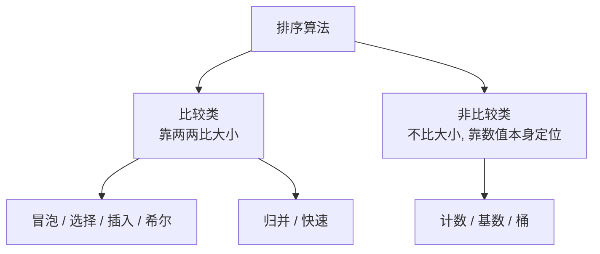
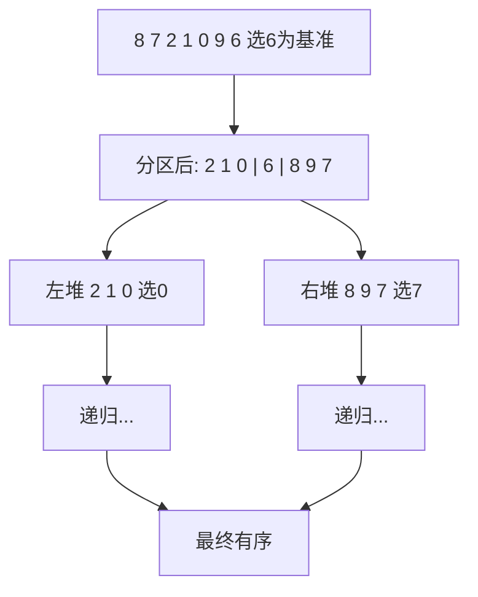
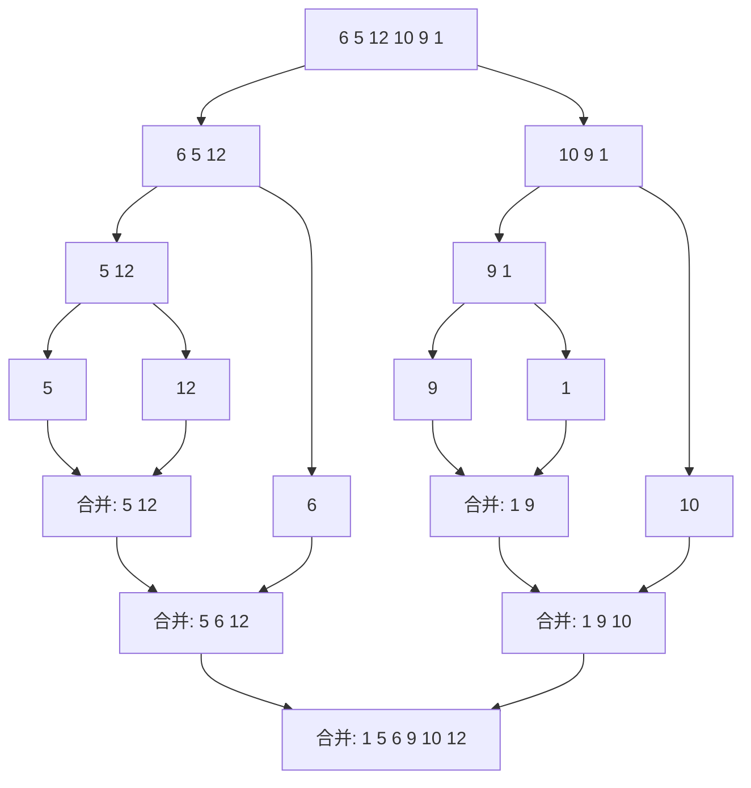

# 排序

排序就是把一组数据按某个规则（升序或降序）重新排列。常见排序有近十种，先看全景表，再挑面试最常手撕的**快速排序**和**归并排序**展开。

| 排序 | 平均时间 | 最坏时间 | 空间 | 稳定 | 一句话记忆 |
| :--- | :--- | :--- | :--- | :--- | :--- |
| 冒泡排序 | O(n²) | O(n²) | O(1) | 稳定 | 大泡泡一路冒到顶 |
| 选择排序 | O(n²) | O(n²) | O(1) | 不稳定 | 每轮选最小的拎出来 |
| 插入排序 | O(n²) | O(n²) | O(1) | 稳定 | 理扑克牌往左插 |
| 希尔排序 | O(n^1.3) | O(n²) | O(1) | 不稳定 | 跳着比的插入排序 |
| 归并排序 | O(n log n) | O(n log n) | O(n) | 稳定 | 先拆散再两两合并 |
| 快速排序 | O(n log n) | O(n²) | O(log n) | 不稳定 | 选个基准分两堆 |
| 计数排序 | O(n+k) | O(n+k) | O(k) | 稳定 | 给每个数记次数 |
| 基数排序 | O(d(n+k)) | O(d(n+k)) | O(n+k) | 稳定 | 按个位十位百位轮着排 |
| 桶排序 | O(n+k) | O(n²) | O(n+k) | 稳定 | 分桶各自排再倒出来 |

:::info
**稳定排序** 指值相同的元素，排完后相对顺序不变。比如先按价格排、再按销量排，稳定排序能保证销量相同的商品仍按价格有序。
:::

判断方法（俗称「比较类 vs 非比较类」）：



比较类排序有 O(n log n) 的理论下限，想突破就得用非比较类（计数、基数、桶），但它们对数据有额外要求（整数、范围有限、分布均匀等）。

:::tip
下面只详解 **快速排序** 和 **归并排序**——它们是面试手撕的重灾区，也是「分治 + O(n log n)」的两个代表。两者思路对称:快排是「**先分区再递归**」(难点在分区)，归并是「**先递归再合并**」(难点在合并)。
:::

## 快速排序

**结论**：分治法。选一个「基准值（pivot）」，把比它小的丢左边、比它大的丢右边，基准就归位了；再对左右两堆递归做同样的事。

> **形象类比**：像分队站排。随便指定一个人当「标杆」，让全班同学按比标杆高/矮分站到两边，标杆自己就站在了正确位置；然后左边一队、右边一队各自再选标杆继续分，直到每队只剩一人。

### 思路拆解



核心是 **partition（分区）** 操作。这里用经典的 Lomuto 分区法，取最右元素作基准：

1. 选最右元素 `pivot` 当基准。
2. 用一个指针 `i` 标记「小于 pivot 区域」的边界。
3. 遍历其余元素，遇到比 pivot 小的，就把它换到 `i` 标记的位置，`i` 右移一格。
4. 遍历完，把 pivot 换到 `i` 的位置，此时 pivot 左边全比它小、右边全比它大，pivot 归位。

### 代码实现

```javascript
function quickSort(arr, low = 0, high = arr.length - 1) {
  // 第一步：递归终止条件 —— 区间内少于2个元素就不用排了
  if (low < high) {
    // 第二步：分区, 返回基准归位后的下标
    const pivotIndex = partition(arr, low, high);

    // 第三步：对基准左边的子区间递归排序
    quickSort(arr, low, pivotIndex - 1);

    // 第四步：对基准右边的子区间递归排序
    quickSort(arr, pivotIndex + 1, high);
  }

  return arr;
}

// 把区间 [low, high] 按基准分成「小的在左, 大的在右」
function partition(arr, low, high) {
  // 第一步：取最右元素当基准
  const pivot = arr[high];

  // 第二步：i 是「小于基准区域」的右边界, 初始在区间左侧外
  let i = low - 1;

  // 第三步：遍历除基准外的元素, 把小于基准的都换到左边
  for (let j = low; j < high; j++) {
    if (arr[j] < pivot) {
      i++;
      const temp = arr[i];
      arr[i] = arr[j];
      arr[j] = temp;
    }
  }

  // 第四步：把基准换到 i+1 的位置, 让它正好夹在小堆和大堆中间
  const temp = arr[i + 1];
  arr[i + 1] = arr[high];
  arr[high] = temp;

  // 第五步：返回基准的最终下标
  return i + 1;
}

quickSort([8, 7, 2, 1, 0, 9, 6]); // [0, 1, 2, 6, 7, 8, 9]
```

:::warning
取「最右元素」当基准在 **数组已有序** 时会退化成 O(n²)（每次分区都极不均衡）。实战中常用「三数取中」或「随机选基准」来避免最坏情况。
:::

### 复杂度

| 情况 | 时间复杂度 | 说明 |
| :--- | :--- | :--- |
| 最优 | O(n log n) | 每次基准都接近中位数, 均匀对半分 |
| 最坏 | O(n²) | 基准每次都是最大/最小值, 分区极不均衡 |
| 平均 | O(n log n) | 随机数据 |

空间复杂度 O(log n)（递归调用栈），**不稳定**。快速排序常数因子小、缓存友好，是大多数语言内置排序的核心算法之一。

## 归并排序

**结论**：同样是分治法。把数组一分为二，分别排好，再把两个有序的子数组「合并」成一个有序数组。

> **形象类比**：像两队已经排好队的人合并成一队。两队各派排头出来比身高，矮的那个先进新队伍，然后那队再出下一个排头继续比，直到两队都走完。难点不在「分」，而在「合并两个有序队列」这一步。

### 思路拆解



分两步：

1. **分（递归）**：把数组从中间切两半，对每一半递归调用归并排序，直到子数组只剩 1 个元素（天然有序）。
2. **合（merge）**：用两个指针分别指向左右两个有序数组的头部，每次取较小的放进结果，直到一边取完，再把另一边剩下的整段接上。

### 代码实现

```javascript
function mergeSort(arr) {
  // 第一步：递归终止条件 —— 只剩 0 或 1 个元素时, 本身就是有序的
  if (arr.length <= 1) {
    return arr;
  }

  // 第二步：从中间切成左右两半
  const middle = Math.floor(arr.length / 2);
  const left = arr.slice(0, middle);
  const right = arr.slice(middle);

  // 第三步：分别递归排好左右两半
  const sortedLeft = mergeSort(left);
  const sortedRight = mergeSort(right);

  // 第四步：把两个有序数组合并起来
  return merge(sortedLeft, sortedRight);
}

// 合并两个有序数组成一个有序数组
function merge(left, right) {
  const result = [];
  let i = 0; // 指向 left 当前位置
  let j = 0; // 指向 right 当前位置

  // 第一步：两个数组都没走完时, 每次挑较小的放进 result
  while (i < left.length && j < right.length) {
    if (left[i] <= right[j]) {
      result.push(left[i]);
      i++;
    } else {
      result.push(right[j]);
      j++;
    }
  }

  // 第二步：有一边走完了, 把另一边剩下的整段接上
  // (剩下的本身就是有序的, 直接拼接即可)
  while (i < left.length) {
    result.push(left[i]);
    i++;
  }
  while (j < right.length) {
    result.push(right[j]);
    j++;
  }

  return result;
}

mergeSort([6, 5, 12, 10, 9, 1]); // [1, 5, 6, 9, 10, 12]
```

:::tip
合并时用 `left[i] <= right[j]`（带等号，左边优先）能保证 **稳定性**：相等元素中靠左的先进结果，相对顺序不变。如果写成 `<`，稳定性就丢了。
:::

### 复杂度

| 情况 | 时间复杂度 |
| :--- | :--- |
| 最优 | O(n log n) |
| 最坏 | O(n log n) |
| 平均 | O(n log n) |

无论数据如何，分治深度都是 log n 层，每层合并要扫 n 个元素，所以三种情况都稳定在 O(n log n)。代价是需要 O(n) 的额外空间存合并结果。

**应用场景**：外部排序（数据量大到内存放不下，分块排好再归并）、求逆序对、链表排序（链表归并不需要额外空间）。

## 快排 vs 归并

两者都是 O(n log n) 的分治排序，但取舍相反：

| | 快速排序 | 归并排序 |
| :--- | :--- | :--- |
| 分治重心 | **先分区**(难点在 partition)，再递归 | 先递归，**后合并**(难点在 merge) |
| 额外空间 | O(log n)，原地交换 | O(n)，要开辅助数组 |
| 最坏时间 | O(n²)(基准选歪) | O(n log n)(恒定) |
| 稳定性 | 不稳定 | 稳定 |
| 适用 | 内存内通用排序，常数小、最快 | 要稳定、求逆序对、链表、外部排序 |

一句话:**追求平均速度和原地用快排，要稳定或处理超大/链式数据用归并**。

## 参考

1. [八大基础排序总结 - 掘金](https://juejin.cn/post/6844903583301763085)
2. [Learn Data Structures and Algorithms - Programiz](https://www.programiz.com/dsa/)
