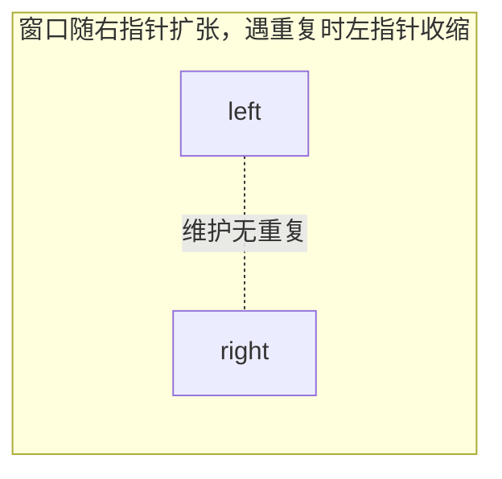

# 双指针

双指针是用**两个指针**在数组或字符串上移动，把原本需要嵌套循环的 `O(n^2)` 问题降到 `O(n)`。滑动窗口是双指针的一个特例，专门处理「连续子数组 / 子串」问题。

按指针移动方式，分三类：**对撞指针** (左右向中间靠)、**快慢指针** (一前一后同向)、**滑动窗口** (同向，维护一段区间)。判断用哪种，看数据特征和问题形态。

## 对撞指针

两个指针分别从**头和尾**向中间逼近，常用于**有序数组**或需要从两端比较的场景。

经典例子——有序数组的两数之和：根据当前两数之和与目标的大小，决定移动哪个指针，`O(n)` 解决：

```js
function twoSum(numbers, target) {
  let left = 0;
  let right = numbers.length - 1;

  while (left < right) {
    const sum = numbers[left] + numbers[right];
    if (sum === target) return [left, right];
    if (sum < target) left++;   // 和太小，左指针右移变大
    else right--;               // 和太大，右指针左移变小
  }

  return [];
}
```

:::tip
对撞指针能成立的关键是**单调性**：移动某个指针，结果朝可预测的方向变化。两数之和靠数组有序、盛最多水的容器靠「移动短板才可能变大」，本质都是用单调性排除掉一整片不可能的解。
:::

### 例题：三数之和 (15)

**题目**：给一个数组，找出所有和为 0 的**不重复**三元组。比如 `[-1, 0, 1, 2, -1, -4]`，答案是 `[[-1, -1, 2], [-1, 0, 1]]`。

暴力是三重循环 O(n³)。优化的转念是：**先固定一个数，剩下的就退化成「两数之和」**——而两数之和在有序数组上正是对撞指针的拿手好戏。所以核心套路是「排序 + 固定一个数 + 对撞指针找另外两个」，O(n²)。

**解题思路 1-2-3**：

1. **先排序**。排序是对撞指针能用的前提（要靠有序的单调性移动指针），顺便也让重复的数挨在一起、方便去重。
2. **固定第一个数，对剩下区间跑对撞指针**。从左到右让 `nums[i]` 当第一个数，问题就变成「在 `i` 右边找两个数，和等于 `-nums[i]`」。在 `[i+1, 末尾]` 上放 `left`、`right`：三数之和太小就 `left` 右移变大，太大就 `right` 左移变小，正好等于 0 就记下这一组。
3. **三处去重 + 一个剪枝**。`i`、`left`、`right` 都要跳过和上一个相同的值，否则会产生重复三元组；另外排序后一旦 `nums[i] > 0`，后面只会更大，三数和不可能为 0，直接结束。

走一遍 `[-1, 0, 1, 2, -1, -4]`，排序后 `[-4, -1, -1, 0, 1, 2]`：

| 固定 nums[i] | 要凑的目标 (-nums[i]) | 对撞过程 | 结果 |
|---|---|---|---|
| -4 | 4 | 区间 `[-1,-1,0,1,2]` 最大也才 `1+2=3 < 4` | 无 |
| -1 (第一个) | 1 | `-1+2=1` ✓ → 收一组；指针内移到 `0+1=1` ✓ → 再收一组 | `[-1,-1,2]`、`[-1,0,1]` |
| -1 (第二个) | — | 和上一个 -1 相同，**跳过** | 去重 |
| 0 | 0 | `1+2=3 > 0`，`right` 左移直到指针相遇 | 无 |

最终 `[[-1,-1,2], [-1,0,1]]`。

```js
function threeSum(nums) {
  nums.sort((a, b) => a - b); // 1. 先排序

  const res = [];
  for (let i = 0; i < nums.length - 2; i++) {
    if (nums[i] > 0) break;                          // 剪枝：第一个数已 > 0，不可能凑出 0
    if (i > 0 && nums[i] === nums[i - 1]) continue;  // i 去重：跳过重复的第一个数

    let left = i + 1;
    let right = nums.length - 1;
    while (left < right) {                           // 2. 对撞指针找另外两数
      const sum = nums[i] + nums[left] + nums[right];
      if (sum === 0) {
        res.push([nums[i], nums[left], nums[right]]);
        // 3. 收到解后跳过重复的 left / right
        while (left < right && nums[left] === nums[left + 1]) left++;
        while (left < right && nums[right] === nums[right - 1]) right--;
        left++;
        right--;
      } else if (sum < 0) {
        left++;   // 和太小，左指针右移变大
      } else {
        right--;  // 和太大，右指针左移变小
      }
    }
  }

  return res;
}
```

:::warning
去重是这题最容易写错的地方。记牢两层：**外层 `i` 跳过重复的第一个数**，**内层收到一组解后跳过重复的 `left` 和 `right`**。少了任何一处，都会冒出重复三元组。
:::

> **口诀**：三数之和 → 排序后固定一个数，剩下两数用对撞指针，三处去重别漏。

#### 为什么不用哈希做内层

固定一个数后剩下的是两数之和，理论上也能用[哈希](./hash.md)：每固定一个 `nums[i]`，对右边的数边扫边查「另一半 `-nums[i]-nums[j]` 在不在 `Set` 里」。结果正确，时间也是 O(n²)，但**不划算**：

| | 对撞指针 | 哈希 |
|---|---|---|
| 时间 | O(n²) | O(n²) |
| 额外空间 | O(1) | O(n)，每个 i 都要建 Set |
| 去重 | 清爽（有序，跳相邻相同值） | 别扭、易错 |

关键在于：**哈希版为了去重仍然躲不开排序**（不排序就得把每个三元组排序后塞进 Set 去重，又慢又脏）。而一旦排了序，对撞指针就「白嫖」了——有序数组上它不需要额外空间、去重只是跳过相邻相同值。

:::tip
区别的本质是「要不要去重」：**两数之和**不用去重也不用排序，哈希的 O(n) 优势纯赚；**三数之和**因为去重逼你排序，排序后对撞指针的 O(1) 空间和简单去重就反超了哈希。
:::

### 例题：接雨水 (42)

**题目**：给一排柱子的高度，下雨后能接多少水。比如 `[0,1,0,2,1,0,1,3,2,1,2,1]` 能接 6 格。

核心一句话：**每个位置能接的水 = min(左边最高, 右边最高) − 自身高度**。暴力做法是对每个位置分别向左、向右扫一遍找最高，O(n²)。

对撞指针的转念是：**不需要同时知道两边的精确最高值**。`left`、`right` 从两端向中间走，沿途维护 `leftMax`、`rightMax`：

1. 若 `leftMax < rightMax`，`left` 位置的水位就由 `leftMax` 拍板——右边反正有一堵 ≥ `rightMax` 的墙兜底，不管中间还有什么，水位短板一定在左边。直接结算 `leftMax - height[left]`，`left` 右移。
2. 反过来则结算右边，`right` 左移。
3. 指针相遇时，每个位置都被结算过一次，累加即答案。

哪边的 max 小，哪边就是短板，先结算哪边——和「盛最多水的容器」移动短板是同一个道理。

```js
function trap(height) {
  let left = 0;
  let right = height.length - 1;
  let leftMax = 0;  // left 走过位置的最高柱子
  let rightMax = 0; // right 走过位置的最高柱子
  let res = 0;

  while (left < right) {
    leftMax = Math.max(leftMax, height[left]);
    rightMax = Math.max(rightMax, height[right]);

    if (leftMax < rightMax) {
      res += leftMax - height[left]; // 左边是短板，水位由 leftMax 决定
      left++;
    } else {
      res += rightMax - height[right]; // 右边是短板
      right--;
    }
  }

  return res;
}
```

:::tip
接雨水还有「单调栈按层结算」的解法，但对撞指针版空间 O(1) 且最好记，面试写这版足够。
:::

> **口诀**：接雨水 → 两端往中间走，谁的 max 矮先结算谁：min(两侧最高) − 自身。

其他常见对撞指针题：反转字符串、判断回文、盛最多水的容器。

## 快慢指针

两个指针**同向移动但速度不同**，常用于链表和原地数组操作。

### 例题：环形链表 (141)

**题目**：判断链表里有没有环。

快慢指针 (Floyd 判圈)：慢指针一次走一步，快指针一次走两步。

- **无环**：快指针先走到 `null`，循环结束，返回 `false`。
- **有环**：两个指针迟早都进环。进环后这就是一场追击——快指针每轮比慢指针**多走一步**，两者距离每轮缩短 1，必然刚好相遇，不存在「跳过去」的可能。

```js
function hasCycle(head) {
  let slow = head;
  let fast = head;

  while (fast && fast.next) {
    slow = slow.next;        // 慢指针走一步
    fast = fast.next.next;   // 快指针走两步
    if (slow === fast) return true; // 相遇即有环
  }

  return false;
}
```

> **口诀**：判环 → 快二慢一，相遇有环，快到头无环。

### 例题：相交链表 (160)

**题目**：两条链表可能从某个节点开始共用尾部 (Y 字形)，找出第一个公共节点；不相交返回 `null`。

难点在两条链表**长度不同**，两个指针没法同步走到交点。消除长度差有个优雅的办法：**走完自己的路，再走对方的路**。`pA` 从 A 出发，走到尾就转去 B 的头；`pB` 反之。

设 A 独有部分长 `a`、B 独有部分长 `b`、公共部分长 `c`：`pA` 到交点走了 `a + c + b`，`pB` 到交点走了 `b + c + a`——**路程相等，必然同时到达交点**。若不相交 (`c = 0`)，两人会同时走到 `null`，循环也自然结束。

```js
function getIntersectionNode(headA, headB) {
  let pA = headA;
  let pB = headB;

  while (pA !== pB) {
    pA = pA ? pA.next : headB; // 走完 A 的路，转去走 B
    pB = pB ? pB.next : headA; // 走完 B 的路，转去走 A
  }

  return pA; // 第一个公共节点；不相交时为 null
}
```

> **口诀**：相交链表 → 走完自己的路再走对方的路，路程同长必相遇。

其他常见快慢指针题：找链表中点 (快指针到尾时慢指针正好在中点)、删除倒数第 N 个节点 (快指针先走 N 步)、原地删除重复项 (慢指针指向新数组末尾)。详见 [链表](./linked-list.md)。

## 滑动窗口

滑动窗口是**同向双指针**维护一个 `[left, right]` 区间 (窗口)，专治「连续子数组 / 子串」的最值或计数问题。核心节奏是**右指针扩大窗口，条件不满足时左指针收缩窗口**。

通用框架：

```js
function slidingWindow(s) {
  const window = new Map(); // 记录窗口内的状态
  let left = 0;
  let res = 0;

  for (let right = 0; right < s.length; right++) {
    const c = s[right];
    // 1. 右指针扩大窗口，更新窗口数据
    window.set(c, (window.get(c) || 0) + 1);

    // 2. 当窗口「不合法」时，收缩左边界
    while (窗口需要收缩) {
      const d = s[left];
      window.set(d, window.get(d) - 1);
      left++;
    }

    // 3. 在合适时机更新答案
    res = Math.max(res, right - left + 1);
  }

  return res;
}
```

### 例题：无重复字符的最长子串 (3)

**题目**：找出字符串中不含重复字符的最长子串长度。比如 `"abcabcbb"` 答案是 3 (`"abc"`)。

直接套上面的框架：右指针每吞进一个字符就计数；一旦当前字符计数超过 1 (出现重复)，左指针收缩到重复消除为止；每轮用窗口长度更新答案。

```js
function lengthOfLongestSubstring(s) {
  const window = new Map();
  let left = 0;
  let res = 0;

  for (let right = 0; right < s.length; right++) {
    const c = s[right];
    window.set(c, (window.get(c) || 0) + 1);

    while (window.get(c) > 1) { // 出现重复，收缩
      const d = s[left];
      window.set(d, window.get(d) - 1);
      left++;
    }

    res = Math.max(res, right - left + 1); // 当前窗口长度
  }

  return res;
}
```



:::info
滑动窗口和对撞指针都是双指针，但方向相反：**对撞指针**从两端向内、指针只会靠近；**滑动窗口**同向移动、窗口有伸有缩。看到「连续区间 + 最长/最短/包含」基本就是滑动窗口。
:::

## 小结

- 双指针用两个指针的协同移动，把 `O(n^2)` 暴力降到 `O(n)`。
- **对撞指针**：左右向中间，靠单调性排除解，多用于有序数组 (两数之和、三数之和、盛水、接雨水)。
- **快慢指针**：同向不同速，多用于链表 (判环、相交链表、找中点、倒数第 N 个)。
- **滑动窗口**：同向维护 `[left, right]` 区间，右扩左缩，专治连续子数组/子串问题；记牢「扩张-收缩-更新答案」三步框架。
