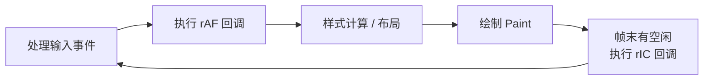

# requestAnimationFrame 与 requestIdleCallback

两个都是浏览器提供的「按时机调度回调」的 API，区别在于**调度的时机不同**：

- **`requestAnimationFrame` (rAF)**：在**每次重绘之前**执行回调，节奏跟随屏幕刷新率 (通常 60Hz，约每 16.7ms 一次)。专门用来做动画。
- **`requestIdleCallback` (rIC)**：在浏览器**每帧的空闲时间**执行回调，用来跑不紧急的低优先级任务，不阻塞渲染和交互。

## 一帧里它们在哪执行



rAF 在「绘制前」跑，所以适合改动画样式；rIC 在「这一帧画完还有空」时才跑，适合见缝插针做杂活。

## requestAnimationFrame

```js
function animate() {
  box.style.left = box.offsetLeft + 1 + 'px'; // 每帧移动 1px
  if (box.offsetLeft < 300) {
    requestAnimationFrame(animate); // 递归注册下一帧
  }
}
requestAnimationFrame(animate);
```

相比 `setTimeout(fn, 16)` 做动画的优势：

- **节奏对齐刷新率**：浏览器保证回调在重绘前执行，不会出现 `setTimeout` 那种「计时和刷新错位」导致的丢帧、卡顿。
- **后台自动暂停**：页面切到后台标签页时 rAF 会暂停，省电省 CPU；`setTimeout` 仍在空转。

取消用 `cancelAnimationFrame(id)`。

## requestIdleCallback

回调收到一个 `deadline` 对象，`timeRemaining()` 返回本帧还剩多少空闲毫秒，据此决定做多少活、何时让出。

```js
const tasks = [...]; // 一堆不紧急的任务

function runTasks(deadline) {
  // 还有空闲时间且有任务，就继续做
  while (deadline.timeRemaining() > 0 && tasks.length) {
    doWork(tasks.shift());
  }
  if (tasks.length) {
    requestIdleCallback(runTasks); // 没做完，下一个空闲再继续
  }
}

requestIdleCallback(runTasks, { timeout: 2000 });
```

- **`timeout` 选项**：兜底，超过这个时间还没等到空闲就强制执行，避免任务被一直饿死。
- 适合：日志上报、预加载、非关键数据计算等——做晚一点没关系、但别卡住主线程的活。

:::warning
`requestIdleCallback` 兼容性不如 rAF (Safari 长期不支持)，生产中常用 `setTimeout` 兜底降级，或直接用 React 的调度器 (Scheduler) 这类封装好的方案。
:::

:::tip
一句话选型：要**动画 / 视觉更新**用 rAF；要**塞低优先级后台任务**又不想卡顿用 rIC。两者都比裸 `setTimeout` 更贴合浏览器的渲染节奏。React 的时间分片 (并发模式) 思路就源自「在空闲时间分片执行」，见 [时间分片](/scenario/time-slicing)。
:::

## 参考

- [Window: requestAnimationFrame() - MDN](https://developer.mozilla.org/zh-CN/docs/Web/API/Window/requestAnimationFrame)
- [Window: requestIdleCallback() - MDN](https://developer.mozilla.org/zh-CN/docs/Web/API/Window/requestIdleCallback)
