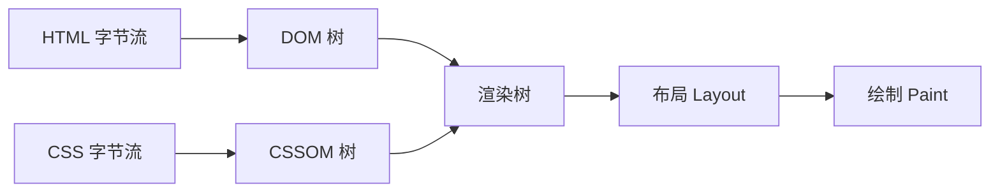

# 浏览器解析与渲染流程

浏览器拿到一堆 HTML、CSS、JS 字节流，到屏幕上出现像素，中间这条路叫**关键渲染路径**（Critical Rendering Path）。理解它，才能解释「为什么 CSS 放头部、JS 放底部」这类规则的由来。

> 这里只讲「拿到资源之后」的解析渲染。前面从输入 URL 到拿到 HTML 的网络部分，见[从输入 URL 到页面呈现](./from-url-to-render.md)。

## 五个阶段



1. **构建 DOM 树**：浏览器自上而下解析 HTML，把标签转成节点，按嵌套关系组织成树。`<html>` 是根，子元素是子节点。节点越多，这步越慢。
2. **构建 CSSOM 树**：解析所有 CSS（外链、`<style>`、行内），按继承和层叠规则算出每个节点最终的样式，组织成 CSSOM 树。
3. **合成渲染树**：把 DOM 和 CSSOM 合并，**只保留要显示的节点**——`display: none` 的元素不进渲染树，`<head>` 这种不可见内容也不进。
4. **布局（Layout / Reflow）**：根据渲染树，计算每个节点在视口中的**确切位置和大小**（几何信息）。首次计算叫 layout，之后因改动重新计算叫**回流**。
5. **绘制（Paint）**：把每个节点转成屏幕上的实际像素——画文字、颜色、边框、阴影。复杂页面还有一步**合成**（Composite），把分层的内容拼成最终画面。

## 阻塞关系（重点）

DOM 和 CSSOM 的构建本是两条独立的线，但 JS 的存在让它们纠缠起来。记住四条规则：

| 谁 | 影响 | 原因 |
|---|---|---|
| CSS | **不**阻塞 DOM 解析 | CSSOM 和 DOM 是两棵独立的树，各建各的 |
| CSS | **阻塞渲染** | 没有 CSSOM 算不出样式，浏览器宁可不画也不愿先画个裸样式再重画 |
| JS | **阻塞 DOM 解析** | 脚本可能增删 DOM，解析到 `<script>` 必须停下、执行完再继续 |
| CSS | **阻塞其后的 JS 执行** | 脚本可能读元素样式，浏览器要先把 CSSOM 建好才敢执行脚本 |

把后两条串起来看，会得到一个反直觉的结论：**CSS 会间接阻塞 DOM 解析**——`<script>` 等 CSSOM，DOM 解析又等 `<script>`，于是一段慢加载的 CSS 能把整个 DOM 构建拖住。

## 由此得出的实践

- **CSS 尽早加载**（放 `<head>`）：它阻塞渲染，越早拿到 CSSOM，越早能画出页面。
- **JS 别阻塞解析**：放 `<body>` 末尾，或用 `defer` / `async`。让 DOM 先建完，脚本晚点执行。详见 [脚本加载时机](../html/script-loading.md)。
- **减少 DOM 节点、避免频繁改样式**：节点多则建树、布局都慢；改动几何属性会触发[回流和重绘](./reflow-and-repaint.md)，是运行时性能的大头。

:::info
现代浏览器还有「预解析」（preload scanner）优化：主解析器被 `<script>` 卡住时，会有一个副线程提前扫描后面的 HTML，把要用到的 CSS、图片、脚本先下载起来，缩短等待。但它只是提前下载资源，不改变上面的执行与阻塞顺序。
:::

## 加载阶段事件：`DOMContentLoaded` 与 `load`

渲染管线跑起来的同时，浏览器用两个事件标志页面加载的不同阶段：**`DOMContentLoaded` 是「结构就绪」，`load` 是「全部就绪」**。

- **`DOMContentLoaded`**：HTML 被解析完、DOM 树构建完成就触发，**不等**图片、样式表、iframe 等外部子资源。
- **`load`**：页面**所有资源**（图片、CSS、脚本、iframe）都加载完毕才触发。

```js
document.addEventListener('DOMContentLoaded', () => {
  console.log('DOM 树好了，可以操作元素、绑事件了');
});

window.addEventListener('load', () => {
  console.log('图片等所有资源也加载完了');
});
```

时间线上 `DOMContentLoaded` 总是先于 `load`——有时早很多，因为一张大图就能让 `load` 多等好几秒。

```
解析 HTML ─▶ DOM 构建完成 ─▶ [DOMContentLoaded] ─▶ 图片/样式等加载完 ─▶ [load]
```

### 为什么大多数初始化用 `DOMContentLoaded`

绑事件、初始化组件这些操作只需要 DOM 元素存在就行，不必等图片下载完。用 `DOMContentLoaded` 能让交互**尽早可用**，而不是干等几秒。jQuery 时代的 `$(document).ready()` 本质就是它。

只有当逻辑**真的依赖资源尺寸**时才用 `load`，比如要读取图片的真实宽高来排版。

### 谁会拖慢 `DOMContentLoaded`

`DOMContentLoaded` 等的是「DOM 解析完」，所以凡是**阻塞 HTML 解析**的东西都会推迟它，这正是上面阻塞关系的延续：

- **同步 `<script>`**：解析 HTML 时遇到它会暂停解析、先下载执行脚本，DOM 解析被卡住，`DOMContentLoaded` 随之推迟。
- **脚本前面的 CSS**：CSS 本身不阻塞 DOM 解析，但如果它后面跟着 `<script>`，浏览器会**先等 CSSOM 构建完**再执行脚本（脚本可能读样式），脚本又卡着 DOM 解析——于是 CSS **间接**拖慢了 `DOMContentLoaded`。
- **`defer` 脚本**：在 `DOMContentLoaded` **之前**按顺序执行完，所以它也会让 `DOMContentLoaded` 等自己。

:::info
`async` 脚本是例外：它和 `DOMContentLoaded` **互不等待**——脚本可能在事件前执行，也可能在后，取决于谁先下载完。详见 [脚本加载时机](../html/script-loading.md)。
:::

### `DOMContentLoaded` 与 `load` 对比

| | `DOMContentLoaded` | `load` |
|---|---|---|
| 触发时机 | DOM 树构建完成 | 所有资源加载完成 |
| 等图片 / CSS / iframe | 否 | 是 |
| 监听对象 | `document` | `window` |
| 典型用途 | 绑事件、初始化 UI | 依赖资源尺寸的逻辑 |
| 先后 | 先 | 后 |
