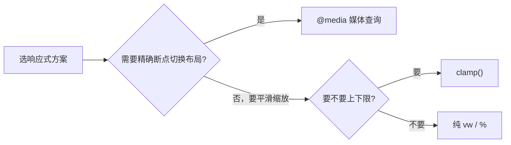

# 单位与响应式

选单位的核心原则：**需要随某个基准缩放就用相对单位，需要固定就用绝对单位**。布局尺寸优先 `rem`/`%`/`vw`，字号优先 `rem`，边框/分隔线等固定细节用 `px`。

## 绝对单位 vs 相对单位

| 单位 | 类型 | 相对基准 | 典型场景 |
|------|------|----------|----------|
| `px` | 绝对 | 物理像素 (设备像素比换算后) | 边框、阴影、需要精确固定的尺寸 |
| `em` | 相对 | **当前元素的字号** (用于字号属性时则相对父元素字号) | 与自身文字相关的间距 |
| `rem` | 相对 | **根元素 `html` 的字号** | 字号、整体可缩放的布局尺寸 |
| `%` | 相对 | **父元素**对应属性的值 | 流式布局宽度、高度 |
| `vw` | 相对 | 视口宽度的 1% | 全屏布局、随屏宽缩放的字号 |
| `vh` | 相对 | 视口高度的 1% | 全屏高度区块 (首屏 banner) |
| `vmin` | 相对 | `vw` 和 `vh` 中较小的一个 | 正方形、不被任一方向裁切的元素 |
| `vmax` | 相对 | `vw` 和 `vh` 中较大的一个 | 需要铺满较长边的场景 |

:::info
`px` 严格来说是 "CSS 像素" 而非屏幕物理像素。在高分屏 (Retina) 上，1 个 CSS 像素可能对应多个物理像素，由设备像素比 `devicePixelRatio` 决定。这正是移动端 "1px 边框" 在高分屏上偏粗问题的根源。
:::

## `em` 与 `rem` 的差异

两者都相对字号，区别在基准：

- `em` 相对**当前元素自身的字号** (当 `em` 用在 `font-size` 自身时，则相对**父元素**字号)。
- `rem` 永远相对**根元素 `html`** 的字号，不受嵌套层级影响。

`em` 的麻烦在于**嵌套累积**：

```html
<div class="outer">
  外层
  <div class="inner">
    中层
    <div class="deep">深层</div>
  </div>
</div>
```

```css
html  { font-size: 16px; }
.outer { font-size: 1.5em; }  /* 16 * 1.5 = 24px */
.inner { font-size: 1.5em; }  /* 24 * 1.5 = 36px，被外层放大 */
.deep  { font-size: 1.5em; }  /* 36 * 1.5 = 54px，越套越大 */
```

同样的写法换成 `rem`，三层都是 `1.5rem = 24px`，互不影响：

```css
.outer, .inner, .deep { font-size: 1.5rem; }  /* 全部 16 * 1.5 = 24px */
```

:::tip
默认用 `rem` 控制字号，结果可预测、不受嵌套干扰。只有当你**故意**希望某个值随当前文字大小联动时才用 `em`，例如按钮的内边距 `padding: 0.5em 1em` 会自动跟随按钮字号缩放。
:::

## 响应式方案

### 媒体查询 `@media`

按视口宽度切换样式，是响应式的基础手段。推荐**移动优先** (先写小屏样式，再用 `min-width` 逐级增强)：

```css
.container { padding: 16px; }

@media (min-width: 768px) {
  .container { padding: 24px; }
}

@media (min-width: 1200px) {
  .container { padding: 40px; max-width: 1140px; margin: 0 auto; }
}
```

### `rem` + 根字号缩放

固定布局尺寸全用 `rem`，再通过媒体查询或 JS 改 `html` 的 `font-size`，整页就能等比缩放：

```css
html { font-size: 16px; }
@media (min-width: 768px)  { html { font-size: 18px; } }
@media (min-width: 1200px) { html { font-size: 20px; } }
```

移动端常配合 JS 按屏宽动态设置根字号 (如 `lib-flexible` 思路)，把设计稿等比映射到不同屏幕。

### `vw` 布局

直接用视口宽度作单位，元素天然随屏宽缩放，连媒体查询都可省去：

```css
.title { font-size: 5vw; }   /* 屏越宽字越大 */
.card  { width: 90vw; }
```

缺点是**无上下限**，超大屏会过大、超小屏会过小，常需配合 `clamp()` 限制范围。

### `clamp()`

`clamp(最小值, 理想值, 最大值)` 在一行内实现 "可伸缩但有边界" 的尺寸，是现代响应式的利器：

```css
.title {
  font-size: clamp(1.5rem, 4vw, 3rem);
}
/* 字号随 4vw 流动，但不小于 1.5rem、不大于 3rem */

.container {
  width: clamp(320px, 90%, 1140px);
}
```

很多原本需要多个媒体查询断点的场景，一个 `clamp()` 就能平滑过渡。



## 移动端适配

响应式的前提是正确的 viewport 设置，否则移动端会按默认 980px 渲染再缩小：

```html
<meta name="viewport" content="width=device-width, initial-scale=1.0">
```

`width=device-width` 让布局视口等于设备宽度，`initial-scale=1.0` 设置初始缩放比例。

关于高分屏下的 **1px 边框变粗** 问题，根源是 1 CSS 像素映射到多个物理像素，可用 `transform: scale()` 或 `0.5px` 等技巧解决，详见技巧章。
