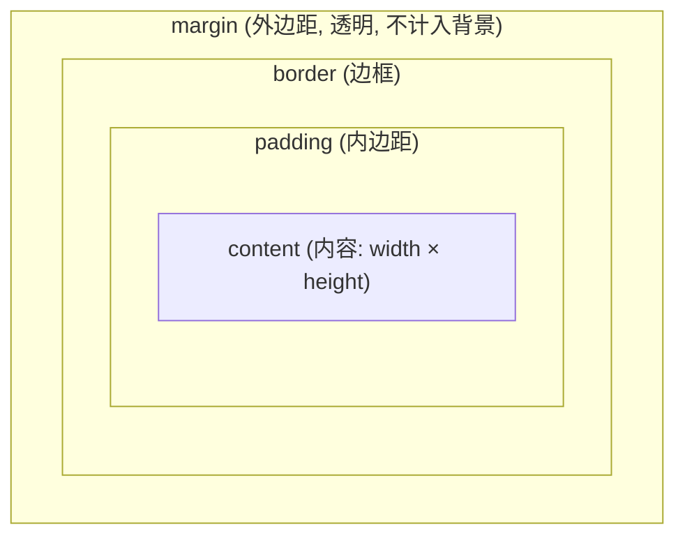

# 盒模型与 box-sizing

每个元素都是一个矩形盒子，由内到外分四层：`content`（内容）、`padding`（内边距）、`border`（边框）、`margin`（外边距）。



- `content`：放文本、图片等实际内容，尺寸由 `width` / `height` 控制
- `padding`：内容与边框之间的空白，会被背景色/背景图覆盖
- `border`：边框，占据空间
- `margin`：盒子与外部其他盒子之间的距离，透明，不被背景覆盖

## 标准盒模型 vs 怪异盒模型

核心区别只有一句：**`width` 到底算不算 padding 和 border**。

| | 标准盒模型 `content-box` | 怪异/IE 盒模型 `border-box` |
|---|---|---|
| `width` 的含义 | 仅 `content` 的宽度 | `content + padding + border` 的总宽度 |
| 元素实际占宽 | `width + padding + border` | 等于 `width` |
| 加 padding 后 | 元素变宽，撑大布局 | 元素总宽不变，content 被压缩 |
| 默认值 | 现代浏览器默认 | 需手动设置 |

:::info
「怪异盒模型」得名于 IE6 在「怪异模式」(quirks mode) 下的渲染行为。当时 IE 把 padding 和 border 算进 `width` 内，与 W3C 标准相反。后来 `border-box` 因为更符合直觉，反而成了工程实践的首选。
:::

### 具体数值例子

同样写 `width: 200px; padding: 20px; border: 5px solid;`：

```css
/* 标准盒模型 */
.box-standard {
  box-sizing: content-box;
  width: 200px;
  padding: 20px;
  border: 5px solid;
}
/* 实际占宽 = 200 + 20×2 + 5×2 = 250px */
/* content 区域 = 200px */
```

```css
/* 怪异盒模型 */
.box-border {
  box-sizing: border-box;
  width: 200px;
  padding: 20px;
  border: 5px solid;
}
/* 实际占宽 = 200px (不变) */
/* content 区域 = 200 - 20×2 - 5×2 = 150px */
```

`content-box` 下你设的 `200px` 只是内容宽，加上 padding 和 border 后元素真正占了 `250px`，很容易撑破布局；`border-box` 下 `200px` 就是元素最终占的宽度，padding 和 border 往内挤压内容区。

## box-sizing 切换两种模型

```css
.standard { box-sizing: content-box; } /* 标准, 默认 */
.weird    { box-sizing: border-box; }  /* 怪异/IE */
```

### 为什么项目里常全局设 border-box

```css
*,
*::before,
*::after {
  box-sizing: border-box;
}
```

- **算宽度更直观**：设 `width: 50%` 就是占父级一半，不用再为 padding/border 做减法
- **布局更稳**：给元素加 padding 不会把它撑大、挤乱旁边的元素
- **栅格友好**：两列各 `width: 50%` 配上 padding 也不会换行

:::tip
几乎所有 CSS Reset / Normalize 方案（如 Tailwind 的 Preflight）都会全局启用 `border-box`。新项目直接照抄上面那段，能省掉大量「为什么加个 padding 布局就乱了」的调试时间。
:::

## margin 合并 (外边距塌陷)

垂直方向相邻的 margin 不会叠加，而是**取最大值**，这叫 margin collapse / 外边距塌陷。注意：只发生在**垂直方向**，水平 margin 永远正常相加。

### 场景一：相邻兄弟元素

```html
<p style="margin-bottom: 30px;">上段</p>
<p style="margin-top: 20px;">下段</p>
<!-- 两段间距 = max(30, 20) = 30px, 不是 50px -->
```

### 场景二：父子 margin 穿透

子元素的 `margin-top` 会「穿透」父元素，跑到父元素外面，导致父元素整体下移而非子元素在父内下移。

```html
<div class="parent">
  <div class="child" style="margin-top: 50px;">内容</div>
</div>
<!-- parent 没有 padding/border 时, child 的 50px margin 顶到了 parent 外面 -->
```

### 如何避免

| 方法 | 适用场景 |
|---|---|
| 给父元素加 `padding-top` 或 `border-top` | 父子穿透 |
| 用 `padding` 代替 `margin` | 父子穿透 |
| 让父元素形成 **BFC** | 父子穿透 (推荐 `display: flow-root`) |
| 用 `gap` (flex/grid 布局) | 兄弟间距 |

:::info
触发 **BFC** (块级格式化上下文) 能阻止父子 margin 穿透。最干净的写法是给父元素加 `display: flow-root`。BFC 还能清除浮动、实现自适应两栏。
:::

:::warning
margin 合并只对**块级元素**、**垂直方向**、**没有被 padding/border/BFC 隔开**时生效。flex 和 grid 容器的子项之间不发生 margin 合并，所以现代布局用 `gap` 控制间距更省心。
:::
