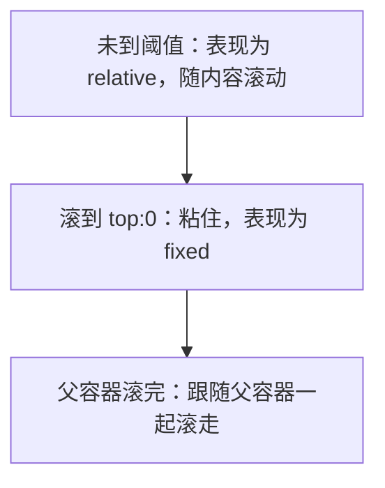

# position 定位

`position` 决定元素如何在页面上摆放，以及 `top` / `right` / `bottom` / `left` 这些偏移量**相对谁**生效。共五种取值。

## 五种取值速览

| 取值 | 相对谁定位 | 是否脱离文档流 | 偏移属性是否生效 |
|------|-----------|----------------|------------------|
| `static` | 默认流，不定位 | 否 | 无效 |
| `relative` | **自身原本位置** | 否（原位置仍占空间） | 有效 |
| `absolute` | 最近的**非 static 祖先** | 是 | 有效 |
| `fixed` | **视口** (viewport) | 是 | 有效 |
| `sticky` | 阈值内像 relative，超出后像 fixed | 否 | 作为阈值生效 |

`static` 是默认值，元素按正常文档流排列，`top` 等属性和 `z-index` 全部无效，可视为「不开启定位」。

## relative：相对自身原位置

```css
.box {
  position: relative;
  top: 10px;
  left: 20px;
}
```

元素相对它**原来该在的位置**偏移，但原位置**仍然占据空间**，后续元素不会上移。所以 relative 常用作两个目的：微调位置；给子元素当 absolute 的定位锚点。

## absolute：相对最近的非 static 祖先

```css
.parent { position: relative; }   /* 锚点 */
.child  {
  position: absolute;
  top: 0;
  right: 0;                        /* 钉在父元素右上角 */
}
```

absolute 元素脱离文档流，向上查找最近一个 `position` 不为 `static` 的祖先作为定位基准；如果一个都没有，就相对**初始包含块**（约等于视口）。

:::tip
最常见的写法是父元素 `position: relative`、子元素 `position: absolute`，俗称「子绝父相」。给父元素加 relative 不会改变它的视觉位置，只是把它声明为子元素的定位锚点。
:::

## fixed：相对视口

```css
.back-to-top {
  position: fixed;
  right: 24px;
  bottom: 24px;
}
```

fixed 脱离文档流，相对**视口**定位，页面滚动时位置不变。常用于回到顶部按钮、固定头部、悬浮客服。

:::warning
祖先元素若设置了 `transform`、`filter` 或 `will-change`，会让其内部的 fixed 元素改为相对该祖先定位，而不是视口。排查 fixed「不固定」时优先检查这点。
:::

## sticky：粘性定位

sticky 是 relative 和 fixed 的混合：元素先按 relative 正常排布，当滚动到设定的阈值（如 `top: 0`）时「粘」住，表现得像 fixed；继续滚动直到父容器离开视口，又跟着滚走。

```css
.section-title {
  position: sticky;
  top: 0;          /* 滚动到距顶部 0 时粘住 */
  background: #fff;
}
```



### sticky 的生效条件

sticky 经常「不生效」，原因几乎都是下面这几条没满足：

1. **必须设阈值**：至少写一个 `top` / `bottom` / `left` / `right`，否则没有「粘住」的触发点。
2. **父容器要能滚动**：sticky 是相对**最近的滚动祖先**生效的。如果某个祖先设了 `overflow: hidden` / `auto` / `scroll`，sticky 会以它为参照；若该祖先没有滚动空间，就粘不住。
3. **父容器高度要足够**：sticky 元素只能在父容器的范围内粘。父容器高度等于子元素高度时，没有可滚动余量，看起来完全不动。

:::warning
最隐蔽的坑：给某个祖先无意中加了 `overflow: hidden`（常为了清除浮动），会直接破坏后代的 sticky。sticky 失效时第一件事就是检查所有祖先的 `overflow`。
:::

## z-index 与层叠

`z-index` 控制定位元素的前后层叠顺序，**只对 `position` 非 static 的元素生效**。值越大越靠上。它的比较只在同一个**层叠上下文**内进行——`position` + `z-index`、`opacity < 1`、`transform` 等都会创建新的层叠上下文，跨上下文的 `z-index` 不能直接比大小。

## 脱离文档流的是哪几个

只有 **`absolute` 和 `fixed`** 完全脱离文档流（原位置不再占空间，后续元素会顶上来）。`relative` 和 `sticky` 不脱离文档流，原位置始终保留。
