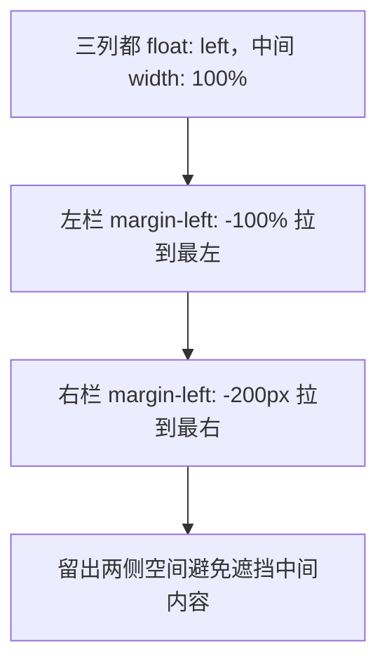

# 常见布局方案

三个高频布局题：水平垂直居中、两栏布局、三栏布局。每个都有多种实现，重点是理解各自的适用场景。

## 水平垂直居中

让一个子元素在父容器中水平且垂直居中。方法很多，按场景选。

### 方法对比

| 方法 | 关键代码 | 适用场景 |
|------|----------|----------|
| 行内元素 | `text-align: center` + `line-height` | 单行文字、行内/行内块元素 |
| Flex | `justify-content: center` + `align-items: center` | **首选**，块级元素，尺寸未知 |
| Grid | `place-items: center` | 最简洁，单个子元素居中 |
| 绝对定位 + transform | `top/left: 50%` + `translate(-50%,-50%)` | 子元素脱离文档流，尺寸未知也可 |
| 绝对定位 + margin auto | `inset: 0` + `margin: auto` | 子元素脱离文档流，需已知或可由内容定尺寸 |

### 行内元素

```css
.parent {
  text-align: center;   /* 水平居中行内内容 */
  height: 100px;
  line-height: 100px;   /* 行高等于高度 = 单行垂直居中 */
}
```

只适合单行文字或行内块，多行会失效。

### Flex（首选）

```css
.parent {
  display: flex;
  justify-content: center;  /* 主轴居中 */
  align-items: center;      /* 交叉轴居中 */
}
```

最通用，子元素尺寸未知也能居中，代码语义清晰，日常优先用它。

### Grid（最简洁）

```css
.parent {
  display: grid;
  place-items: center;   /* 一行搞定行列居中 */
}
```

`place-items` 是 `align-items` + `justify-items` 的简写，单个子元素居中时最省事。

### 绝对定位 + transform

```css
.parent { position: relative; }
.child {
  position: absolute;
  top: 50%;
  left: 50%;
  transform: translate(-50%, -50%);
}
```

`top/left: 50%` 先把子元素**左上角**移到中心，再用 `translate(-50%, -50%)` 按子元素**自身尺寸**回退一半，达到居中。子元素尺寸未知也适用，因为 `translate` 的百分比是相对自身的。

### 绝对定位 + margin auto

```css
.parent { position: relative; }
.child {
  position: absolute;
  top: 0; right: 0; bottom: 0; left: 0;  /* 等价 inset: 0 */
  margin: auto;
  width: 200px;
  height: 100px;
}
```

四个方向都为 0 时，`margin: auto` 会把多余空间平均分到上下左右，实现居中。需要子元素有确定尺寸。

## 两栏布局（左固定右自适应）

左侧固定 200px，右侧占满剩余空间。

### Flex 法（推荐）

```css
.container { display: flex; }
.left  { flex: none; width: 200px; }
.right { flex: 1; }              /* 占满剩余 */
```

### Grid 法

```css
.container {
  display: grid;
  grid-template-columns: 200px 1fr;
}
```

最简洁，一行定义列宽。

### float + BFC 法

```css
.left  { float: left; width: 200px; }
.right { overflow: hidden; }     /* 触发 BFC，不与浮动重叠 */
```

右侧元素形成 BFC 后不会被浮动的左侧覆盖，自动填充剩余空间。老方案。

### 绝对定位法

```css
.container { position: relative; }
.left  { position: absolute; left: 0; width: 200px; }
.right { margin-left: 200px; }
```

## 三栏布局（两侧固定中间自适应）

左右各 200px，中间自适应。这是经典的「圣杯/双飞翼」要解决的问题。

### Flex 法（推荐）

```css
.container { display: flex; }
.left, .right { flex: none; width: 200px; }
.center { flex: 1; }
```

### Grid 法（最简洁）

```css
.container {
  display: grid;
  grid-template-columns: 200px 1fr 200px;
}
```

### 圣杯与双飞翼（了解原理）

两者都是 Flex 出现前用 **float** 实现三栏的方案，核心诉求是：让**中间内容写在 HTML 最前面**先渲染，左右两栏靠负 margin「拉」到两侧。



- **圣杯布局**：父容器加左右 `padding` 留出两栏空间，左右栏再用 `position: relative` + 负偏移归位。
- **双飞翼布局**：中间栏内部再套一层 `div`，用这层的 `margin` 留出两侧空间，避免圣杯里相对定位的繁琐。

:::info
圣杯和双飞翼解决的核心问题是「中间内容优先加载」+「三栏等高自适应」。在 Flex / Grid 时代，这两种 hack 已无需手写，了解其「负 margin 归位」的思路即可应对面试。
:::

:::tip
实际开发中，两栏、三栏布局一律用 **Flex 或 Grid**：列宽固定且语义是网格用 Grid，需要内容驱动或垂直对齐用 Flex。float 和绝对定位方案仅作原理理解。
:::
