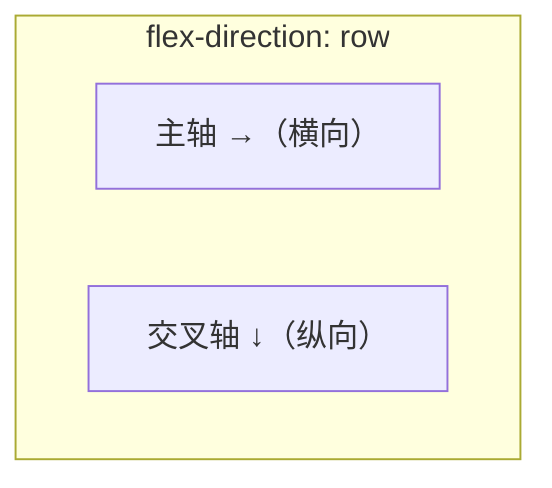

# Flex 弹性布局

Flex 解决**一维布局**：在一行或一列内，控制一组项目的排列、对齐和空间分配。它替代了过去用 `float`、`inline-block` 实现横向排列的各种 hack，是现在最常用的布局方式。

只要把一个元素设为 `display: flex`，它就成了 **flex 容器**，其直接子元素自动成为 **flex 项目**。

```css
.container {
  display: flex;
}
```

## 主轴与交叉轴

Flex 的所有对齐规则都围绕两条轴展开。**主轴** (main axis) 是项目排列的方向，由 `flex-direction` 决定；**交叉轴** (cross axis) 永远与主轴垂直。



- `flex-direction: row`（默认）：主轴是水平方向，交叉轴是垂直方向。
- `flex-direction: column`：主轴变成垂直方向，交叉轴变成水平方向。

:::info
记住一个原则：`justify-*` 系列管**主轴**，`align-*` 系列管**交叉轴**。一旦把 `flex-direction` 改成 `column`，两者的视觉效果就互换了——这是初学者最常踩的坑。
:::

## 容器属性

容器属性作用在 `display: flex` 的元素上，控制整体排列方式。

| 属性 | 作用 | 常用取值 |
|------|------|----------|
| `flex-direction` | 主轴方向 | `row` / `row-reverse` / `column` / `column-reverse` |
| `justify-content` | 项目沿**主轴**对齐 | `flex-start` / `center` / `flex-end` / `space-between` / `space-around` / `space-evenly` |
| `align-items` | 项目沿**交叉轴**对齐（单行） | `stretch` / `flex-start` / `center` / `flex-end` / `baseline` |
| `flex-wrap` | 是否换行 | `nowrap`（默认） / `wrap` / `wrap-reverse` |
| `align-content` | **多行**在交叉轴上的分布 | 同 `justify-content`，仅换行后生效 |
| `gap` | 项目间距 | 如 `gap: 16px` / `gap: 8px 16px`（行列分别） |

### justify-content 的几种分布

```css
.container {
  display: flex;
  justify-content: space-between; /* 两端对齐，间隔均分 */
}
```

- `space-between`：首尾贴边，中间均分。
- `space-around`：每个项目左右各留相等空间，所以两端的间距是中间的一半。
- `space-evenly`：所有间距完全相等，包括两端。

### align-content 与 align-items 的区别

`align-items` 控制**单行内**项目在交叉轴的对齐；`align-content` 只在 `flex-wrap: wrap` 且**有多行**时才生效，控制这些「行」整体在交叉轴上如何分布。

:::warning
`align-content` 在单行（`nowrap` 或只有一行）时完全无效。如果发现它不起作用，先检查有没有换行。
:::

### gap

`gap` 直接给项目之间加间距，不影响容器边缘，比给项目加 `margin` 再处理首尾元素干净得多。优先用 `gap`。

## 项目属性

项目属性作用在 flex 项目（子元素）上，控制单个项目如何伸缩。

| 属性 | 作用 | 默认值 |
|------|------|--------|
| `flex-grow` | 剩余空间的**放大**比例 | `0`（不放大） |
| `flex-shrink` | 空间不足时的**缩小**比例 | `1`（可缩小） |
| `flex-basis` | 分配空间前的**基准尺寸** | `auto`（按内容） |
| `flex` | 上面三者的简写 | `0 1 auto` |
| `align-self` | 单个项目覆盖 `align-items` | `auto` |

### flex 简写：重点理解

`flex` 是 `flex-grow flex-shrink flex-basis` 的简写。日常最常见的是这几个值：

| 写法 | 等价于 | 含义 |
|------|--------|------|
| `flex: 1` | `1 1 0%` | 完全弹性，忽略内容尺寸，所有 `flex: 1` 的项目**等分**整行 |
| `flex: auto` | `1 1 auto` | 可伸缩，但以**内容尺寸**为起点分配剩余空间 |
| `flex: none` | `0 0 auto` | 不伸不缩，固定为内容尺寸 |
| `flex: 0` | `0 1 0%` | 不放大，basis 为 0，会被压到内容最小尺寸 |

`flex: 1` 和 `flex: auto` 的关键差别在 `flex-basis`：

- `flex: 1` 的 basis 是 `0%`，意味着「先把项目尺寸当作 0，再按 grow 比例瓜分**全部**容器空间」，结果是严格等分。
- `flex: auto` 的 basis 是 `auto`，意味着「先按各自内容撑开，再把**剩余**空间按 grow 瓜分」，内容多的项目最终更宽。

```css
/* 三个项目严格三等分，不管内容多少 */
.item { flex: 1; }

/* 三个项目按内容大小为基础，再分剩余空间，内容多的更宽 */
.item { flex: auto; }
```

:::tip
做等宽栅格（如三列等分）用 `flex: 1`；做「内容自适应宽度 + 平摊空白」的导航栏用 `flex: auto`；做固定尺寸不参与伸缩的侧边栏用 `flex: none`。
:::

### align-self

`align-self` 让某个项目单独覆盖容器的 `align-items`。比如整体顶部对齐，唯独某个项目要居中：

```css
.container { display: flex; align-items: flex-start; }
.special   { align-self: center; }
```

## 一个完整示例

经典的导航栏：左侧 logo 固定，中间菜单自适应，右侧按钮固定，整体垂直居中。

```html
<nav class="navbar">
  <div class="logo">Logo</div>
  <ul class="menu">...</ul>
  <button class="login">登录</button>
</nav>
```

```css
.navbar {
  display: flex;
  align-items: center;   /* 交叉轴垂直居中 */
  gap: 24px;
}
.menu {
  flex: 1;               /* 占满中间所有剩余空间 */
}
.logo, .login {
  flex: none;            /* 固定尺寸，不伸缩 */
}
```
