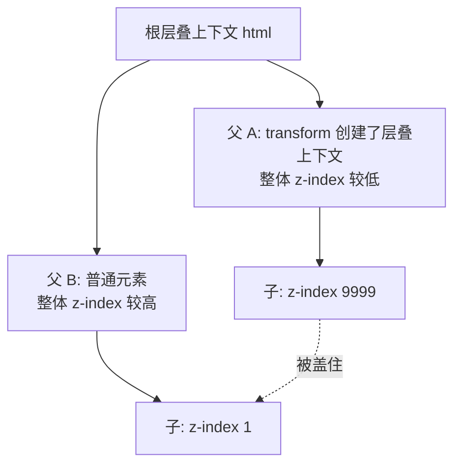
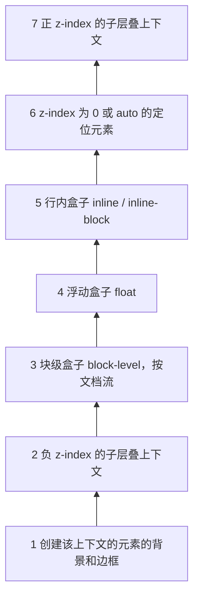
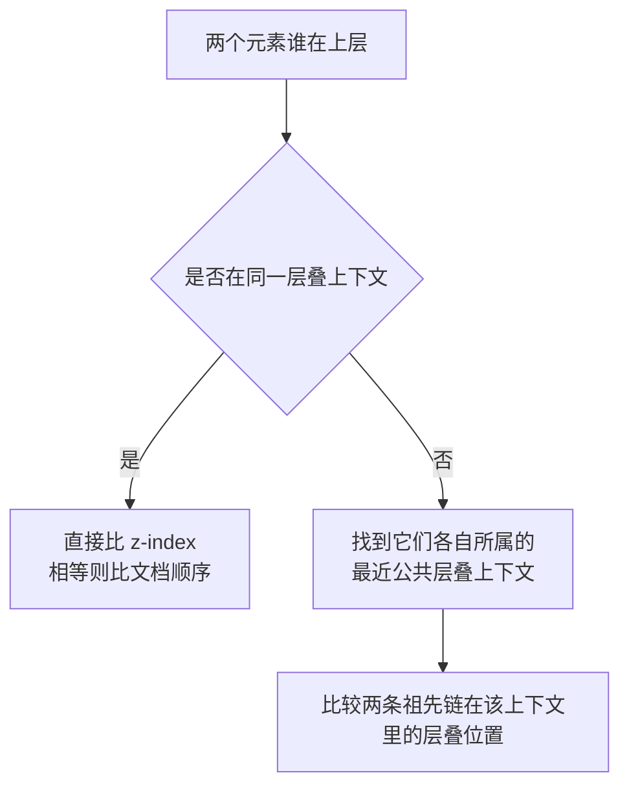

# 层叠上下文与 z-index

**为什么设了 `z-index: 9999` 还是被别的元素盖住？** 因为 `z-index` 不是全局排序，它只在**同一个层叠上下文（stacking context）**内部比较。你的元素 `z-index: 9999` 再大，如果它所在的层叠上下文整体排在另一个上下文后面，照样被压在下面。

上图中 `A1` 虽然 `z-index: 9999`，但它被困在父 A 的层叠上下文里。父 A 整体比父 B 靠后，于是 `A1` 永远盖不过 `B1`，哪怕 `B1` 只有 `z-index: 1`。

## 什么是层叠上下文

层叠上下文是 HTML 元素在 **Z 轴**（垂直于屏幕、指向用户）上的一个独立排序单元。根元素 `<html>` 天然形成根层叠上下文，其他元素满足特定条件时会创建新的层叠上下文。一旦某元素创建了层叠上下文，它的所有子元素就在这个「子宇宙」里排序，无法越界和外部元素直接比 `z-index`。

可以把它类比成图层组：组内图层怎么排，整组在画布上还是作为一个整体移动。

## 如何创建层叠上下文

常见触发条件：

| 条件 | 说明 |
| --- | --- |
| 根元素 `<html>` | 文档默认的根层叠上下文 |
| `position: absolute/relative` 且 `z-index` 不为 `auto` | 经典方式，定位 + 具体 z-index 值 |
| `position: fixed` / `position: sticky` | 无需 `z-index` 即创建 |
| `opacity` 小于 `1` | 任何透明度都会创建 |
| `transform` 不为 `none` | 哪怕 `transform: translateZ(0)` |
| `filter` / `backdrop-filter` 不为 `none` | |
| `will-change` 指定了会创建层叠上下文的属性 | 如 `will-change: opacity` |
| `flex` / `grid` 子项且 `z-index` 不为 `auto` | 父为弹性/网格容器，子项可直接用 `z-index` |
| `isolation: isolation` | 专门用来「凭空」创建层叠上下文，不带其他副作用 |
| `mix-blend-mode` 不为 `normal` | |
| `contain: layout/paint/strict/content` | |

:::warning
最容易踩的坑是 `transform`、`opacity`、`filter`。给祖先加了一个动画用的 `transform` 或半透明的 `opacity`，无意中创建了层叠上下文，导致里面元素的 `z-index` 突然「失效」（被关进了子宇宙）。排查 `z-index` 不生效时，优先往上找哪个祖先有这些属性。
:::

## 层叠顺序

在**同一个层叠上下文内部**，元素从下到上的绘制顺序固定如下（后绘制的盖在上面）：

从底到顶记忆：**背景边框 → 负 z-index → 块级 → 浮动 → 行内 → z-index:0/auto → 正 z-index**。

几个反直觉的点：

- **行内元素默认盖过浮动和块级元素**（第 5 层 > 第 3、4 层）。所以文字默认会显示在浮动图片之上。
- **负 z-index 元素会沉到背景之上、但在普通块级内容之下**。常用于把装饰背景藏到内容后面：父元素设 `position: relative`，装饰子元素设 `z-index: -1`。
- 同一层内、未设 `z-index` 时，按**文档中出现的先后顺序**绘制，后写的盖前面的。

## 比较规则

核心：**先比上下文，再比 z-index。** 跨上下文的两个元素，永远先看它们各自的「上下文整体」谁在上面，整体定了，内部 `z-index` 再大也翻不了盘。

## 实战排查清单

`z-index` 没生效时按顺序检查：

1. 元素是否有 `position` 非 `static`（或在 flex/grid 容器里）？`z-index` 对普通静态定位元素无效。
2. 是不是某个祖先创建了层叠上下文，把你的元素关进了子宇宙？重点查祖先的 `transform`、`opacity`、`filter`、`will-change`。
3. 两个元素是否真的在同一上下文里？不在的话，去调整它们**共同祖先**的层级，而不是死磕子元素的 `z-index`。

:::tip
想给某个组件「隔离」出独立的层叠环境，又不想引入 `transform`/`opacity` 的副作用，用 `isolation: isolate`。它唯一的作用就是创建层叠上下文，最干净。
:::
