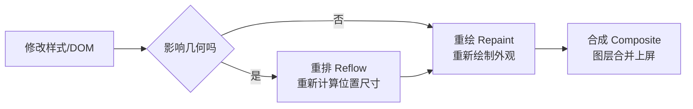

# 重排与重绘

一句话区分：**重排（reflow，也叫回流）是重新计算几何信息——元素的位置和尺寸；重绘（repaint）是按几何信息重新绘制外观——颜色、阴影、可见性。** 重排必然引起重绘（位置变了肯定要重画），重绘不一定引起重排（只改颜色不影响布局）。



重排开销远大于重绘，因为它要从改动点开始重新计算受影响元素（甚至整棵子树、乃至整个文档）的布局。性能优化的核心目标就是**减少重排、其次减少重绘，尽量只触发合成**。

## 哪些操作触发重排

任何改变元素几何或影响布局的操作：

| 类别 | 例子 |
| --- | --- |
| 改尺寸/位置 | `width`、`height`、`padding`、`margin`、`border`、`top`/`left`、`display` |
| 改字体相关 | `font-size`、`font-family`、`line-height`、`text-align` |
| 增删/移动 DOM | `appendChild`、`removeChild`、改变元素 `display: none` ↔ `block` |
| 改窗口/容器 | 浏览器窗口 `resize`、滚动条出现 |
| **读取布局属性** | 读 `offsetWidth/Height`、`scrollTop/Left`、`clientWidth`、`getBoundingClientRect()`、`getComputedStyle()` |

### 强制同步布局（layout thrashing）

最隐蔽的性能杀手。浏览器为了性能会**把多次样式修改攒成一批、等空闲时统一重排**。但如果你在修改后**立刻读取**某个布局属性（如 `offsetWidth`），浏览器为了给你返回准确的值，被迫**马上重排**，这就是强制同步布局。在循环里「读—写—读—写」交替，会触发多次重排，性能急剧下降：

```javascript
// 反例：每次循环都强制同步布局，读 offsetWidth 触发重排
for (let i = 0; i < items.length; i++) {
  // 读 box.offsetWidth 强制重排，再写 width 弄脏布局，下一轮读又重排
  items[i].style.width = box.offsetWidth + 'px';
}
```

```javascript
// 正解：先一次性读完，再统一写
const width = box.offsetWidth; // 只读一次
for (let i = 0; i < items.length; i++) {
  items[i].style.width = width + 'px';
}
```

:::warning
「读布局属性会触发重排」很违反直觉——读取怎么会改东西？因为浏览器有未刷新的样式改动排在队列里，你一读，它必须先把队列刷掉、算出最新布局才能给你准确值。所以**避免在写样式之后、循环之内读取布局属性**。
:::

## 哪些操作只触发重绘

改外观、不改几何的属性：`color`、`background-color`、`background-image`、`visibility`、`box-shadow`、`border-color`、`outline`。它们不影响元素位置尺寸，跳过重排、直接重绘。

:::info
`visibility: hidden` 只触发重绘（元素仍占位），而 `display: none` 触发重排（元素脱离文档流、布局改变）。这也是两者性能上的一个区别，详见 [隐藏元素的方式](./隐藏元素的方式.md)。
:::

## 优化手段

### 1. 批量修改样式

多次单独改 `style` 可能触发多次重排，合并成一次：

```javascript
// 反例：三次写操作
el.style.width = '100px';
el.style.height = '200px';
el.style.margin = '10px';

// 正解一：用 class 一次性切换
el.classList.add('resized');

// 正解二：用 cssText 一次写入
el.style.cssText = 'width:100px; height:200px; margin:10px;';
```

### 2. 离线操作 DOM

频繁增删 DOM 时，先让元素脱离文档流再批量操作，最后一次性插回，把多次重排合并成一两次：

```javascript
// 用 DocumentFragment，整个 fragment 在内存中拼好，一次插入只触发一次重排
const fragment = document.createDocumentFragment();
for (let i = 0; i < 100; i++) {
  const li = document.createElement('li');
  li.textContent = `第 ${i} 项`;
  fragment.appendChild(li);
}
list.appendChild(fragment);
```

其他离线思路：先 `display: none`（一次重排），改完再显示（一次重排），中间所有改动不触发重排。

### 3. 用 transform / opacity 走合成层

`transform` 和 `opacity` 的动画可以交给 GPU 在**合成阶段**处理，不触发重排、甚至不触发重绘。做位移动画时，用 `transform: translate()` 而不是改 `top`/`left`：

```css
/* 反例：改 left，每帧重排 */
.box {
  transition: left 0.3s;
}

/* 正解：改 transform，走合成层，不重排 */
.box {
  transition: transform 0.3s;
}
.box.moved {
  transform: translateX(100px);
}
```

### 4. will-change 提前提升合成层

提前告诉浏览器某元素将要变化，让它预先把元素提升为独立合成层，避免动画开始时临时创建图层造成卡顿：

```css
.draggable {
  will-change: transform;
}
```

:::warning
`will-change` 不要滥用、不要长期挂着。每个合成层都占内存，全局乱加会拖垮性能。只在即将发生的动画前临时加，结束后移除。
:::

### 5. 避免在循环里读取布局属性

见上文「强制同步布局」。把读操作提到循环外、缓存结果。

## 渲染流程关系

重排、重绘是浏览器渲染管线（解析 → 样式计算 → 布局 → 绘制 → 合成）中布局和绘制环节的重新触发。完整的浏览器渲染流程见 [浏览器解析与渲染流程](../../javascript/browser/rendering-process.md)，理解管线才能精准判断某个改动落在哪个环节。
