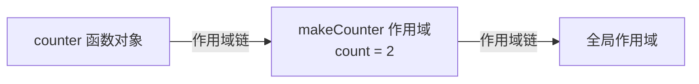

# 闭包

**闭包 = 函数 + 它定义时所在的词法作用域**。一个函数即使在它定义的作用域之外被调用，依然能访问当初那个作用域里的变量——这就是闭包。

```js
function makeCounter() {
  let count = 0; // 被内部函数引用，不会随 makeCounter 返回而销毁
  return function () {
    return ++count;
  };
}

const counter = makeCounter();
counter(); // 1
counter(); // 2 —— count 一直活着
```

`makeCounter` 执行完本该回收 `count`，但返回的函数引用了它，于是 `count` 被「关」在闭包里持续存在。

## 为什么会形成闭包

JavaScript 用**词法作用域**：函数能访问哪些变量，在它**定义**时就决定了，与在哪里调用无关。函数被创建时会保存一个指向其外层作用域的引用 (作用域链)。只要这个函数还存在 (比如被返回、被当回调注册)，它引用的外层变量就不会被垃圾回收。



## 典型用途

- **私有变量 / 数据封装**：把变量藏在函数作用域里，只暴露受控的读写接口 (如上面的 `counter`)。
- **函数工厂**：根据参数生成定制化的函数。

```js
function makeAdder(x) {
  return (y) => x + y; // 每个 adder 闭住自己的 x
}
const add5 = makeAdder(5);
add5(3); // 8
```

- **回调中保留状态**：防抖、节流、`once` 等都靠闭包记住 `timer`、`last`、`called` 等状态，见 [防抖节流](/scenario/debounce-throttle)。

## 经典陷阱：循环中的 var

```js
for (var i = 0; i < 3; i++) {
  setTimeout(() => console.log(i), 0); // 3 3 3
}
```

`var` 没有块级作用域，三个回调闭住的是**同一个** `i`，循环结束时 `i` 已是 `3`。解法：用 `let` (每次迭代创建独立绑定)，或用 IIFE 传值形成独立作用域。

```js
for (let i = 0; i < 3; i++) {
  setTimeout(() => console.log(i), 0); // 0 1 2
}
```

:::warning
闭包会延长变量的生命周期，用得不当会导致**内存无法释放**：被闭包引用的大对象、DOM 节点会一直驻留内存。不再需要时把引用置为 `null`，或避免在闭包里抓住不必要的大数据。
:::

## 一句话口诀

> **闭包**：函数记住了它出生时的作用域。只要函数还在，那个作用域里的变量就不会被回收——既能做私有状态，也可能造成内存泄漏。
