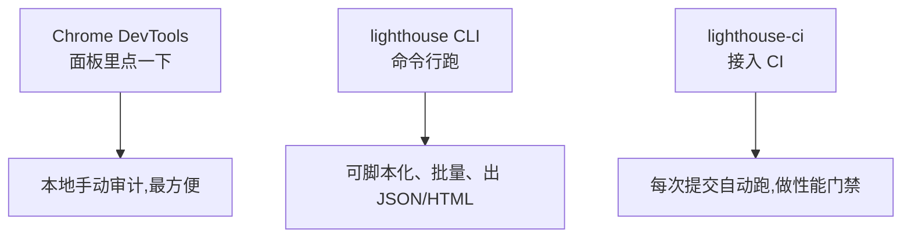

# Lighthouse

Lighthouse 是 Google 出的**自动化网页质量审计工具**:给它一个 URL,它在受控环境里跑一遍页面,产出一份带分数和改进建议的报告。它是**测量工具**,而 [Web Vitals](./web-vitals.md) 是它测量的**指标**之一——工具和指标的关系,别搞混。


## 五大类

Lighthouse 从五个维度打分,每类 0–100:

| 类别 | 审什么 |
| --- | --- |
| **性能**(Performance) | 加载快不快、交互流不流畅,基于一组 Lab 指标加权算分 |
| **无障碍**(Accessibility) | 屏幕阅读器、对比度、`alt` 等无障碍可用性 |
| **最佳实践**(Best Practices) | HTTPS、控制台报错、废弃 API、安全相关 |
| **SEO** | 搜索引擎可抓取、可索引(meta、结构化数据等) |
| **PWA** | 是否满足渐进式 Web 应用要求(可安装、离线等) |

## 性能分怎么算

性能分是**几个 Lab 指标的加权平均**。各指标按权重折算成分数再相加(以 Lighthouse 10/11 为例,权重会随版本微调):

| 指标 | 含义 | 大致权重 |
| --- | --- | --- |
| **FCP**(First Contentful Paint) | 首次内容绘制 | 10% |
| **SI**(Speed Index) | 速度指数,内容**可见进度**有多快填满屏幕 | 10% |
| **LCP**(Largest Contentful Paint) | 最大内容绘制 | 25% |
| **TBT**(Total Blocking Time) | 总阻塞时间,FCP 到 TTI 间主线程被长任务阻塞的累计时长 | 30% |
| **CLS**(Cumulative Layout Shift) | 累积布局偏移 | 25% |

:::info
**TBT 是 INP 的实验室替身**。INP 需要真实交互才能测,Lighthouse 是无人交互的 Lab 环境测不出,于是用 TBT(主线程被阻塞多久)来近似「交互会不会卡」。所以优化 TBT 基本就是在优化真实的 INP。
:::

形象例子:性能分像**体检综合评分**——LCP 是心率、TBT 是血压、CLS 是体温,每项有不同权重,加权汇成一个总分。某项拉胯,总分就上不去。

## Lab vs Field 的局限

Lighthouse 跑的是 **Lab(实验室)数据**:一台机器、模拟一种网络和 CPU 节流、跑一次。优点是可复现、上线前就能测;**局限**也明显:

- **结果有波动**:同一页面连跑几次分数能差十几分(网络抖动、后台进程、节流模拟偏差)。看趋势别看单次。
- **代表不了真实用户**:模拟的「中端手机 + 4G」未必匹配你的真实用户群。
- **测不出真实 INP**:无交互环境只能用 TBT 近似。

所以 Lab 适合**开发期定位问题、做性能门禁**;线上真实体验仍要靠 Field 数据(CrUX / RUM)兜底。这层区别详见 [Web Vitals 的字段数据 vs 实验数据](./web-vitals.md)。

## 三种运行方式



- **Chrome DevTools** → Lighthouse 面板,选类别点 Analyze,适合开发时随手测。
- **CLI**:`npx lighthouse https://example.com --view`,可输出 JSON/HTML,便于自动化。
- **CI(lighthouse-ci)**:接到 CI 流水线,每次 PR 自动跑,设阈值——**分数低于门槛就让构建失败**,防止性能回退被合进主干。

```bash
# CLI 跑一次并自动打开报告
npx lighthouse https://example.com --view

# CI 中常用 lhci,断言性能分不低于门槛
npx @lhci/cli autorun
```

## 怎么读报告并落地

报告分数下面有两块可执行内容,这才是干活的地方:

- **Opportunities(优化机会)**:列出「这么改能省多少加载时间」,如「压缩图片可省 1.2s」「移除阻塞渲染的资源」。按预估收益排序,**先啃大头**。
- **Diagnostics(诊断信息)**:不直接给省时数字,但指出问题成因,如「主线程工作过重」「DOM 节点过多」「存在长任务」。

:::tip
落地节奏:Opportunities 看收益排序逐项改,改完用 CLI / CI **复跑对比**,确认分数和指标真的涨了再下一项。务必跑多次取中位数,别被单次波动误导。
:::

## 参考

- [Lighthouse - Chrome for Developers](https://developer.chrome.com/docs/lighthouse/overview)
- [Lighthouse performance scoring - Chrome for Developers](https://developer.chrome.com/docs/lighthouse/performance/performance-scoring)
- [Total Blocking Time (TBT) - web.dev](https://web.dev/articles/tbt)
- [Lighthouse CI - GitHub](https://github.com/GoogleChrome/lighthouse-ci)
